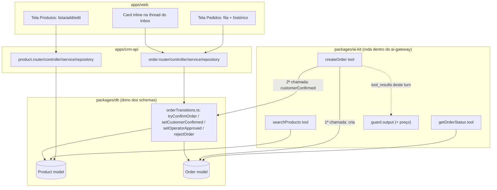

# Catalog Orders Design

**Spec**: `.specs/features/catalog-orders/spec.md`
**Context**: `.specs/features/catalog-orders/context.md`
**Status**: Draft

---

## Architecture Overview

Duas superfícies novas de escrita convergem no mesmo par de collections
(`products`, `orders`): o operador via `crm-api` (CRUD de catálogo, aprovar/rejeitar) e a
IA via `ai-gateway`/`packages/ai-kit` (buscar, criar pedido, capturar confirmação do
cliente). A transição `pending_approval → confirmed` é a única operação que qualquer um
dos dois lados pode disparar — por isso vive numa função compartilhada em `packages/db`
(ver Tech Decisions, AD-032/AD-033), não duplicada por app.



---

## Code Reuse Analysis

### Existing Components to Leverage

| Component | Location | How to Use |
| --- | --- | --- |
| `ToolContext` | `packages/ai-kit/src/tools/toolContext.ts` | Reusado sem alteração — as 3 tools novas recebem `(input, ctx)` como as 4 já existentes |
| `tenantScoped()` | `packages/db/src/tenantScoped.ts` | Todo filtro Mongo novo (models e `orderTransitions.ts`) passa por aqui, mesmo padrão já usado em `getProcessTemplate.ts`/`process.repository.ts` |
| Padrão de handler de tool | `packages/ai-kit/src/tools/getProcessTemplate.ts`, `openProcess.ts` | `searchProducts.ts`/`getOrderStatus.ts`/`createOrder.ts` seguem a mesma forma: import direto de model do `@crm/db`, `tenantScoped`, nunca `throw` em not-found — sempre `{error}` |
| `executeTool` switch | `packages/ai-kit/src/loop.ts` | 3 novos `case` adicionados, mesmo formato dos 4 existentes |
| `TOOL_DEFINITIONS` | `packages/ai-kit/src/tools/toolDefinitions.ts` | 3 entradas novas de `input_schema` JSON literal (AD-004) — nenhum tenant/channel/conversation no schema (AD-010) |
| `withDbTiming` | `apps/crm-api/src/metrics/db.metric.js` | Todo método de `product.repository.ts`/`order.repository.ts` |
| Padrão repository/service/controller/router | `apps/crm-api/src/{repositories,services,controllers,routers}/process.*`, `conversation.*` | `product.*`/`order.*` seguem a mesma forma — `toRecord()`, `CustomError` tipado no service, tradução pro controller |
| Workaround de query paginada | `apps/crm-api/src/routers/customer.router.ts` (`validListCustomersQuery`) | Reusado tal-e-qual para `GET /products`/`GET /orders` — bug conhecido do Express 5 `req.query` getter |
| `respObj`/`badRespObj` | `packages/contracts/src/response/index.ts` | Envelope de resposta de todos os endpoints novos |
| `createProcess.schema.ts` (padrão `.strict()`) | `packages/contracts/src/schemas/` | Molde para `createProduct.schema.ts`/`updateProduct.schema.ts`/`rejectOrder.schema.ts` |
| `CustomError` + tradução service→controller | `apps/crm-api/src/services/conversation.service.ts`, `conversation.controller.ts` | Molde para `OrderNotFoundError`→404, `OrderAlreadyTerminalError`→409 |
| Rotas file-based + `details.tsx`/`add/index.tsx` (AD-030) | `apps/web/src/routes/_private/customers/` | Molde exato para `_private/products/` e `_private/orders/` — `search:{id}`, nunca `$id` |
| `@tanstack/react-table` manual/server mode (AD-028) | `apps/web/src/routes/_private/customers/list/index.tsx` | Tela de Produtos e de Pedidos usam a mesma convenção — sem slice/sort/filter client-side |
| Camada de dados TanStack Query | `apps/web/src/query/customer.ts`, `conversation.ts` | Molde para `query/product.ts`/`query/order.ts` |
| Componentes do Inbox | `apps/web/src/routes/_private/inbox/@components/takeover-badge.tsx`, `thread.tsx` | `order-card.tsx` novo segue o mesmo padrão visual/estrutural, montado dentro de `thread.tsx` |
| `t()` (dicionário de tradução) | `apps/web/src/lib/helpers/translate.helper.ts` | Toda string nova de Produto/Pedido passa por aqui (convenção já confirmada em toda a feature `inbox-realtime`) |

### Integration Points

| System | Integration Method |
| --- | --- |
| `packages/db` | Dono dos models `Product`/`Order` e da função compartilhada `orderTransitions.ts` — único lugar que os dois apps importam para a transição de confirmação (AD-033) |
| `tests/structural/toolInputSchema.structural.test.ts` | Editado — `EXPECTED_TOOL_NAMES` ganha 3 entradas, `toHaveLength(4)`→`toHaveLength(7)`; a sweep de chaves proibidas já é genérica sobre `TOOL_DEFINITIONS`, cobre as tools novas sem mudança de lógica |
| `apps/crm-api/src/app.ts` | Monta `product.router`/`order.router`, mesmo padrão dos routers já montados |

---

## Components

### `Product` model

- **Purpose**: Item do catálogo do tenant — schema fixo, sem field-engine.
- **Location**: `packages/db/src/models/product.model.ts`
- **Interfaces**: exporta `ProductDocument`, `Product` (Mongoose model)
- **Dependencies**: nenhuma além de Mongoose/`Tenant`
- **Reuses**: `channel.model.ts` como molde de schema fixo (timestamps, índice por `Tenant`)

### `Order` model

- **Purpose**: Pedido montado na conversa — nasce `pending_approval`, transiciona pra
  `confirmed`/`rejected` sob as regras do Anel B (AD-009).
- **Location**: `packages/db/src/models/order.model.ts`
- **Interfaces**: exporta `OrderDocument`, `Order`, `OrderStatus`, `OrderItem`
- **Dependencies**: `Conversation`, `Customer`, `Product`, `User` (refs)
- **Reuses**: `process.model.ts` como molde de schema com sub-documento (`items`, análogo a
  `values`, ainda que aqui tipado, não `Mixed`)

### `orderTransitions.ts` — transição compartilhada (AD-033)

- **Purpose**: Única implementação da máquina de estados de `Order`, chamada por
  `apps/crm-api` (aprovar/rejeitar) e `packages/ai-kit` (2ª chamada de `create_order`) —
  nunca duplicada.
- **Location**: `packages/db/src/orderTransitions.ts`
- **Interfaces**:
  - `setCustomerConfirmed(tenantId, orderId, items): Promise<OrderRecord | {error}>` —
    valida que `items` bate com o `Order` `pending_approval` existente, marca
    `customerConfirmed:true`, chama `tryConfirmOrder` internamente se `operatorApproved`
    já é `true`.
  - `setOperatorApproved(tenantId, orderId, userId): Promise<OrderRecord | {error}>` —
    marca `operatorApproved:true`/`approvedBy`/`approvedAt`, chama `tryConfirmOrder`
    internamente se `customerConfirmed` já é `true`.
  - `tryConfirmOrder(tenantId, orderId): Promise<OrderRecord>` — reserva atomicamente
    (`findOneAndUpdate` condicional por item, `stock: {$gte: quantity}`, `$inc` negativo)
    o estoque de cada item; se qualquer item falhar, desfaz (`$inc` positivo) os itens já
    reservados nesta tentativa e grava `confirmFailureReason`, mantendo `pending_approval`;
    se todos os itens reservarem, seta `status:'confirmed'`.
  - `rejectOrder(tenantId, orderId, userId, reason?): Promise<OrderRecord | {error}>` —
    `status:'rejected'`, terminal, sem tocar estoque (nunca foi reservado).
- **Dependencies**: `Product`, `Order` (`packages/db` models)
- **Reuses**: `tenantScoped()`

### Tools Anel A: `searchProducts`, `getOrderStatus`

- **Purpose**: Consulta autônoma de catálogo e status de pedido dentro da conversa.
- **Location**: `packages/ai-kit/src/tools/searchProducts.ts`, `getOrderStatus.ts`
- **Interfaces**:
  - `searchProducts({query?}, ctx): Promise<{products: Array<{id,name,price,stock,description}>}>`
    — top-5 `Product`s `active` do `Tenant`, filtro por `name` (regex case-insensitive) se
    `query` informado.
  - `getOrderStatus({orderId?}, ctx): Promise<OrderSummary | {error}>` — se `orderId`
    informado, exige `order.conversation === ctx.conversationId`; se omitido, retorna o
    `Order` mais recente dessa `conversation`.
- **Dependencies**: `Product`/`Order` models
- **Reuses**: padrão de `getProcessTemplate.ts`

### Tool Anel B: `createOrder`

- **Purpose**: Cria o `Order` (1ª chamada) e captura a confirmação do cliente em código
  (2ª chamada) — primeira tool do Anel B do projeto.
- **Location**: `packages/ai-kit/src/tools/createOrder.ts`
- **Interfaces**: `createOrder({items, idempotencyKey, customerConfirmed?}, ctx): Promise<OrderSummary | {error}>`
  - Sem `customerConfirmed` (ou `false`): valida cada `productId` (existe, `active`) e
    `quantity` (inteiro, `1..100`); se algum item é inválido, `{error}`; senão cria
    `Order` `pending_approval`, `customerConfirmed:false`, snapshot de `name`/`unitPrice`
    por item, `totalPrice` calculado.
  - Com `customerConfirmed:true`: localiza `Order` `pending_approval` por
    `(Tenant, conversation, idempotencyKey)`; se `items` diverge do gravado, `{error}`;
    se não existe, `{error}`; se já é terminal, retorna o estado atual sem mutar; senão
    chama `orderTransitions.setCustomerConfirmed`.
- **Dependencies**: `Product`/`Order` models, `orderTransitions.ts`
- **Reuses**: padrão de `openProcess.ts` (cria documento a partir de input validado)

### `guard.output` — extensão de escopo de preço

- **Purpose**: Impedir que a resposta final da IA cite um valor monetário sem lastro em
  tool result deste turno (AD-009/glossário).
- **Location**: `packages/ai-kit/src/guardOutput.ts` (assinatura muda),
  `packages/ai-kit/src/runTurn.ts` (chamada muda)
- **Interfaces**: `guardOutput(reply: string, toolResultsThisTurn: unknown[]): string`
  - Extrai o conjunto de preços permitidos (em reais, convertido de centavos) presentes
    nos `tool_result`s deste turno (`Product.price` de `searchProducts`,
    `unitPrice`/`totalPrice` de `createOrder`/`getOrderStatus`).
  - Extrai, via regex, valores formatados como moeda na resposta (`R$\s?\d+([.,]\d{2})?`).
  - Qualquer valor extraído que não bate com o conjunto permitido é redigido (mesmo padrão
    do `REDACTED_PLACEHOLDER` já usado pro ObjectId) e a ocorrência é logada.
- **Dependencies**: nenhuma nova — só o dado que `runTurn.ts` já tem em
  `loopResult.rawTurn` e hoje não repassa
- **Reuses**: `OBJECT_ID_REGEX`/`REDACTED_PLACEHOLDER`/`truncateAtSafeBoundary` como molde
  de implementação (regex + substituição + log)

### `product.repository/service/controller/router` (apps/crm-api)

- **Purpose**: CRUD de catálogo pelo operador.
- **Location**: `apps/crm-api/src/{repositories,services,controllers,routers}/product.*`
- **Interfaces**: `createProduct`, `listProducts` (paginado, filtro `name`/`active`),
  `updateProduct`, `findById`
- **Dependencies**: `Product` model
- **Reuses**: padrão de `process.repository.ts`/`process.service.ts`/`process.router.ts`

### `order.repository/service/controller/router` (apps/crm-api)

- **Purpose**: Listagem, aprovação e rejeição de pedidos pelo operador — qualquer um do
  tenant, não só o `assignee` da conversa.
- **Location**: `apps/crm-api/src/{repositories,services,controllers,routers}/order.*`
- **Interfaces**: `listOrders` (paginado, filtro `status`/`conversation`, popula
  `customer.name`), `approveOrder` (chama `orderTransitions.setOperatorApproved`),
  `rejectOrder` (chama `orderTransitions.rejectOrder`)
- **Dependencies**: `Order` model, `orderTransitions.ts`
- **Reuses**: padrão de `conversation.service.ts` (erro tipado no service, tradução HTTP
  no controller: `OrderNotFoundError`→404, `OrderAlreadyTerminalError`→409)

### Telas `apps/web`

- **Purpose**: Cadastro de catálogo, fila/histórico de pedidos, card inline no Inbox.
- **Location**:
  - `apps/web/src/routes/_private/products/index.tsx` (lista, `@tanstack/react-table`
    manual mode)
  - `apps/web/src/routes/_private/products/add/index.tsx`
  - `apps/web/src/routes/_private/products/details.tsx` (edição, `search:{id}`, AD-030)
  - `apps/web/src/routes/_private/orders/index.tsx` (fila + histórico, filtro `status` via
    `search`)
  - `apps/web/src/routes/_private/inbox/@components/order-card.tsx` (novo, montado em
    `thread.tsx`)
  - `apps/web/src/query/product.ts`, `apps/web/src/query/order.ts`
- **Dependencies**: `product.router`/`order.router` (crm-api)
- **Reuses**: `apps/web/src/routes/_private/customers/{list,add,details}` (AD-027/AD-028/
  AD-030), `apps/web/src/routes/_private/inbox/@components/takeover-badge.tsx` (molde
  visual de badge/card curto com ação)

---

## Data Models

### `Product`

```typescript
interface ProductDocument {
  _id: mongoose.Types.ObjectId
  Tenant: mongoose.Types.ObjectId
  name: string
  sku?: string
  description?: string
  price: number // inteiro, centavos
  stock: number // inteiro, >= 0
  active: boolean // default true
  createdAt: Date
  updatedAt: Date
}
```

Índices: `{Tenant:1, active:1}` (busca de `searchProducts`/listagem), sem índice único em
`sku` (não exigido — ver Assumptions do `spec.md`).

### `Order`

```typescript
interface OrderItem {
  product: mongoose.Types.ObjectId
  name: string // snapshot no momento da criação
  unitPrice: number // snapshot, centavos
  quantity: number
}

type OrderStatus = 'pending_approval' | 'confirmed' | 'rejected'

interface OrderDocument {
  _id: mongoose.Types.ObjectId
  Tenant: mongoose.Types.ObjectId
  conversation: mongoose.Types.ObjectId
  customer: mongoose.Types.ObjectId
  items: OrderItem[]
  totalPrice: number // centavos, soma de unitPrice*quantity
  status: OrderStatus
  idempotencyKey: string
  customerConfirmed: boolean // default false — escrito por ai-gateway
  operatorApproved: boolean // default false — escrito por crm-api
  approvedBy?: mongoose.Types.ObjectId
  approvedAt?: Date
  rejectedBy?: mongoose.Types.ObjectId
  rejectedAt?: Date
  rejectionReason?: string
  confirmFailureReason?: string // último motivo de falha da reserva atômica, se houver
  createdAt: Date
  updatedAt: Date
}
```

Índices: `{Tenant:1, conversation:1, idempotencyKey:1}` **único** (garante idempotência na
camada de dado, não só na lógica de app), `{Tenant:1, status:1, createdAt:-1}` (fila de
Pedidos).

**Relationships**: `Order.conversation`→`Conversation` (feature 6, leitura apenas — esta
feature nunca escreve em `conversations`), `Order.customer`→`Customer`,
`Order.items[].product`→`Product` (snapshot, não recarrega o preço atual).

---

## Error Handling Strategy

| Error Scenario | Handling | User Impact |
| --- | --- | --- |
| `Product`/`Order` não existe ou de outro `Tenant` | 404, mesmo idioma de `customer.service.ts` | Operador vê "não encontrado", sem diferenciar ausente de outro tenant |
| `POST /products`/`PATCH /products/:id` com `price`/`stock` negativo ou `name` vazio | 400 (Zod `.strict()`) | Formulário mostra erro de validação |
| `create_order` com item inválido (produto inexistente/inativo, quantidade fora de `1..100`) | Tool retorna `{error}`, nenhum `Order` criado | IA relata ao cliente que não conseguiu montar o pedido, sem detalhe técnico |
| `create_order` (2ª chamada) com `items` divergente da 1ª | Tool retorna `{error}`, `Order` original intocado | IA não consegue "reabrir" um pedido já resumido com itens diferentes — evita corromper silenciosamente |
| `create_order` (2ª chamada) sem `Order pending_approval` correspondente | Tool retorna `{error}` | IA relata que não encontrou o pedido pra confirmar |
| `create_order` chamado de novo sobre `Order` já terminal | Tool retorna o estado atual, sem mutar (leitura idempotente) | IA relata o status real (já confirmado/rejeitado) em vez de erro |
| `approve`/`reject` sobre `Order` já terminal | 409 (`OrderAlreadyTerminalError`) | Operador vê que a ação não é mais possível |
| Reserva atômica de estoque falha na confirmação | `Order` permanece `pending_approval`, `confirmFailureReason` gravado, resposta 200 com o estado atual (aprovar/confirmar é uma tentativa, não uma garantia) | Operador vê o motivo na tela/card, decide próximo passo manualmente |
| Preço fabricado na resposta da IA | `guard.output` redige o valor, loga a ocorrência | Cliente nunca vê o valor incorreto; conversa continua normalmente |
| Sem `canOperate` em qualquer endpoint novo | 403 | Acesso negado, sem vazar dado |

---

## Risks & Concerns

| Concern | Location (file:line) | Impact | Mitigation |
| --- | --- | --- | --- |
| `docs/architecture.md` (tabela "Propriedade de escrita por collection") já estava desatualizada **antes** desta feature: diz `customers`/`processes` → só `crm-api`, mas `packages/ai-kit/src/tools/findOrCreateCustomer.ts:26` (`Customer.create`) e `openProcess.ts:28` (`Process.create`) já escrevem essas collections de dentro do `ai-gateway` desde a feature 5 | `docs/architecture.md:71-74` | Documentação engana quem lê antes de olhar o código; esta feature precisaria do mesmo padrão pra `orders` (Anel B roda na conversa), o que pareceria uma violação nova de AD-002 sem o contexto correto | AD-032 (nova) corrige a tabela e explicita que a granularidade real do "dono único de escrita" é por write-path, não por collection inteira, pros 4 casos que já precisam disso (`customers`, `processes`, `orders`; `products` continua só `crm-api`) |
| Sem transação nativa do Mongo (standalone, AD-002/AD-006) pra reservar estoque de N itens + transicionar `Order` atomicamente | `packages/db/src/orderTransitions.ts` (novo) | Crash entre decrementar o estoque de alguns itens e virar `status:'confirmed'` deixa uma janela de inconsistência transitória (estoque já reservado, pedido ainda `pending_approval`) | Mesmo padrão já aceito em AD-024 (`FieldValueStore.migrateValues`): `$inc` por documento é atômico por si, rollback compensatório em caso de falha de item, ação de baixa frequência — AD-033 (nova) documenta e generaliza esse risco aceito |
| Matching de preço em `guard.output` é baseado em regex sobre texto livre da IA | `packages/ai-kit/src/guardOutput.ts` (novo trecho) | Falso negativo (preço fabricado escrito por extenso, não em dígitos, escapa do regex) ou falso positivo (um número que parece moeda mas não é preço é redigido à toa) | Escopo explicitamente limitado a valores no formato dígito+moeda (mesma limitação que o redaction de ObjectId já tem, que também só pega o formato hex esperado); coberto por caso de golden set dedicado (CAT-25/26); falso positivo é o lado seguro do erro (redige demais, nunca deixa passar preço errado) |
| `searchProducts` faz regex case-insensitive sobre `Product.name` sem índice de texto dedicado | `packages/ai-kit/src/tools/searchProducts.ts` (novo) | Em volume alto de produtos por tenant, a busca degrada linearmente | Mesmo raciocínio de AD-025: aceitável no volume esperado de um CRM nesta fase; revisitar com índice de texto se perfilamento mostrar gargalo real, não preemptivamente |

> Nenhum outro risco novo encontrado na varredura do código existente (`packages/ai-kit`,
> `apps/crm-api`, `packages/db`) além dos listados acima.

---

## Tech Decisions (only non-obvious ones)

| Decision | Choice | Rationale |
| --- | --- | --- |
| Onde vive a lógica de transição `pending_approval→confirmed` | Função compartilhada `packages/db/src/orderTransitions.ts`, chamada por `apps/crm-api` E `packages/ai-kit` | Ver AD-033 — evita duplicar uma invariante financeira em dois apps |
| Resposta HTTP de `POST /orders/:id/approve` quando a reserva de estoque falha | 200 com o `Order` atual (`status` continua `pending_approval`, `confirmFailureReason` preenchido) — nunca um erro HTTP | "Aprovar" é uma ação do operador que sempre é registrada; o resultado da tentativa de confirmação é dado no corpo, não no código HTTP — evita confundir "a requisição falhou" com "a transição de negócio não completou" |
| Top-N de `search_products` | 5, fixo | Suficiente pra uma resposta de chat; Design fecha o número que `context.md` deixou em aberto |
| Teto de `quantity` por item em `create_order` | Inteiro `1..100` | Rejeita entrada absurda sem virar regra de negócio; `context.md` deixou o valor exato pra Design |
| Busca de `search_products` | Regex case-insensitive só em `name` (não em `description`) | Menor escopo defensável; nada no Discuss pediu busca por descrição |
| `sku` sem unicidade | Sem índice único, campo livre/opcional | Já registrado como Assumption no `spec.md` — não foi pedido, evita constraint não solicitada |

> **Project-level decisions:** AD-032 e AD-033 apendadas a `.specs/STATE.md` `## Decisions`
> nesta sessão de Design — ver essas entradas para o texto completo. `docs/architecture.md`
> corrigido no mesmo commit desta etapa de planejamento.
