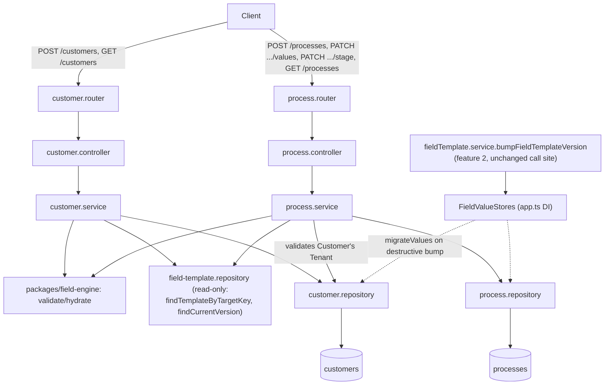

# CRM Core Design

**Spec**: `.specs/features/crm-core/spec.md`
**Status**: Approved

---

## Architecture Overview

Two new modules inside the existing `apps/crm-api` monolith (same shape as the `field-template`
module from feature 2 — router → controller → service → repository), plus two new Mongoose
models in `packages/db`. No new service, no new package. `crm-core` is purely a **consumer** of
`packages/field-engine` and of the `field-template` module's read paths (`findTemplateByTargetKey`,
`findCurrentVersion`) — it never edits template definitions.



**Key boundary rule (kept from AD-021):** `packages/field-engine` is not modified. The
`field-template` module's *service/repository/contracts* files ARE extended additively (new
`stages` field, see AD-023) — that touch was explicitly scoped out only for the
FieldValueStore adapters, not for closing the `stages` gap discovered during this Design (see
Risks & Concerns).

---

## Code Reuse Analysis

### Existing Components to Leverage

| Component | Location | How to Use |
| --- | --- | --- |
| `validate(fields, values)` | `packages/field-engine/src/validate.ts` | Validate `Customer.values` / `Process.values` against the resolved `FieldDef[]` before every create/update |
| `findTemplateByTargetKey`, `findCurrentVersion`, `findTemplateById` | `apps/crm-api/src/repositories/fieldTemplate.repository.ts` | Resolve the tenant's current `customer` template and the chosen `process` template (by `key`); resolve a specific `templateVersion` snapshot for values validation |
| `DEFAULT_CUSTOMER_TEMPLATE_KEY` | `packages/field-engine/src/constants.ts` | Same key `customer.service` uses to look up the tenant's single customer template |
| `tenantScoped` | `packages/db/src/tenantScoped.ts` | Every `Customer`/`Process` repository filter (AD-010) |
| `withDbTiming` | `apps/crm-api/src/metrics/db.metric.ts` | Wrap every new repository function (CORE-16) |
| `respObj`/`badRespObj`, `CustomError` | `packages/contracts/src/response`, `middlewares/errorHandler.middleware.ts` | Controller response envelope + error propagation, same as `field-template` |
| `validToken`, `tenantAssignmentCheck` | `middlewares/authentication.middleware.ts`, `middlewares/tenantAssign.middleware.ts` | Same auth chain as every other authenticated route |
| `tenantAndIpKeyGenerator` + `rejectWithTooManyRequests` factory | `middlewares/rateLimit.middleware.ts` | New `customerRateLimit`/`processRateLimit` instances, same shape as `fieldTemplateRateLimit` |
| Router factory pattern `create<X>Router(deps)` | `routers/fieldTemplate.router.ts` | Copy verbatim for `createCustomerRouter`/`createProcessRouter` |
| `id.schema.ts` (`idSchema`) | `packages/contracts/src/schemas/id.schema.ts` | `:id` param validation on `PATCH /processes/:id/...` |

### Integration Points

| System | Integration Method |
| --- | --- |
| `field-template` module (feature 2) | In-process function calls only (same Express app, same DB) — no HTTP hop, no new service (AD-002 governs cross-*service* calls, not cross-*module* calls inside `crm-api`) |
| `packages/db` | Two new models (`Customer`, `Process`) exported from the existing barrel; `syncIndexes()` extended |
| `app.ts` | Mount `/customers`, `/processes`; replace the two `createNoopFieldValueStore()` calls with the real adapters |

---

## Components

### `customer` module

- **Purpose**: Create and list `Customer` records (core fields + tenant-defined `values`).
- **Location**: `apps/crm-api/src/{routers,controllers,services,repositories}/customer.*.ts`
- **Interfaces**:
  - `createCustomer(tenantId, data: CreateCustomer): Promise<{id, templateVersion}>` — resolves the tenant's current `customer` template, rejects if `archived` (AD-022 dependant piece), runs `validate()`, normalizes `phone`/`document`, persists.
  - `listCustomers(tenantId, query: ListCustomersQuery): Promise<{items, total, page, limit}>` — search (`q` on `name`/`phone`), `sort` (whitelist: `name`, `createdAt`), `status` filter (`values.status`), clamps `page`/`limit`.
- **Dependencies**: `field-template.repository` (read), `packages/field-engine`, `packages/db` (`Customer`).
- **Reuses**: router/controller/service/repository layering, `tenantScoped`, `withDbTiming`.

### `process` module

- **Purpose**: Open a `Process` against a chosen `ProcessTemplate` + `Customer`, update its `values`, guard `stage` transitions, list by `Customer`.
- **Location**: `apps/crm-api/src/{routers,controllers,services,repositories}/process.*.ts`
- **Interfaces**:
  - `createProcess(tenantId, data: CreateProcess): Promise<{id, stage, templateVersion}>` — resolves the chosen `process` template by `key`, rejects if `archived`, verifies the `Customer` belongs to the same tenant (`tenantScoped` lookup — foreign/forged id resolves to `null` → 404), sets `stage` to `stages[0]` of the resolved `FieldTemplateVersion`, persists `templateVersion` as a **snapshot** (never re-resolved later).
  - `updateProcessValues(tenantId, id, values): Promise<void>` — loads the Process's OWN `templateVersion` (not the template's current one — CORE-08), validates, persists only if valid.
  - `updateProcessStage(tenantId, id, stage): Promise<void>` — loads the Process's own `templateVersion`'s `stages`, 400s if `stage` isn't a member, otherwise atomic `findOneAndUpdate` (single-document write = the CORE-15 concurrency guard; no optimistic-lock field needed — see Tech Decisions).
  - `listProcessesByCustomer(tenantId, customerId): Promise<ProcessSummary[]>` — P2.
- **Dependencies**: `field-template.repository` (read), `customer.repository` (tenant-ownership check), `packages/field-engine`, `packages/db` (`Process`).
- **Reuses**: same layering as `customer` module.

### FieldValueStore real adapters (AD-021 closure)

- **Purpose**: Replace the no-op adapters wired in `app.ts` with real bulk migration over `customers`/`processes`.
- **Location**: `apps/crm-api/src/providers/fieldValueStore/customer.fieldValueStore.ts`, `.../process.fieldValueStore.ts`
- **Interfaces**: same `FieldValueStore` type as the no-op (`countByTemplateVersion`, `migrateValues`) — signature untouched, per AD-021.
- **Dependencies**: `packages/db` (`Customer`/`Process` models), `@crm/contracts` (`MigrationPlan`/`MigrationAction`).
- **Reuses**: `withDbTiming`, `tenantScoped`. Implements the idempotent-filtered-bulk strategy (AD-024).

---

## Data Models

### `Customer` (new — `packages/db/src/models/customer.model.ts`)

```typescript
interface CustomerDocument {
  _id: ObjectId;
  Tenant: ObjectId;          // ref Tenant
  name: string;
  phone: string;              // normalized: digits only
  document?: string;          // normalized: alphanumeric only
  template: ObjectId;         // ref FieldTemplate (targetType: 'customer')
  templateVersion: number;    // snapshot at creation — mirrors FieldValueStore's (templateId, version) pair
  values: Record<string, unknown>; // validated by field-engine against the resolved FieldTemplateVersion
  createdAt: Date;
  updatedAt: Date;
}
```

Indexes: `{Tenant, name}`, `{Tenant, phone}` (search — both `.collation` case-insensitive),
`{Tenant, '$**' /* values wildcard */}` as a **compound wildcard** `{Tenant: 1, 'values.$**': 1}`
(MongoDB 7+ compound wildcard indexes — confirmed supported by the project's Mongo version;
scopes the `status` filter/kanban-column query and any future dynamic-field query to the tenant
without a full collection scan).

**Relationships**: `template` + `templateVersion` resolve to one `FieldTemplateVersion` document
(`{template, version}` unique index, feature 2) whenever `values` needs re-validating.

### `Process` (new — `packages/db/src/models/process.model.ts`)

```typescript
interface ProcessDocument {
  _id: ObjectId;
  Tenant: ObjectId;            // ref Tenant
  customer: ObjectId;          // ref Customer — same Tenant, enforced at creation
  template: ObjectId;          // ref FieldTemplate (targetType: 'process')
  templateVersion: number;     // snapshot at creation — CORE-08: never auto-advances
  stage: string;               // current stage key — member of the snapshot's FieldTemplateVersion.stages
  values: Record<string, unknown>;
  createdAt: Date;
  updatedAt: Date;
}
```

Indexes: `{Tenant, customer}` (P2 history listing), `{Tenant, template, templateVersion}`
(mirrors the `FieldValueStore.countByTemplateVersion`/`migrateValues` filter shape exactly).

**Relationships**: `customer` → `Customer` (same Tenant). `template`+`templateVersion` → one
`FieldTemplateVersion` snapshot, whose `stages` array is the transition guard's source of truth.

### `FieldTemplateVersion.stages` (extension — AD-023)

```typescript
interface FieldTemplateVersionDocument {
  // ...unchanged fields
  stages?: string[]; // required (non-empty, unique) when targetType === 'process'; absent for 'customer'
}
```

Threaded through (all in `apps/crm-api`, feature-2-owned files, additive only):

- `packages/contracts/src/schemas/createFieldTemplate.schema.ts` — `stages: z.array(z.string().min(1)).min(1).optional()`, `superRefine` requires it (non-empty, unique) when `targetType === 'process'`, rejects it when `targetType === 'customer'`.
- `packages/contracts/src/schemas/bumpFieldTemplate.schema.ts` — same `stages` field, always optional at the schema level (the schema has no `targetType` to branch on); `fieldTemplate.service.bumpFieldTemplateVersion` 400s if `template.targetType === 'process'` and `data.stages` is missing, mirroring the existing `resolveKey` service-level branch for `customer` vs `process`.
- `fieldTemplate.repository.claimVersionSlot` / `findCurrentVersion` — accept/return `stages` alongside `fields`.
- `fieldTemplate.service.createFieldTemplate` / `getCurrentTemplate` (`CurrentTemplate` type gains `stages?: string[]`).

---

## Error Handling Strategy

| Error Scenario | Handling | User Impact |
| --- | --- | --- |
| `Customer`/`Process` `values` invalid against the resolved template version | `validate()` runs before any write; nothing persists | 400, `errors: Record<fieldId, string[]>` |
| `Customer`/`Process` created against an **archived** template (AD-022 closure) | Service checks `template.archived` (from `getCurrentTemplate`/`findTemplateByTargetKey`) before insert | 400 "template arquivado" |
| `Process` created with a forged/foreign `Customer` id | `customer.repository.findById` wrapped in `tenantScoped` — a foreign-tenant id resolves to `null`, same as every other cross-tenant lookup in the codebase | 404 (not 403 — mirrors the existing `findTemplateById` pattern: invisibility, not a permission message) |
| `Process.stage` moved to a value outside the snapshot's `stages` | Guard rejects before the update; document unchanged | 400, `stage` unchanged |
| `status` filter value not present in the tenant's template options | Query executes normally, matches zero documents | 200, `{items: [], total: 0}` — empty column is valid (spec Edge Cases) |
| `page`/`limit` out of bounds | Clamped server-side to `[1, MAX_PAGE_SIZE]` (constant, mirrors `MAX_FIELDS_PER_TEMPLATE` style) | 200, never the full unpaginated collection |
| Two concurrent `stage` moves on the same `Process` | Each request re-validates membership against current DB state and issues one atomic `findOneAndUpdate` — Mongo's single-document atomicity is the guard (CORE-15), no extra optimistic-lock field | Last write wins deterministically; never a torn/partial write |
| `destructive` template bump: `migrateValues` throws mid-batch (real adapter) | Filter-based idempotent retry (AD-024): already-migrated docs (`templateVersion = toVersion`) are excluded by the query on any retry; `fieldTemplate.service` still performs its existing rollback (`releaseVersionSlot`) so the pointer never advances over a partial migration | Admin can safely re-run the same bump; no manual cleanup |

---

## Risks & Concerns

| Concern | Location (file:line) | Impact | Mitigation |
| --- | --- | --- | --- |
| `stages` was assumed to exist by `docs/glossary.md`/ADR-0003 but was dropped by the AD-019/AD-020 generalization — discovered only now, mid-Design | `packages/db/src/models/fieldTemplateVersion.model.ts:4-12` (no `stages` field) | Without it, CORE-09/CORE-17 (stage guard) has no source of truth to validate against | AD-023 (this design): additive `stages` field on `FieldTemplateVersion`, confirmed with user |
| No native Mongo transactions available for bulk `values` migration (AD-002/AD-006 avoid requiring a replica set) | `apps/crm-api/src/providers/fieldValueStore/*` (new) | A crash mid-`migrateValues` could leave some `Customer`/`Process` docs migrated and others not | AD-024: idempotent filtered bulk update — a retry of the identical bump only touches the still-unmigrated subset; combined with feature 2's existing slot-release rollback, the pointer never advances over a partial batch |
| First-ever wildcard index in the project applied to a *business-data* collection (`customers`) rather than the template metadata collections | `packages/db/src/models/customer.model.ts` (new) | Wildcard indexes index every key under `values` (all tenant-defined fields, not just `status`), which grows with template complexity | Acceptable at CRM scale (AD-025); revisit only if profiling shows it, not preemptively |
| `Process.values` update trusts the Process's **own** `templateVersion`, which can diverge from the template's current one after a later bump | `services/process.service.ts` (new) | A stale template snapshot could reference fields since deleted/changed if `findCurrentVersion` reuse assumes "current" — must fetch by the Process's stored `(template, templateVersion)` pair, never `template.currentVersion` | Explicit in the service interface above (CORE-08); covered by its own coverage-matrix row in Tasks |

> No pre-existing fragile/tech-debt code found in the paths this feature touches — `field-template` module and `packages/db` are freshly built (feature 2) and already Verified.

---

## Tech Decisions (only non-obvious ones)

| Decision | Choice | Rationale |
| --- | --- | --- |
| Customer/Process document shape | Core fields + `values` + `template`/`templateVersion` pointer in **one** Mongoose document (not split) | Matches AD-021's own stated reasoning; also matches the `FieldValueStore` interface signature, which already takes `(tenantId, templateId, version)` — implying callers filter business docs by exactly that pair |
| Template pointer fields | `template: ObjectId` + `templateVersion: number` (not a single `templateVersionId` FK) | Zero-friction reuse of `fieldTemplate.repository.findCurrentVersion(tenantId, templateId, version)` as-is; matches `FieldValueStore.countByTemplateVersion`/`migrateValues` parameter shape exactly |
| `Process.stage` transition rule | Membership check only (`stage ∈ snapshot.stages`) — **not** sequential/adjacent-only | Spec ACs (CORE-09/CORE-17) only require "listed in the template's stages," never "only the next stage"; a stricter rule isn't requested and isn't invented here |
| Customer/Process mutation authorization | No role gate beyond `validToken` + `tenantAssignmentCheck` (any of `admin`/`gestor`/`operador`) | Unlike `field-template` (admin-only, defines the schema), Customer/Process are day-to-day CRM records; CORE-14 says "qualquer papel autenticado" and no AC restricts creation to `admin` |
| Cross-tenant `Customer` reference on `Process` create | 404, not 403 | Matches the codebase's existing pattern everywhere else (`tenantScoped` makes foreign records invisible, never "forbidden") |
| `Process` update split into two endpoints | `PATCH /processes/:id/values` and `PATCH /processes/:id/stage` | CORE-08 (values validation) and CORE-09/17 (stage guard) are distinct dimensions with distinct error semantics — one endpoint per concern avoids a single handler branching on request shape |
| `GET /customers/:id`, `GET /processes/:id` | **Not built** | No CORE-NNN requirement calls for a single-record detail read; front-end needs (feature 4) aren't specified yet — adding it now would be scope beyond the traceability table |
| Phone/document normalization | Strip to digits (`phone`) / alphanumeric (`document`) before persisting | Same spirit as the feature 1 e-mail-lowercasing normalization already in the codebase; spec Edge Cases requires it explicitly |
| Pagination/listing query convention (`page`, `limit`, `q`, `sort`, `status`) | New convention — first paginated listing in the project | No prior art existed to reuse (checked); documented here so `process` listing (P2) and any future listing follows the same shape without redeciding |

> **Project-level decisions from this design are appended to `.specs/STATE.md` as AD-023..AD-026** (stages location, migration atomicity model, dynamic-field query strategy, entity document shape convention).

---

## Tips (not part of the doc — process note)

All four forks below were presented to the user with options + recommendation and confirmed
before being recorded here:

1. `stages` → `FieldTemplateVersion.stages` (additive extension to feature 2's model/contracts/service).
2. `migrateValues` atomicity → idempotent filtered bulk update, no transaction/marker.
3. `Customer.status` query path → `values.status` + compound wildcard index, no denormalization.
4. Listing endpoint → single `GET /customers` serves both table and kanban columns (spec default confirmed, not reopened).
