# CRM Web Shell Design

**Spec**: `.specs/features/crm-web-shell/spec.md`
**Status**: Approved

---

## Architecture Overview

`apps/web` today is only the feature-1 shell (TanStack Router + TanStack Query already
wired, zero design system, zero UI dependency). This feature adds: (1) a design-system
layer ported from `../DentalEase/DentalEase` and adapted where its API doesn't fit this
project's requirements, (2) a set of Customer/Process screens built on top of it, and (3)
five small touches to `apps/crm-api`'s already-Verified `customer`/`fieldTemplate`
modules (3 new read/write surfaces + 1 query-contract extension to an existing endpoint +
1 more, `GET /field-templates/:id/versions/:version`, found and added 2026-09-05 — see T25B
in `tasks.md` — a Process's own `templateVersion` snapshot cannot be fetched by any
endpoint that existed before this addition).

```mermaid
graph TD
  subgraph apps/web
    R[TanStack Router routes] --> Q[TanStack Query hooks]
    R --> UI[ui/ primitives<br/>Button/Input/Select/Table/Dialog/Badge/Form]
    Q --> API[lib/api/client.api.ts<br/>+patch]
    R --> DFR[DynamicField renderer<br/>walks hydrate&#40;&#41; RenderNode tree]
    R --> DT[DataTable<br/>tanstack-table, manual mode]
    R --> KB[Kanban<br/>&#64;dnd-kit]
  end
  API -->|fetch, credentials: include| CRM[apps/crm-api]
  subgraph apps/crm-api
    CRM --> CC[customer router/controller/service]
    CRM --> PC[process router/controller/service<br/>unchanged, already built]
    CRM --> FT[fieldTemplate router/controller/service]
  end
  CC --> DB[(MongoDB<br/>customers/processes/fieldTemplates)]
  PC --> DB
  FT --> DB
```



**Scope split:** front-end work (`apps/web`) is the bulk of this feature; back-end work
(`apps/crm-api`) is five small, additive touches to modules already Verified by
`crm-core`/`dynamic-field-engine` — no new collection, no schema migration.

---

## Code Reuse Analysis

### Existing `apps/web` code to leverage

| Component | Location | How to use |
| --- | --- | --- |
| `request`/`get`/`post` fetch wrapper | `apps/web/src/lib/api/client.api.ts` | Extend with `patch<T>(path, body)` — same shape (`credentials:'include'`, never throws, returns `ApiResponse<T>`). No new HTTP client. |
| `sessionQuery` pattern (TanStack Query `queryOptions` + `queryKey` factory) | `apps/web/src/query/session.ts` | Same pattern for `customersQuery`, `customerQuery(id)`, `processesQuery(customerId)`, `processQuery(id)`, `fieldTemplatesQuery(targetType)`, `currentCustomerTemplateQuery`. |
| `_private.tsx` layout + `beforeLoad` session guard | `apps/web/src/routes/_private.tsx` | Unchanged behavior — all new routes nest under it, inherit the redirect-to-`/auth` behavior for free (Edge Case: session expiry). Converted to `createFileRoute` by T7/AD-030; the `beforeLoad` logic itself is untouched. |
| `t(key)` helper | `apps/web/src/lib/helpers/translate.helper.ts` | Same function signature (`t(key): string`), dictionary grows from 12 to every user-facing string in the app (closes the `SPEC_DEVIATION`). No i18n library added. |
| Test patterns (`vi.mock('../../lib/api/client.api.js', …)`, dynamic `await import` after mocks, `@vitest-environment jsdom` pragma, `userEvent`) | `apps/web/src/routes/auth/index.unit.test.tsx` (moved from `_public/auth/...` by T7/AD-030) | Same mocking/rendering convention for every new screen's tests. |
| `router.tsx` `addChildren` composition | `apps/web/src/router.tsx` | **Superseded by AD-030** — every new route in this feature is auto-registered via the generated `routeTree.gen.ts` (file-based routing, T7), not manual `addChildren`. `router.tsx` itself becomes a thin `createRouter({ routeTree, context: { queryClient } })` importing the generated tree. |

### `../DentalEase/DentalEase` — ported as-is

| Component | Location (reference) | How to use |
| --- | --- | --- |
| `Button`, `Input`, `Select*`, `Dialog*`, `Badge`, `Label`, `Tabs*`, `Form*`/`useFormField`, `DropdownMenu*`, `Sonner`/`Toaster`, `date-picker.tsx`, `money-input.tsx`, `switch.tsx`, `checkbox.tsx` | `src/components/ui/*.tsx` | Ported near-verbatim (props/variants kept) — these have no client/server-mode conflict, they're pure presentational primitives over Radix. |
| `kanban.tsx` (`KanbanProvider`/`KanbanBoard`/`KanbanHeader`/`KanbanCards`/`KanbanCard`, `@dnd-kit/core`+`@dnd-kit/sortable` sensors) | `src/components/ui/kanban.tsx` | Ported as-is. Confirmed pattern: `KanbanProvider` exposes only raw `onDragEnd(event: DragEndEvent)` — the consuming app (not the Kanban component) resolves `active`/`over` into a target column and fires its own mutation (see `KanbanBoardView.tsx`'s `handleDragEnd`). This is exactly what WEB-03 needs, so no adaptation required here. |
| `class-variance-authority`, `clsx`, `tailwind-merge` (`cn()` helper), Tailwind v4 via `@tailwindcss/vite` (CSS-first `@theme`, no `tailwind.config.js`) | `package.json`, `src/lib/utils.ts` (or equivalent `cn`) | Installed fresh in `apps/web` (currently has **zero** styling infra — no Tailwind, no Radix, no cva/clsx/tailwind-merge anywhere in the monorepo, confirmed by repo-wide search). Same versions as DentalEase: `@dnd-kit/core@6.3.1`, `@dnd-kit/sortable@10.0.0`, `@dnd-kit/utilities@3.2.2`, `@tanstack/react-table@8.21.3`, `tailwindcss@4.3.1`. |

### `../DentalEase/DentalEase` — ported and **adapted** (not verbatim)

| Component | Why adapted | New shape |
| --- | --- | --- |
| `data-table.tsx` | The convenience `DataTable<T>` actually used by `patient/index.tsx` is 100% client-side (loads everything, filters/sorts/paginates in-browser) — it would violate WEB-01 AC2/AC3 (server-side search/sort/page, never the full collection). Confirmed via Design decision with the user. | Build on `@tanstack/react-table`'s real headless API (`useReactTable` with `manualPagination: true, manualSorting: true, manualFiltering: true`, `getCoreRowModel` only) — the same library already a dependency, just the unused headless half of that same reference file (`DataTableProvider`/`ColumnDef`), wired to `page`/`limit`/`sort`/`order`/`q` state owned by the route (URL search params, WEB-09) instead of internal component state. Styled with the ported `Table`/`Button`/`Input`/`DropdownMenu` primitives. |

### Integration Points

| System | Integration Method |
| --- | --- |
| `GET /customers` (existing, `crm-core`) | Table + kanban columns' data source. Already supports `page,limit,q,sort,order,status` — no change except the new `status` sentinel (see Data Models). |
| `POST /customers` (existing) | Create-Customer form submit. |
| `GET /customers/:id` (**new**) | Detail page load / reload / direct link (WEB-05). |
| `PATCH /customers/:id` (**new**) | Kanban drag (partial `values`) and full edit form (core + `values`) — same endpoint, two calling shapes. |
| `GET /field-templates` (**new**) | New-Process template picker (WEB-07) — lists `{key,label,archived}` filtered by `targetType`. |
| `GET /field-templates/current?targetType=customer&key=<default>` (existing) | Drives the Create/Edit-Customer form's field tree (`hydrate()`) and the kanban's column set (`status` field's `options`). |
| `GET /field-templates/:id/versions/:version` (**new, T25B, added 2026-09-05**) | Drives the Process values form + the `stage` control's allowed options (`fields`/`stages` from the record's **own** `(template, templateVersion)` pointer — WEB-08 AC1's "record's own templateVersion, not the current one" is authoritative for an open Process, and no endpoint before this one could serve a non-current version at all: `GET /field-templates/current` always resolves the template's `currentVersion`, confirmed by reading `fieldTemplate.service.ts`). |
| `POST /processes`, `PATCH /processes/:id/values`, `PATCH /processes/:id/stage`, `GET /processes?customerId=` (all existing, unchanged) | Process creation/edit/stage-advance screens. There is no `GET /processes/:id` — the values/stage screen (`_private/processes/details.tsx`) resolves the one record it needs from `GET /processes?customerId=`'s `items`, using `search: { id, customerId }` (both always known from the caller's context). |

---

## Components

### `apps/web` — Design system (new)

- **Purpose**: Port the subset of `../DentalEase/DentalEase/src/components/ui/` this feature actually needs; closes the `card.tsx`/`default-loading.tsx` `SPEC_DEVIATION`s for every existing and new screen.
- **Location**: `apps/web/src/components/ui/` (replaces the placeholder `card.tsx`; `default-loading.tsx` becomes a thin wrapper around the ported `Spinner`/`Skeleton`).
- **Interfaces**: `Button`, `Input`, `Select`/`SelectTrigger`/`SelectContent`/`SelectItem`, `Dialog`/`DialogContent`/`DialogHeader`/`DialogFooter`, `Badge`, `Card`/`CardHeader`/`CardContent`/`CardAction` (signature preserved: `asPage`, `title`), `Item`/`ItemGroup`/`ItemContent`/`ItemTitle`/`ItemDescription`, `Breadcrumb`/`Tooltip` (added 2026-09-05 — the reference `Card asPage` embeds both, matching `CLAUDE.md`'s "Breadcrumb automático via rota" contract; `Item`/`ItemGroup` were missing from the original list despite `CLAUDE.md` requiring them for every non-page componente comum — closed as a task-list correction under this same AD-027 scope, not a new architectural decision), `Label`, `Tabs`/`TabsList`/`TabsTrigger`/`TabsContent`, `Form`/`FormField`/`FormItem`/`FormLabel`/`FormControl`/`FormMessage` (react-hook-form wrapper — `apps/web` already has `react-hook-form`+`@hookform/resolvers` installed, unused today), `DropdownMenu*`, `Toaster`/`toast()` (sonner), `DatePicker`, `MoneyInput`, `Switch`, `Checkbox`.
- **Dependencies**: `tailwindcss@4`, `@tailwindcss/vite`, `class-variance-authority`, `clsx`, `tailwind-merge`, `radix-ui` (aggregator package, matching DentalEase's `dropdown-menu.tsx` import style) + the individual `@radix-ui/react-*` packages actually used, `sonner`.
- **Reuses**: literal port, adapted only for import paths (`@crm/*` workspace vs DentalEase's `@/*` alias — `apps/web`'s own path alias, decided in Tasks).

### `apps/web` — `DataTable<T>` (new, adapted)

- **Purpose**: Server-driven, sortable, searchable, paginated table — used by the Customer list (WEB-01) only (Process has no list screen in this feature; it's accessed via the Customer detail).
- **Location**: `apps/web/src/components/ui/data-table.tsx`.
- **Interfaces**:
  - `DataTable<T>({ data: T[], columns: ColumnDef<T,unknown>[], pageCount: number, state: {pagination, sorting}, onPaginationChange, onSortingChange, searchValue: string, onSearchChange: (v:string)=>void, loading?: boolean, emptyState?: ReactNode }): JSX.Element`
  - Internally: `useReactTable({ data, columns, pageCount, state, onPaginationChange, onSortingChange, manualPagination:true, manualSorting:true, manualFiltering:true, getCoreRowModel: getCoreRowModel() })`.
- **Dependencies**: `@tanstack/react-table@8`.
- **Reuses**: visual/styling conventions (borders, hover, `bordered`/`striped` props) from the reference `DataTable<T>`; the actual row-model wiring from the reference's own (unused-by-`patient/index.tsx`) `DataTableProvider` half.

### `apps/web` — `Kanban` (Customer board)

- **Purpose**: Column-per-`status` board (WEB-02), drag to persist `values.status` (WEB-03).
- **Location**: `apps/web/src/routes/_private/customers/kanban/index.tsx` (page, AD-030 directory+`index.tsx` convention) + reuses ported `apps/web/src/components/ui/kanban.tsx` (primitives).
- **Interfaces**: page-level `handleDragEnd(event: DragEndEvent)` — resolves `active.id` (customer id) + target column key from `over`, calls the `PATCH /customers/:id` mutation with `{values:{status: targetKey}}`; optimistic move + rollback on failure (`onError` reverts the TanStack Query cache / local column state and calls `toast.error(...)`, WEB-03 AC3).
- **Dependencies**: `@dnd-kit/core`, `@dnd-kit/sortable`, `@dnd-kit/utilities`; `GET /customers?status=<key>` per column + one extra call with `status=__none__` for the "sem status" column (see Data Models).
- **Reuses**: `KanbanProvider`/`KanbanBoard`/`KanbanCards`/`KanbanCard` verbatim from the ported `kanban.tsx`; the "resolve target column inside `onDragEnd`" pattern from `KanbanBoardView.tsx`.

### `apps/web` — `DynamicField` (new — no reference precedent)

- **Purpose**: Recursive renderer walking a `hydrate()` `RenderNode[]` tree into react-hook-form-bound inputs — one component for any `FieldDef.type`/depth, per Goals ("no per-template-shape code"). Confirmed: DentalEase has **no** schema-driven form renderer precedent (every one of its forms hardcodes fields with `react-hook-form` + `FormField`) — this is new engineering, flagged in Risks & Concerns.
- **Location**: `apps/web/src/components/dynamic-field/dynamic-field.tsx` (+ one file per type-branch under the same folder, e.g. `dynamic-field.array.tsx`, `dynamic-field.group.tsx`).
- **Interfaces**: `DynamicField({ node: RenderNode, name: string, control: Control }): JSX.Element` — dispatches on `node.type`:
  | `FieldDef.type` | Rendered as |
  | --- | --- |
  | `text` | `Input` (or `Textarea` if `multiline`) |
  | `number` | `Input type="number"`, `step`/`min`/`max` from def |
  | `currency` | ported `MoneyInput` — stores/reads **integer cents** (field-engine's `validate()` requires `z.number().int()` for currency; the display formats via `Intl.NumberFormat` with `code`/`precision`, the stored value is always integer) |
  | `percent` | `Input type="number"` with a `%` suffix (precision from def) |
  | `boolean` | `Switch` |
  | `date`/`datetime` | ported `DatePicker` |
  | `select` | `Select` (multi via `multiple`) |
  | `status` | `Select`, options rendered with a color dot from `StatusOption.color` |
  | `document`, `reference` | **read-only fallback** (Design decision, confirmed): renders the raw stored value as plain text, no upload control / no search-picker — neither has a backend in this feature's scope. Never blocks the rest of the form, never silently drops the field's value on save (untouched values round-trip through the merge in `PATCH /customers/:id` / `PATCH /processes/:id/values`). |
  | `array` | Repeatable list of `DynamicField` for `of`, with Add/Remove buttons |
  | `group` | Fieldset nesting `fields` recursively (indented) |
- **Dependencies**: `react-hook-form` (already installed, unused today), the ported `Form*` primitives.
- **Reuses**: nothing portable from DentalEase for the dispatch logic itself; reuses its concrete input primitives (`Input`/`Select`/`DatePicker`/`MoneyInput`/`Switch`) as the leaves.

### `apps/web` — Routes (new)

**Amended 2026-09-05** (Execute-time gap found before Batch 2, user-confirmed, recorded as **AD-030**): the table below originally used dynamic path segments (`$customerId`, `$processId`) and assumed the project's existing manual `createRoute`+`router.tsx` composition. Both contradict `CLAUDE.md`'s binding routing convention (`createFileRoute`, directory+`index.tsx`, **no** `$id` path segments — use `details.tsx` with `search` params) — a convention feature 1 never actually adopted and this feature's own Design missed. Corrected here; see AD-030 for the full migration decision.

| Route | Story | Notes |
| --- | --- | --- |
| `_private/customers/index.tsx` | WEB-01 | Table. Search/sort/page in URL search params (WEB-09), `validateSearch` per TanStack Router convention (same as DentalEase's `usePatientList`). |
| `_private/customers/kanban/index.tsx` | WEB-02, WEB-03 | Board. `Tabs`-style toggle at the top of both routes links table ⇄ kanban (no precedent in DentalEase — this toggle is new UI, both views are Customer-only per Out of Scope). |
| `_private/customers/add/index.tsx` | WEB-04 | Create form. |
| `_private/customers/details.tsx` | WEB-05, WEB-06 | Detail; reads the record id via `search: { id }` (`validateSearch`), never a path param (AD-030). Edit is an in-place mode toggle on the same route (not a separate route) — Design's discretion per spec, no new screen needed. |
| `_private/processes/add/index.tsx` | WEB-07, WEB-10 | Template picker + create. Reads `customerId` via `search: { customerId }`, never a path param (AD-030); the kanban-card shortcut (WEB-10) navigates here with the card's id preset via the same search param — same route, no duplication. |
| `_private/processes/details.tsx` | WEB-08 | Process values form + stage control. Reads the record id via `search: { id }` (AD-030). |

### `apps/crm-api` — Customer module (extended)

- **Purpose**: The 3 additive endpoints + 1 query extension confirmed in spec.md's Assumptions, with exact shapes below.
- **Location**: `apps/crm-api/src/{routers,controllers,services,repositories}/customer.router.ts` (extended), `apps/crm-api/src/{routers,controllers,services,repositories}/fieldTemplate.*.ts` (extended), `packages/contracts/src/schemas/updateCustomer.schema.ts` (new).
- **Interfaces**: see Data Models.
- **Dependencies**: unchanged (`@crm/field-engine`'s `validate`, `@crm/db`'s `tenantScoped`).
- **Reuses**: `withDbTiming` (WEB-16 observability), the `formatValidationErrors`/`CustomError` pattern already in `customer.service.ts`, the same middleware chain shape (`validToken → tenantAssignmentCheck → rateLimit → validParams/validBody`) as every existing mutation route (WEB-14).

---

## Data Models

### `GET /customers/:id` (new)

- Router: `router.get('/:id', validToken, tenantAssignmentCheck, validParams(idSchema), customerController.getCustomerById)` — no rate limit (matches convention: only mutations are rate-limited).
- Service: `getCustomerById(tenantId, id): Promise<CustomerRecord>` — reuses `customerRepository.findById` (already exists, just wasn't exposed); throws `CustomError('Customer não encontrado', 404)` on `null` (tenant-scoped filter already makes a cross-tenant id resolve to `null` — AD-010, satisfies WEB-05 AC2 without extra code).
- Response: `200 {success:true, data: CustomerRecord}` | `404 {success:false, message:'Customer não encontrado'}`.

### `PATCH /customers/:id` (new — the single Customer mutation endpoint)

New schema, `packages/contracts/src/schemas/updateCustomer.schema.ts`:

```ts
export const updateCustomerSchema = z
  .object({
    name: z.string().trim().min(1).max(120).optional(),
    phone: z.string().trim().min(1).max(30).optional(),
    document: z.string().trim().min(1).optional(),
    values: z.record(z.string(), z.unknown()).optional(),
  })
  .strict()
  .refine((data) => Object.keys(data).length > 0, { message: 'nenhum campo para atualizar' });
```

Router: `router.patch('/:id', validToken, tenantAssignmentCheck, customerRateLimit, validParams(idSchema), validBody(updateCustomerSchema), customerController.updateCustomer)`.

Service `updateCustomer(tenantId, id, data)` — confirmed behavior (Design decision):

1. `existing = customerRepository.findById(tenantId, id)` → 404 if missing.
2. Resolve the tenant's **current** `customer` template (`findTemplateByTargetKey` + `findCurrentVersion` — same calls `createCustomer` already makes; archived-template does **not** block an edit — AD-022 only blocks *new* records, an existing record isn't a new one).
3. `mergedValues = data.values ? { ...existing.values, ...data.values } : existing.values`.
4. **Always** run `validate(currentFields, mergedValues)` — even when `data.values` is absent — because step 5 always advances the stored pointer to "current", so the full merged `values` must actually have been checked against current's rules to make that claim true. 400 (`formatValidationErrors`) on failure; nothing persists.
5. Persist `name`/`phone`(normalized)/`document`(normalized) when present, `values: mergedValues`, **and** `template: currentTemplate.id, templateVersion: currentTemplate.currentVersion` — confirmed with the user: every successful edit re-affirms compatibility with the current template, so the stored `(template, templateVersion)` pointer (AD-026) always truthfully describes what last validated the record's `values`. This is the one place `crm-web-shell` deviates from Process's snapshot philosophy — intentional, because WEB-06 AC3 (unlike WEB-08 AC1) explicitly validates against "o template corrente", not a per-record snapshot.
6. Response: `200 {success:true, data: CustomerRecord}` (updated).

Both the kanban drag (`{values:{status:'ativo'}}`) and the full edit form (`{name, phone, document, values:{...}}`) call this same endpoint — confirmed spec decision, no split by call site.

### `GET /field-templates` (new — list, for the Process template picker)

New repository method, `fieldTemplate.repository.ts`:
```ts
findTemplatesByTargetType(tenantId: string, targetType: FieldTemplateTargetType): Promise<TemplateRecord[]>
// FieldTemplate.find(tenantScoped({ Tenant: tenantId, targetType })).lean(), wrapped in withDbTiming
```
New service method:
```ts
listTemplates(tenantId: string, targetType: FieldTemplateTargetType): Promise<{ key: string; label: string; archived: boolean }[]>
// maps TemplateRecord.name -> label (the model field is `name`; the response DTO
// calls it `label` for consistency with FieldDefBase.label/SelectOption.label elsewhere)
```
Router: `router.get('/', validToken, tenantAssignmentCheck, validQuery({ targetType: z.enum(['customer','process']) }), fieldTemplateController.listTemplates)` — mounted in `fieldTemplate.router.ts` alongside the existing `/current`, `/:id/versions`, `/:id/archive` (no path collision). No `isAdmin` gate (matches `GET /field-templates/current`'s already-open-to-any-role precedent). No coercion in the query (`targetType` is a plain string enum — confirmed this does **not** hit the Express-5 `req.query` getter bug from `crm-core`'s validation.md finding, since that bug only manifests for `z.coerce.*` transforms changing the value's type; a plain enum string survives the existing shared `validQuery` middleware unchanged, same as `GET /processes?customerId=` already proves).

Response: `200 {success:true, data:{items: Array<{key,label,archived}>}}`.

### `GET /customers` — `status` sentinel extension (existing endpoint, query-contract addition)

New exported constant, `packages/contracts/src/schemas/createCustomer.schema.ts` (co-located with the other Customer-domain constants) or a new small file — Tasks decides the exact file, not architecturally significant:
```ts
export const NO_STATUS_FILTER_VALUE = '__none__';
```
`listCustomersQuerySchema.status` stays `z.string().trim().optional()` (no schema change — `__none__` is just a string value it already accepts). `customer.service.listCustomers` change: when `query.status === NO_STATUS_FILTER_VALUE`, resolve the tenant's current `customer` template's `status` field `options` (same `findTemplateByTargetKey`+`findCurrentVersion` calls used elsewhere) and pass `knownStatusKeys` down; `customer.repository.listCustomers` change:
```ts
const statusFilter =
  query.status === undefined ? {}
  : query.status === NO_STATUS_FILTER_VALUE
    ? { $or: [{ 'values.status': { $exists: false } }, { 'values.status': { $nin: query.knownStatusKeys } }] }
    : { 'values.status': query.status };
```
This covers **both** halves of the spec's Edge Case (no `status` key at all, and a stored value whose option was later removed from the template) with one query — confirmed with the user as the 4th small backend touch, in addition to the 3 already scoped in spec.md's Assumptions table.

### `GET /field-templates/:id/versions/:version` (new — fetch one specific historical version) — the 5th backend touch, added 2026-09-05, see T25B in `tasks.md`

Found blocking during Execute (before Batch 4): WEB-08 AC1 requires an open Process to render against **its own** `(template, templateVersion)` pointer, never the template's current version — but `GET /field-templates/current` (the only existing read endpoint) always resolves `template.currentVersion`, confirmed by reading `fieldTemplate.service.ts`'s `getCurrentTemplate`. No endpoint could serve a non-current version. The repository already supports it generically:

```ts
// fieldTemplate.repository.ts (unchanged) — despite the name, this already
// takes an explicit version and isn't restricted to "current":
findCurrentVersion(tenantId: string, templateId: string, version: number): Promise<{ fields: FieldDef[]; stages?: string[] } | null>
```

New service method (thin wrapper, `fieldTemplate.service.ts`):
```ts
getTemplateVersion(tenantId: string, templateId: string, version: number): Promise<{ fields: FieldDef[]; stages?: string[] } | null>
// = fieldTemplateRepository.findCurrentVersion(tenantId, templateId, version)
```

Router: `router.get('/:id/versions/:version', validToken, tenantAssignmentCheck, validParams({id: idSchema, version: z.coerce.number().int().positive()}), fieldTemplateController.getTemplateVersion)` — mounted in `fieldTemplate.router.ts`, no path collision with the existing `POST /:id/versions` (bump) or `POST /:id/archive` (Express matches on method+path together). No `isAdmin` gate (read, not a structural mutation — matches `/current`'s precedent).

Response: `200 {success:true, data:{fields:FieldDef[], stages?:string[]}}` | `404 {success:false, message:'Versão de template não encontrada'}` (missing template, cross-tenant, or a version number never claimed for that template — AD-010, indistinguishable by design).

No repository change, no schema change, no new collection — purely additive wiring around an already-existing, already-generic repository function.

---

## Error Handling Strategy

| Error Scenario | Handling | User Impact |
| --- | --- | --- |
| `GET /customers/:id` — id missing or cross-tenant | 404, `badRespObj({message:'Customer não encontrado'})` | Detail page renders an explicit "não encontrado" state (WEB-05 AC2), never a blank/broken screen. |
| `PATCH /customers/:id` — `values` invalid against current template | 400, single `message` string (same envelope shape as every other endpoint in this project — no structured per-field error object, matching the already-known/accepted spec-precision gap from `crm-core`'s `validation.md`) | Form keeps the user's typed data, shows the message inline (WEB-06 AC3) — no per-field highlighting since the API doesn't return field-level errors. |
| Kanban drag → `PATCH /customers/:id` fails (network or 400) | TanStack Query mutation `onError`: revert the optimistic column move, `toast.error(t('kanban.move.error'))` | Card visually returns to its origin column; a toast explains the failure (WEB-03 AC3) — never a card stuck in a column the server rejected. |
| Double-submit on any create form | Disable the submit button for the duration of the in-flight mutation (`isPending` from TanStack Query's `useMutation`) | Second click is a no-op while the first request is in flight (WEB-13) — no library, no dedup key needed, the existing `useMutation` state is sufficient. |
| `PATCH /processes/:id/stage` rejects a transition (stage not in the record's own `stages` snapshot) | 400 (already built in `crm-core`, unchanged) | UI keeps showing the previous `stage` (no optimistic update on stage change — WEB-08 AC4), shows the error. |
| Session expires mid-screen (any new route) | Inherited `_private.tsx` `beforeLoad` guard (unchanged) — the next query in this feature that returns 401-shaped failure triggers the same redirect-to-`/auth` path already Verified in feature 1. | Redirect to `/auth`, no new code (Edge Case, explicitly not a new AC). |
| `document`/`reference` field present in a template | Rendered read-only (see `DynamicField`) rather than erroring | Form still loads and saves every other field; the unsupported field's value is preserved untouched (never dropped) but not editable through this feature. |
| `GET /field-templates/:id/versions/:version` — missing template, cross-tenant, or version never claimed | 404, `badRespObj({message:'Versão de template não encontrada'})` | Process detail (`_private/processes/details.tsx`) shows an explicit not-found/error state rather than a broken render — this should be rare in practice (a Process's own pointer always names a version that existed when it was created), but the endpoint never assumes it. |

---

## Risks & Concerns

| Concern | Location | Impact | Mitigation |
| --- | --- | --- | --- |
| `apps/web` has zero styling/UI infra today (no Tailwind, no Radix, no cva/clsx/tailwind-merge anywhere in the monorepo) | `apps/web/package.json`, `apps/web/vite.config.ts` | Non-trivial one-time setup cost (Tailwind v4 `@theme`, `cn()` helper, path alias) before any screen can be built | Scoped as explicit first-phase Tasks (design-system bootstrap) before any Customer/Process screen work starts — sequencing risk, not a technical unknown (DentalEase proves the exact versions work together). |
| No dynamic/schema-driven form renderer precedent anywhere in either repo | `DynamicField` (new) | Highest-uncertainty new component in this feature — wrong assumptions here cascade into every Create/Edit form | Build and unit-test `DynamicField` in isolation first (one test per `FieldDef.type` branch) before wiring it into the Customer/Process forms — Tasks should sequence it as an early, independently-testable task. |
| `client.api.ts` has no `patch` method today (only `get`/`post`) | `apps/web/src/lib/api/client.api.ts` | `PATCH /customers/:id`, `PATCH /processes/:id/values`, `PATCH /processes/:id/stage` all need it | Small additive change, same shape as `get`/`post` — low risk, called out explicitly so Tasks doesn't miss it. |
| The reference `DataTable<T>`'s callback surface (`onRowClick`, `onPageChange`, `onPageSizeChange`) has **no** `onSortChange`/`onSearchChange` — sort/search are fully internal there | `../DentalEase/DentalEase/src/components/ui/data-table.tsx` | Confirms `DataTable` cannot be reused as-is for WEB-01 (already resolved above — building on `@tanstack/react-table`'s manual mode instead) | Already mitigated by the adaptation decision; flagged here so Tasks doesn't attempt a literal port first and discover this mid-implementation. |
| `GET /customers`'s `status` sentinel requires an extra template lookup (`findTemplateByTargetKey`+`findCurrentVersion`) on every kanban "sem status" column fetch | `customer.service.listCustomers` (extended) | One extra DB round-trip specifically for that one column's requests, not the table view | Acceptable at this feature's expected data volume (same judgment already made by AD-025); revisit only if profiling shows it matters. |

> No security/tech-debt findings beyond the above — the 4 back-end touches extend already-Verified, already-tenant-scoped (AD-010) code paths without introducing new patterns.

---

## Tech Decisions

| Decision | Choice | Rationale |
| --- | --- | --- |
| DataTable implementation | `@tanstack/react-table` manual/server mode, not the reference's client-side convenience wrapper | Confirmed with user — literal port would violate WEB-01 AC2/AC3. |
| Customer edit validates against current template + advances stored `templateVersion` pointer | Yes, on every successful edit | Confirmed with user — keeps `(template, templateVersion)` (AD-026) truthful; differs intentionally from Process's snapshot model per WEB-06 vs WEB-08's own AC wording. |
| Kanban "sem status" column data source | Extend `GET /customers`'s `status` query with a `__none__` sentinel (4th small backend touch) | Confirmed with user — front-end-only bucketing would require fetching the full collection, violating WEB-01/02's own "never load everything" principle. |
| `document`/`reference` `FieldDef` types in `DynamicField` | Read-only fallback (raw value, no upload/picker UI) | Confirmed with user — no backend exists for either in this feature's scope; never blocks the rest of the form. |
| Table ⇄ Kanban toggle for Customers | Two sibling routes (`_private/customers/index.tsx` / `.../kanban/index.tsx`) linked by a `Tabs`-style toggle, no shared component state beyond the URL | Design's discretion per spec (no DentalEase precedent — its Kanban is a separate, unconnected "tool"); simplest mental model, WEB-09's URL-persistence applies naturally to the table route. |
| Customer edit UI location | In-place mode toggle on the detail route, not a separate `/edit` route | Design's discretion per spec; fewer routes, same testability. |
| Toast/transient-error mechanism | Port `sonner` (`ui/sonner.tsx`) from the reference, used for the kanban drag failure (WEB-03 AC3) | Existing form-level errors keep the already-established inline-text convention (`translate.helper.ts` keys like `auth.signin.error`); kanban drag has no form to attach an inline error to — a transient toast is the only sensible surface. |

> **Project-level decisions** (AD-027/028/029 confirmed with the user and written to `STATE.md` at Design close; AD-030 added during Execute, before Batch 2 — see amendment note above):
>
> - **AD-027**: `apps/web`'s front-end stack is Tailwind v4 (`@tailwindcss/vite`) + a ShadCN-style component layer + `@dnd-kit/*` + `@tanstack/react-table`, ported from `../DentalEase/DentalEase` at the versions listed in Code Reuse Analysis — binding for every future `apps/web` feature, not just this one.
> - **AD-028**: any table in `apps/web` uses `@tanstack/react-table` in manual mode (`manualPagination`/`manualSorting`/`manualFiltering: true`) — client-side slicing over a fetched page is never acceptable, even for small datasets — extends WEB-01's "never load the full collection" principle into a reusable front-end convention.
> - **AD-029**: a field-engine consumer whose mutation endpoint validates `values` against the tenant's **current** template (rather than the record's own snapshot version) must, on every successful write, advance the record's stored `(template, templateVersion)` pointer to match what was actually validated — keeps AD-026's pointer pair truthful for any future entity that chooses "always-current" validation semantics over Process's snapshot model.
> - **AD-030**: `apps/web` adopts TanStack Router's file-based routing (`@tanstack/router-plugin` + `createFileRoute`), converging feature 1's manual `createRoute`/`router.tsx` composition onto the convention `CLAUDE.md` already documented as mandatory. Every route resolves a record identifier via `search` params (`validateSearch`), never a dynamic path segment (`$id`) — `details.tsx` names a single-record view/edit screen, `add/index.tsx` a create screen. See STATE.md AD-030 for full rationale/trade-off.

---

## Requirement Traceability (updated)

All 17 requirements now map to at least one component/data-model section above:

| Requirement ID | Design section |
| --- | --- |
| WEB-01 | `DataTable`, `GET /customers` (existing) |
| WEB-02 | `Kanban` component, `GET /customers` + `status` sentinel |
| WEB-03 | `Kanban` `handleDragEnd`, `PATCH /customers/:id`, Error Handling (drag failure) |
| WEB-04 | `_private/customers/add/index.tsx`, `DynamicField`, `POST /customers` (existing) |
| WEB-05 | `_private/customers/details.tsx` (`search: { id }`, AD-030), `GET /customers/:id` (new) |
| WEB-06 | Same route (edit mode), `PATCH /customers/:id` (new) |
| WEB-07 | `_private/processes/add/index.tsx` (`search: { customerId }`, AD-030), `GET /field-templates` (new) |
| WEB-08 | `_private/processes/details.tsx` (`search: { id, customerId }`, AD-030), `GET /field-templates/:id/versions/:version` (new, T25B), `PATCH /processes/:id/values`+`/stage` (existing, unchanged) |
| WEB-09 | Route `validateSearch` on `_private/customers/index.tsx` |
| WEB-10 | Kanban card shortcut → same route as WEB-07 |
| WEB-11 | `validate()` (field-engine, existing) is server-side source of truth; `DynamicField` does light client-side hints only (`required`/`min`/`max` from `FieldDef`), never a replacement |
| WEB-12 | Error Handling Strategy table (rollback, form data preservation) |
| WEB-13 | Error Handling Strategy table (submit disabled while `isPending`) |
| WEB-14 | Customer module component (same middleware chain as `crm-core`) |
| WEB-15 | Confirmed unchanged (last-write-wins, no lock) — no design impact |
| WEB-16 | `withDbTiming` reuse on all 4 new/extended repository methods |
| WEB-17 | `PATCH /processes/:id/stage` (existing, unchanged — validates against the record's own `stages` snapshot) |

---

## Tips (author checklist, not part of the deliverable)

- [x] Read `.specs/STATE.md` Decisions before designing (AD-001..AD-026)
- [x] Research: codebase (`apps/web`, `crm-api`, `field-engine`, `contracts`) + reference repo, in that order
- [x] Approach exploration presented for the 4 real fork points, user confirmed all 4
- [x] Risks flagged with mitigations
- [x] New AD candidates flagged, not yet written — awaiting confirmation
