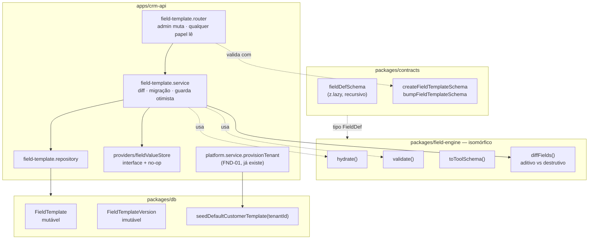
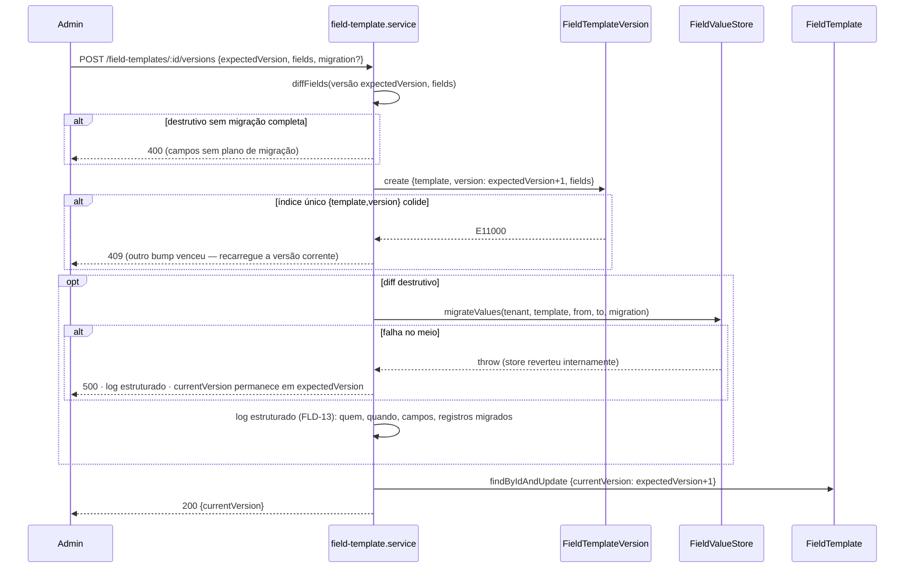

# Dynamic Field Engine — Design

**Spec**: `.specs/features/dynamic-field-engine/spec.md`
**Status**: Approved
**Depende de**: `foundation-tenancy-auth` (Verified) — reusa `req.tenantUser`, `checkRole`,
`validBody/Params/Query`, `withDbTiming`, `schemaRegistry`, o boot fail-fast e o fluxo de
provisão de Tenant (FND-01) para o seed.

---

## Architecture Overview

Um novo package isomórfico (`packages/field-engine`) carrega a árvore `FieldDef` e a
lógica pura (`hydrate`, `validate`, `toToolSchema`, `diffFields`) — zero dependência de
Mongoose ou Express, roda igual em `crm-api` (Node) e sob `jsdom` (prova de browser), sem
tocar `apps/web` nesta feature (nenhuma UI aqui — feature 4). `packages/contracts` ganha o
schema estrutural `fieldDefSchema` (fonte única da forma da árvore, de onde o tipo
`FieldDef` é inferido) e o schema de criação/bump de template. `packages/db` ganha os dois
models generalizados (AD-019): `FieldTemplate` (mutável, aponta versão corrente) e
`FieldTemplateVersion` (snapshot imutável), com `targetType: 'customer' | 'process'` como
discriminador — **um único par de collections**, não dois pares paralelos (decisão
confirmada com o usuário, ver Architecture Decisions abaixo). `apps/crm-api` ganha o módulo
`field-template` (CRUD de template restrito a `admin`) e o hook de seed automático plugado
em `platform.service.provisionTenant` (FND-01).



### Fluxo — bump de versão (aditivo vs. destrutivo)



**Por que a claim do slot de versão é a guarda, não um `currentVersion` CAS no ponteiro
mutável:** o índice único `{template:1, version:1}` em `FieldTemplateVersion` faz o SEGUNDO
`create` concorrente falhar imediatamente com `E11000`, antes de qualquer migração rodar —
exatamente o "guard otimista" que FLD-17 pede, e o invariante vive no banco (mesmo espírito
do índice parcial de `Invite.pending` da feature 1), não num `if`. Só quem reivindicou o
slot chega a migrar e a avançar o ponteiro — sem corrida possível entre os dois passos.

---

## Architecture Decisions (confirmadas com o usuário antes de detalhar componentes)

Duas escolhas de arquitetura genuínas foram levantadas com 2 opções cada, recomendação
liderando, e confirmadas explicitamente antes de qualquer componente ser detalhado:

1. **Forma das collections generalizadas** — **par único discriminado por `targetType`**
   (`fieldTemplates`/`fieldTemplateVersions`) em vez de dois pares paralelos
   (`customerTemplates`/`processTemplates`). Registrado como **AD-020**.
2. **Como provar migração destrutiva sem `Customer`/`Process` existirem ainda** —
   **interface `FieldValueStore` injetada por `targetType`**, com adapter no-op em produção
   nesta feature e um fake em memória nos testes; `crm-core` (feature 3) implementa os
   adapters reais depois, sem tocar em `field-engine`. Rejeitada a alternativa de criar já
   uma collection genérica de valores (`Customer` precisa do núcleo fixo no MESMO documento
   que `values` — decisão que é escopo da feature 3). Registrado como **AD-021**.

Uma terceira opção — rejeitar toda mudança destrutiva nesta feature e adiar a mecânica
inteira — foi descartada sem apresentar: contradiria FLD-05/AC3 e FLD-12/13, que a spec
marca "Design: Pending" (dentro do escopo desta execução), diferente de como FND-20/21/22
foram explicitamente marcados "fora do escopo" na feature 1.

---

## Code Reuse Analysis

### Existing Components to Leverage

Toda a fundação vem da feature 1, já implementada e Verified — nada aqui é portado de um
projeto de referência externo (não existe precedente de campos dinâmicos em
`../DentalEase`; ADR-0003 é uma decisão nativa deste projeto).

| Component | Location | How to Use |
| --- | --- | --- |
| `withDbTiming` | `apps/crm-api/src/metrics/db.metric.ts` | Envolver toda operação nova de `field-template.repository.ts` (FLD-18) |
| `tenantScoped` | `packages/db/src/tenantScoped.ts` | Todo filtro de repositório de `FieldTemplate`/`FieldTemplateVersion` passa por ele |
| `checkRole` / `isAdmin` | `apps/crm-api/src/middlewares/authorization.middleware.ts` | Mutação de template exige `isAdmin` (FLD-07), idêntico ao padrão de `platform.router.ts` |
| `tenantAssignmentCheck` | `apps/crm-api/src/middlewares/tenantAssign.middleware.ts` | Toda rota de `field-template` (mutação e leitura) exige tenant vinculado |
| `validBody / validParams / validQuery` | `apps/crm-api/src/middlewares/validation.middleware.ts` | Reusado literal para os novos schemas |
| `rejectWithTooManyRequests` (factory) | `apps/crm-api/src/middlewares/rateLimit.middleware.ts` | Base para `fieldTemplateRateLimit` (FLD-16) — keying muda (ver Tech Decisions) |
| `CustomError` + `errorHandler` | `apps/crm-api/src/middlewares/errorHandler.middleware.ts` | Reusado literal |
| `respObj` / `badRespObj` / `schemaRegistry` | `packages/contracts` | Reusado literal; novos schemas entram no registry |
| `transitionTenantStatus` (padrão de guarda por query) | `packages/db/src/models/tenant.model.ts:33` | Modelo do estilo "a guarda é a query" aplicado ao archive de template (FLD-19) |
| `isDuplicateKeyError` + fluxo de reenvio de `Invite` | `apps/crm-api/src/services/platform.service.ts` | Padrão de índice único + catch 11000, reusado no `create` de template (chave `{Tenant,targetType,key}`) e no slot de versão |
| DI de `MailProvider` (`providers/mail/`) | `apps/crm-api/src/providers/mail/` | Molde exato para `providers/fieldValueStore/` — mesma forma (`index.ts` com o tipo, implementação de produção à parte) |
| `MongoMemoryServer` + `globalSetup` | `packages/db/tests/setup/globalSetup.ts` | Reusado sem alteração pelos testes de integração dos novos models |
| `// @vitest-environment jsdom` (pragma por arquivo) | `apps/web/src/routes/_public/auth/index.unit.test.tsx:1` | Mecanismo exato usado para a prova de isomorfismo (FLD-01/AC5) — dois arquivos de teste em `packages/field-engine`, um default (Node) e um com o pragma, sem precisar de nenhuma mudança em `apps/web` |
| `schema é fonte, tipo é `z.infer`` (padrão) | `packages/contracts/src/schemas/provisionTenant.schema.ts:18` | `fieldDefSchema` segue o mesmo molde; `FieldDef` é `z.infer<typeof fieldDefSchema>` |

### Integration Points

| System | Integration Method |
| --- | --- |
| `platform.service.provisionTenant` (FND-01) | Ganha uma chamada a `seedDefaultCustomerTemplate(tenantId)` logo após `platformRepository.createTenant` — mesmo módulo, sem novo endpoint (AD-018: dado de bootstrap nunca é rota nova) |
| `docs/architecture.md` | Tabela "Propriedade de escrita por collection" e a seção "Motor de campos dinâmicos" ainda mostram a forma pré-AD-019 (`processTemplates` Process-only) — **desatualizada**, ver Risks & Concerns |
| `tests/structural/schema-registry.structural.test.ts` | Varre `packages/field-engine` e os novos `*.schema.ts` de `packages/contracts` automaticamente — `fieldDefSchema` e o schema de criação precisam estar em `schemaRegistry` ou o teste falha |
| `apps/web` | Nenhuma integração nesta feature — `field-engine` fica pronto para ser consumido na feature 4, mas nada em `apps/web` muda aqui (Out of Scope do spec) |

---

## Components

### `packages/field-engine` (NOVO)

- **Purpose**: motor isomórfico — define o comportamento sobre a árvore `FieldDef`, sem
  nenhuma dependência de Mongoose/Express.
- **Location**: `packages/field-engine/src/`
- **Interfaces**:
  - `hydrate(fields: FieldDef[], values: FieldValues): RenderNode[]` (FLD-01)
  - `validate(fields: FieldDef[], values: FieldValues): { valid: boolean; errors: Record<string, string[]> }` (FLD-02)
  - `toToolSchema(fields: FieldDef[]): JsonSchema` (FLD-03)
  - `diffFields(oldFields: FieldDef[], newFields: FieldDef[]): FieldDiff` — `{ kind: 'additive' } | { kind: 'destructive'; changes: DestructiveChange[] }`, puro, sem I/O — base de FLD-04/05
  - `emptyValueFor(field: FieldDef): RenderNodeValue` — usado por `hydrate` (FLD-01/AC2)
  - `DEFAULT_CUSTOMER_TEMPLATE_KEY = 'default'` — constante compartilhada com `packages/db` e `apps/crm-api`
- **Dependencies**: `@crm/contracts` (tipo `FieldDef`), `zod` (construção dinâmica de schema de valor dentro de `validate`)
- **Reuses**: nada de código — é o package novo que tudo mais consome.

### `packages/contracts` (extensão)

- **Purpose**: `fieldDefSchema` como fonte única da forma da árvore (estrutural: tipos
  permitidos, profundidade, tamanhos) — de onde `FieldDef` é inferido; schemas de API para
  criar/bumpar template.
- **Location**: `packages/contracts/src/schemas/fieldDef.schema.ts`,
  `createFieldTemplate.schema.ts`, `bumpFieldTemplate.schema.ts`
- **Interfaces**:
  - `fieldDefSchema: ZodType<FieldDef>` — `z.lazy(() => z.discriminatedUnion('type', [...]))`, recursivo em `array`(`of`)/`group`(`fields`); `.superRefine` aplica `MAX_TREE_DEPTH` (5) e `MAX_FIELDS_PER_TEMPLATE` (100) — os limites técnicos de FLD-14 (Agent's Discretion do spec)
  - `type FieldDef = z.infer<typeof fieldDefSchema>`
  - `createFieldTemplateSchema` — `{ targetType: 'customer'|'process'; key?: string; name: string; fields: FieldDef[] }.strict()`; `key` obrigatório quando `targetType==='process'`, ignorado (forçado a `DEFAULT_CUSTOMER_TEMPLATE_KEY`) quando `'customer'`
  - `bumpFieldTemplateSchema` — `{ expectedVersion: number; fields: FieldDef[]; migration?: MigrationPlan }.strict()`
  - `migrationActionSchema` / `type MigrationPlan = Record<string, MigrationAction>`
- **Dependencies**: `zod`
- **Reuses**: molde de `provisionTenant.schema.ts` (schema é a fonte, tipo é `z.infer`); `fieldId` usa o mesmo padrão de `.trim()` + `.regex()` já visto em `document` do Tenant.
- **Nota de dependência**: `packages/contracts` passa a ser importado por `packages/field-engine` (não o inverso) — ver Tech Decisions.

### `packages/db` (extensão)

- **Purpose**: os dois models generalizados (AD-019/AD-020) + o seed idempotente.
- **Location**: `packages/db/src/models/fieldTemplate.model.ts`,
  `fieldTemplateVersion.model.ts`
- **Interfaces**:
  - `FieldTemplate`, `FieldTemplateVersion` (models)
  - `archiveFieldTemplate(id: string): Promise<FieldTemplateDocument | null>` — guarda por query (`{_id, archived:false}`), padrão de `transitionTenantStatus` (FLD-19)
  - `seedDefaultCustomerTemplate(tenantId: string): Promise<void>` — dois `findOneAndUpdate` com `$setOnInsert` + `upsert:true` (FLD-09/10/11, ver Data Models)
  - `syncIndexes()` (em `index.ts`) ganha os dois novos models
- **Dependencies**: `mongoose`
- **Reuses**: `tenantScoped`, o estilo de `hashToken`-como-helper-ao-lado-do-model (aqui, `seedDefaultCustomerTemplate` ao lado de `fieldTemplate.model.ts`).

### `apps/crm-api` — módulo `field-template`

- **Purpose**: CRUD de template restrito a `admin`; leitura por qualquer papel do tenant.
- **Location**: `apps/crm-api/src/{routers,controllers,services,repositories}/fieldTemplate.*`
- **Interfaces**:
  - `POST /field-templates` → 201 `{id, currentVersion:1}` | 409 (já existe para `{targetType,key}`) — FLD-04/AC1
  - `GET /field-templates/current?targetType=&key=` → 200 `{template:{id,name,currentVersion,archived}, fields}` | 404 — alimenta FLD-11 e o consumo futuro de `crm-core`
  - `POST /field-templates/:id/versions` → 200 `{currentVersion}` | 400 (migração incompleta) | 409 (conflito de slot) — FLD-04/05/12/13/17
  - `POST /field-templates/:id/archive` → 200 — FLD-08
  - `createFieldTemplate(...)`, `bumpFieldTemplateVersion(...)`, `archiveFieldTemplate(...)`, `getCurrentTemplate(...)` no service
- **Dependencies**: `isAdmin`, `tenantAssignmentCheck`, `fieldTemplateRateLimit`, `field-engine` (`diffFields`, `validate` para validar `fields` novos antes de persistir), `providers/fieldValueStore`
- **Reuses**: forma exata de `platform.router.ts`/`.controller.ts`/`.service.ts`/`.repository.ts`.

### `apps/crm-api` — `providers/fieldValueStore`

- **Purpose**: seam de DI que isola a mecânica de migração de quem, hoje, não tem nenhum
  registro real para migrar (AD-021).
- **Location**: `apps/crm-api/src/providers/fieldValueStore/index.ts` (tipo),
  `noop.fieldValueStore.ts` (produção)
- **Interfaces**:
  - `type FieldValueStore = { countByTemplateVersion(tenantId, templateId, version): Promise<number>; migrateValues(tenantId, templateId, fromVersion, toVersion, migration): Promise<{migrated: number}> }`
  - `createNoopFieldValueStore(): FieldValueStore` — `count` sempre 0, `migrateValues` sempre `{migrated:0}` sem tocar em nada
- **Dependencies**: nenhuma
- **Reuses**: molde de `MailProvider` (`type` + fábrica de implementação, injetado no composition root de `app.ts`)
- **Costura para `crm-core`**: a feature 3 escreve `customer.fieldValueStore.ts` e
  `process.fieldValueStore.ts` implementando o mesmo tipo contra as collections reais, e
  troca a injeção em `app.ts` — nenhuma mudança em `field-template.service.ts`.

---

## Data Models

### `fieldTemplates` — escrita: `crm-api` · collection nova (renomeia `processTemplates`)

```typescript
interface FieldTemplateDocument {
  _id: ObjectId
  Tenant: ObjectId
  targetType: 'customer' | 'process'
  key: string              // 'default' para customer; escolhido pelo admin para process (ex.: 'compra')
  name: string              // 3..120
  currentVersion: number    // aponta a FieldTemplateVersion corrente
  archived: boolean         // default false
  createdAt: Date
  updatedAt: Date
}
// índices:
//   { Tenant: 1, targetType: 1, key: 1 } unique   ← FLD-10/11 (seed idempotente) e FLD-04/AC1 (409 em duplicata)
//   { Tenant: 1, targetType: 1 }
```

### `fieldTemplateVersions` — escrita: `crm-api` · collection nova (renomeia `processTemplateVersions`)

```typescript
interface FieldTemplateVersionDocument {
  _id: ObjectId
  Tenant: ObjectId
  template: ObjectId        // -> FieldTemplate._id
  targetType: 'customer' | 'process'   // denormalizado — evita join para saber o alvo a partir só da versão
  version: number
  fields: FieldDef[]         // Schema.Types.Mixed — validado por fieldDefSchema ANTES de chegar aqui, nunca revalidado pelo Mongoose (mesma convenção de "Zod é fonte única")
  createdAt: Date
}
// índices:
//   { template: 1, version: 1 } unique   ← A GUARDA de concorrência (FLD-17): quem perde o create recebe E11000
//   { Tenant: 1, targetType: 1 }
```

**Nunca apagada.** FLD-08: um registro antigo aponta para a `templateVersion` que usou;
`hydrate` continua servindo mesmo depois do template avançar ou ser arquivado.

### Seed idempotente (FLD-09/10/11)

```typescript
// Dois upserts guardados por índice — nunca um "if existe" em código.
// Cura até um estado parcial deixado por uma falha anterior no meio do seed.
const template = await FieldTemplate.findOneAndUpdate(
  { Tenant: tenantId, targetType: 'customer', key: DEFAULT_CUSTOMER_TEMPLATE_KEY },
  { $setOnInsert: { name: 'Cliente', currentVersion: 1, archived: false } },
  { upsert: true, new: true },
);

await FieldTemplateVersion.findOneAndUpdate(
  { template: template._id, version: 1 },
  { $setOnInsert: { Tenant: tenantId, targetType: 'customer', fields: DEFAULT_CUSTOMER_FIELDS } },
  { upsert: true },
);
```

`$setOnInsert` nunca sobrescreve um documento existente — se o admin já bumpou o template
para v3, o `findOneAndUpdate` do template é um no-op puro (FLD-11: customização sobrevive a
reseed). `DEFAULT_CUSTOMER_FIELDS`: um único campo `status` —

```typescript
const DEFAULT_CUSTOMER_FIELDS: FieldDef[] = [
  {
    fieldId: 'status',
    label: 'Status',
    type: 'status',
    required: true,
    options: [
      { key: 'novo', label: 'Novo', color: '#3B82F6', order: 0 },
      { key: 'ativo', label: 'Ativo', color: '#22C55E', order: 1 },
      { key: 'inativo', label: 'Inativo', color: '#94A3B8', order: 2 },
    ],
  },
];
```

Conteúdo exato ainda é assumption não confirmada em spec.md (chute do agente) — reafirmado
aqui sem bloquear o Design, como o spec já autoriza.

### `FieldDef` (tipo, `packages/contracts` + `packages/field-engine`)

```typescript
type FieldId = string; // /^[a-zA-Z][a-zA-Z0-9_]{0,59}$/ — nunca `.` nem `$` (chave de path do wildcard index `values.$**`)

type FieldDefBase = { fieldId: FieldId; label: string /* 1..120 */; required?: boolean; order?: number };

type FieldDef =
  | (FieldDefBase & { type: 'text'; multiline?: boolean; minLength?: number; maxLength?: number; pattern?: string })
  | (FieldDefBase & { type: 'number'; min?: number; max?: number; integer?: boolean; step?: number })
  | (FieldDefBase & { type: 'currency'; code: string; precision: number })      // value: inteiro em centavos
  | (FieldDefBase & { type: 'percent'; precision: number })
  | (FieldDefBase & { type: 'boolean' })
  | (FieldDefBase & { type: 'date' | 'datetime'; timezone?: string })           // value: ISO 8601 string
  | (FieldDefBase & { type: 'select'; options: { key: string; label: string }[]; multiple?: boolean })
  | (FieldDefBase & { type: 'status'; options: { key: string; label: string; color: string; order: number }[] })
  | (FieldDefBase & { type: 'document'; accept?: string[]; maxSizeMb?: number; multiple?: boolean })
  | (FieldDefBase & { type: 'reference'; target: 'customer' | 'product' | 'user' | 'process'; multiple?: boolean })
  | (FieldDefBase & { type: 'array'; of: FieldDef })     // recursivo
  | (FieldDefBase & { type: 'group'; fields: FieldDef[] }); // recursivo
```

Forma e tipos exatamente conforme a tabela já fixada em `docs/architecture.md` — nenhuma
invenção nova aqui, só a formalização em tipo/schema.

### `RenderNode` / `hydrate` (algoritmo, `packages/field-engine`)

```typescript
type RenderNode = FieldDef & { value: RenderNodeValue };

function hydrateNode(def: FieldDef, raw: unknown): RenderNode {
  if (def.type === 'group') {
    const obj = (raw ?? {}) as FieldValues;
    return { ...def, value: def.fields.map((f) => hydrateNode(f, obj[f.fieldId])) };
  }
  if (def.type === 'array') {
    const arr = Array.isArray(raw) ? raw : [];
    return { ...def, value: arr.map((item) => hydrateNode(def.of, item)) };
  }
  return { ...def, value: raw ?? emptyValueFor(def) };
}

export const hydrate = (fields: FieldDef[], values: FieldValues): RenderNode[] =>
  fields.map((f) => hydrateNode(f, values[f.fieldId]));
```

`group` e `array` sempre resolvem para `RenderNode[]` — uniforme nos dois casos recursivos,
o que é exatamente o que prova "array de group de array não perde tipo" (Independent Test
de FLD-01): cada nível reaplica a mesma função sem caso especial.

| Tipo | Valor vazio (`emptyValueFor`) |
| --- | --- |
| `text` | `''` |
| `number` / `percent` / `currency` | `null` |
| `boolean` | `false` |
| `date` / `datetime` | `null` |
| `select` (`multiple`) / `reference` (`multiple`) | `[]` |
| `select` / `status` / `reference` (não `multiple`) | `null` |
| `document` | `null` |

### `FieldValueStore` (interface, `apps/crm-api`)

```typescript
type MigrationAction =
  | { action: 'discard' }
  | { action: 'mapField'; toFieldId: string }
  | { action: 'mapOptions'; mapping: Record<string, string> };
type MigrationPlan = Record<string, MigrationAction>;

interface FieldValueStore {
  countByTemplateVersion(tenantId: string, templateId: string, version: number): Promise<number>;
  migrateValues(
    tenantId: string,
    templateId: string,
    fromVersion: number,
    toVersion: number,
    migration: MigrationPlan,
  ): Promise<{ migrated: number }>;
}
```

**Relationships**: `FieldTemplateVersion.template → FieldTemplate._id`. Futuro (feature 3):
`Customer.template`/`templateVersion` e `Process.template`/`templateVersion` apontam para
cá; `FieldValueStore` real dessa feature migra `customers`/`processes`.

---

## Error Handling Strategy

| Error Scenario | Handling | User Impact |
| --- | --- | --- |
| `fields` fora da forma de `fieldDefSchema` (tipo inválido, profundidade > 5, > 100 campos, `fieldId` malformado) | `validBody(createFieldTemplateSchema \| bumpFieldTemplateSchema)` | 400 com o campo e o motivo |
| Corpo contém `Tenant`/`tenantId`/`orgId` | `.strict()` + `TENANT_FORBIDDEN_KEYS` (sweep estrutural) | Campo nem chega ao service (AD-010) |
| Usuário sem `admin` tenta criar/bumpar/arquivar template | `isAdmin` antes do controller | 403 sem tocar dados (FLD-07) |
| `POST /field-templates` duplicado para `{Tenant,targetType,key}` | Índice único + `isDuplicateKeyError` | 409, nenhum template duplicado (FLD-04/AC1 aplicado à unicidade) |
| Bump destrutivo sem `migration` cobrindo toda mudança destrutiva | `diffFields` + checagem de cobertura antes de qualquer `create` | 400, nada persistido (FLD-05/AC3) |
| Dois admins bumpam a mesma versão ao mesmo tempo | Índice único `{template,version}` — perdedor recebe `E11000` | 409 "recarregue a versão corrente" (FLD-17) |
| Migração destrutiva falha no meio (`FieldValueStore.migrateValues` lança) | Version N+1 já criada mas nunca referenciada (órfã inofensiva); `currentVersion` nunca avança | 500 + log estruturado; template continua servindo a versão anterior (FLD-12) |
| Migração destrutiva bem-sucedida | Log estruturado com quem/quando/template/campos/registros migrados | 200 (FLD-13) |
| `GET /field-templates/current` sem template para `{targetType,key}` | Repositório devolve `null` | 404 |
| Registro antigo aponta para versão de um template já arquivado | `hydrate` não distingue — só lê a `FieldTemplateVersion`, nunca checa `archived` | Renderiza normalmente (FLD-08) |
| Novo registro tenta usar template arquivado | Checagem no consumidor (`crm-core`, feature 3) — fora desta feature, mas o campo `archived` já existe para isso | — |
| `reference` aponta para um registro apagado | `hydrate` devolve o `value` como está gravado (ObjectId), sem tentar resolver o alvo | Nunca lança — resolução de referência pendente é responsabilidade do consumidor (crm-core) |
| Excesso de mutações de template | `fieldTemplateRateLimit` (por tenant+IP) | 429 (FLD-16) |

---

## Risks & Concerns

| Concern | Location (file:line) | Impact | Mitigation |
| --- | --- | --- | --- |
| `docs/architecture.md` ainda documenta `processTemplates`/`processTemplateVersions` Process-only (tabela de propriedade de escrita e a seção "Motor de campos dinâmicos") | `docs/architecture.md:72`, `docs/architecture.md:118-176` | Implementador (ou uma feature futura) lê o doc estático e codifica contra a forma pré-AD-019, divergindo deste design | Primeira task da fase Tasks: sincronizar `docs/architecture.md` e `docs/glossary.md` (entradas `ProcessTemplate`/`ProcessTemplateVersion`) com o par único `targetType`-discriminado antes de qualquer código |
| A varredura `TENANT_FORBIDDEN_KEYS` do teste estrutural só inspeciona `schema instanceof z.ZodObject` no nível raiz do registry — não recursa em `z.discriminatedUnion`/`z.lazy()` | `tests/structural/schema-registry.structural.test.ts:89-98` | Uma variante de `FieldDef` (ex.: `text`) poderia em tese declarar uma chave `tenant` sem o sweep pegar, já que ela vive dentro de um `discriminatedUnion` embrulhado em `lazy` | Risco baixo (nenhuma variante de `FieldDef` tem motivo legítimo para uma chave desse tipo) — registrado como melhoria futura do sweep (recursar em union members), não bloqueia esta feature |
| FLD-12 exige rollback completo sob falha no meio da migração, mas o projeto não usa transação Mongo nativa (`MongoMemoryServer` standalone, decisão herdada da feature 1) | `packages/db/tests/setup/globalSetup.ts:6` | Uma implementação real de `FieldValueStore` (feature 3, sobre `customers`/`processes`) não pode confiar em `session.withTransaction` | Esta feature só precisa provar a MECÂNICA (diff, rejeição, log, ponteiro) contra um fake em memória cuja atomicidade é trivial (cópia local, troca só no fim). A materialização Mongo real (staged writes com marcador de progresso + resume idempotente, ou write-ahead auditável) fica para o Design de `crm-core` — documentado aqui para não ser esquecido |
| `fields: Schema.Types.Mixed` no Mongoose não revalida a forma de `FieldDef` — confia inteiramente em `fieldDefSchema` já ter rodado antes | `packages/db/src/models/fieldTemplateVersion.model.ts` (a criar) | Uma escrita direta ao banco (script, migração manual) fora do fluxo HTTP puderia gravar uma árvore inválida sem ninguém barrar | Mesma convenção já aceita no projeto ("Zod é fonte única de validação"; nenhum model Mongoose do projeto duplica validação de forma) — sem mitigação adicional, é o trade-off assumido |

> Nenhum problema de fragilidade/débito encontrado no que já existe (feature 1) que toque
> esta feature além do já listado — o resto do código percorrido (middlewares, repositórios,
> `app.ts`) está limpo o suficiente para reuso direto, sem novos achados.

---

## Tech Decisions

| Decision | Choice | Rationale |
| --- | --- | --- |
| Forma das collections generalizadas | Par único `fieldTemplates`/`fieldTemplateVersions`, discriminador `targetType` | Confirmado com o usuário. **AD-020** |
| Mecânica de migração sem consumidor real ainda | Interface `FieldValueStore` injetada por `targetType`, no-op em produção nesta feature | Confirmado com o usuário. **AD-021** |
| Onde vive o tipo `FieldDef` | `packages/contracts` (schema `fieldDefSchema`, fonte única — `FieldDef = z.infer<...>`); `packages/field-engine` importa o TIPO de lá | Seguir o padrão já estabelecido em `contracts` (schema é a fonte, tipo é `z.infer`) evita duplicar a árvore como Zod em dois lugares (exatamente o que AD-001 diz que "diverge"). `contracts` ganha uma dependência de workspace nova (nenhuma antes) — sem ciclo, já que `field-engine` não depende de `contracts` para nada além do tipo |
| `toToolSchema` sem biblioteca externa (`zod-to-json-schema` etc.) | Mapeamento recursivo escrito à mão, mesma travessia de `validate` | Mantém `field-engine` com uma única dependência externa (`zod`); evita pesquisar/pinar mais uma lib para uma função que já reusa a mesma árvore que `validate` percorre |
| Guarda de concorrência do bump (FLD-17) | Claim do slot `{template,version}` via índice único, não CAS em `currentVersion` | O índice único serializa os dois requests no MESMO ponto que decide quem migra — nenhuma janela onde dois admins migram valores em paralelo para a mesma versão |
| Prova de isomorfismo (FLD-01/AC5) | Dois arquivos de teste dentro de `packages/field-engine` — um default (Node), um com `// @vitest-environment jsdom` — sem tocar `apps/web` | `apps/web` está fora do escopo desta feature; o pragma por arquivo já é o mecanismo usado no projeto (`_public/auth/index.unit.test.tsx`), plenamente suficiente para provar o comportamento sob DOM |
| Limites de FLD-14 | `MAX_TREE_DEPTH = 5`, `MAX_FIELDS_PER_TEMPLATE = 100`, `label` 1..120, `fieldId` `/^[a-zA-Z][a-zA-Z0-9_]{0,59}$/` | Agent's Discretion (spec não define número) — limites técnicos conservadores; `fieldId` proíbe `.`/`$` porque vira segmento de path do índice wildcard `values.$**` já fixado em `docs/architecture.md` |
| `key` de template | Fixo `'default'` (constante `DEFAULT_CUSTOMER_TEMPLATE_KEY`) para `customer`; escolhido pelo admin para `process` | `customer` tem exatamente um template por tenant (glossário, spec); `process` admite vários tipos (`compra`, `agendamento`) — mesmo exemplo já usado em `docs/architecture.md` |
| Rate limit de mutação de template | Chave `tenant+IP` (não e-mail+IP como login/convite) | Rotas autenticadas, sem e-mail no corpo — divergência consciente do `emailAndIpKeyGenerator` da feature 1 |
| Bump em template arquivado | Permitido — nenhum AC do spec proíbe | `archived` só bloqueia NOVO USO por registro (FLD-08); inventar uma restrição extra não pedida seria escopo não solicitado |

> **Project-level decisions:** AD-020 e AD-021 vão para `.specs/STATE.md`. As demais linhas
> são locais desta feature.

---

## Requirement → Component

| ID | Onde é implementado | Onde é provado |
| --- | --- | --- |
| FLD-01 | `field-engine.hydrate` | unit: fixture com `array` de `group` de `array`; isomorfismo Node vs. jsdom |
| FLD-02 | `field-engine.validate` | unit: uma regra por tipo, erro por `fieldId`, nunca lança |
| FLD-03 | `field-engine.toToolSchema` | unit: JSONSchema sem nenhuma chave de tenant |
| FLD-04 | `fieldTemplate.service.createFieldTemplate` / `bumpFieldTemplateVersion` | e2e: criação vira v1; bump aditivo não pede migração |
| FLD-05 | `bumpFieldTemplateVersion` + `diffFields` | e2e: bump destrutivo sem `migration` → 400; com `migration` → aceito |
| FLD-06 | `FieldTemplateVersion` imutável + `hydrate` | integration: registro em v1 renderiza igual após template avançar pra v3 |
| FLD-07 | `isAdmin` no `field-template.router` | e2e: 403 para `gestor`/`operador` |
| FLD-08 | `archiveFieldTemplate` (guarda por query) | integration: `hydrate` de registro existente funciona após archive; novo uso bloqueado no consumidor |
| FLD-09 | `seedDefaultCustomerTemplate` chamado de `platform.service.provisionTenant` | e2e: provisionar tenant → `GET /field-templates/current` já devolve `status` |
| FLD-10 | Upserts guardados por índice em `seedDefaultCustomerTemplate` | integration: seed chamado 2x, um único template |
| FLD-11 | `$setOnInsert` (nunca sobrescreve) | integration: bump customiza, reseed não reverte |
| FLD-12 | `FieldValueStore.migrateValues` (fake em memória) + ordem versão-antes-de-ponteiro | integration: fault injection no fake, nenhum registro órfão, `currentVersion` não avança |
| FLD-13 | Log estruturado em `bumpFieldTemplateVersion` | unit: evento com quem/quando/template/campos/registros |
| FLD-14 | `fieldDefSchema` (`.superRefine`) | unit: árvore acima do limite → rejeitada antes de persistir |
| FLD-15 | Índice único `{template,version}` | integration: dois bumps concorrentes → uma versão nova, um 409 |
| FLD-16 | `fieldTemplateRateLimit` | integration: N+1 mutações → 429 |
| FLD-17 | Claim do slot de versão (ver Architecture Overview) | integration: `Promise.all` de dois bumps → 1 sucesso + 1× 409 |
| FLD-18 | `withDbTiming` em `field-template.repository` + log em migração destrutiva | unit: instrumento chamado; falha de dependência já coberta por FND-18 (N/A nova aqui) |
| FLD-19 | `archiveFieldTemplate` guardado + índice único do slot de versão | unit: archive em template já arquivado é no-op idempotente |

---

## Handoff para Tasks

Estimativa: ~16-20 tasks em 5 fases — (0) sincronizar `docs/architecture.md`/`docs/glossary.md`
com AD-019/AD-020 (Risks & Concerns), (1) `packages/field-engine` (tipos + `hydrate` +
`validate` + `toToolSchema` + `diffFields`, com a prova de isomorfismo), (2)
`packages/contracts` (`fieldDefSchema` + schemas de API) + `packages/db` (models + seed),
(3) `apps/crm-api` módulo `field-template` (router/controller/service/repository +
`providers/fieldValueStore`), (4) hook do seed em `platform.service.provisionTenant` +
testes de integração/estrutural (isolamento entre tenants estendido, `schemaRegistry`).
Isso passa de um batch de ~7 tasks — a fase Execute deve começar pela oferta de
sub-agentes (offer-then-confirm), com o Verifier independente rodando automaticamente
depois da última task.
