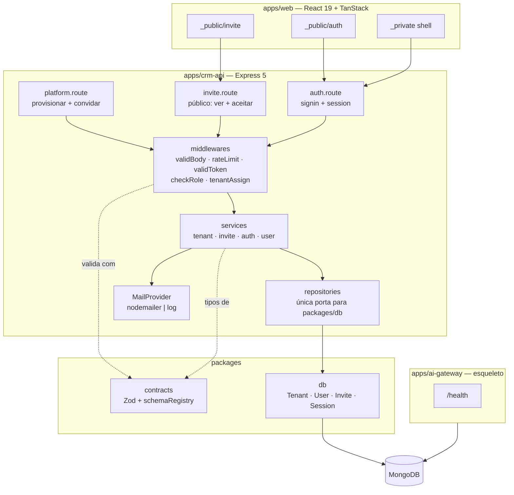
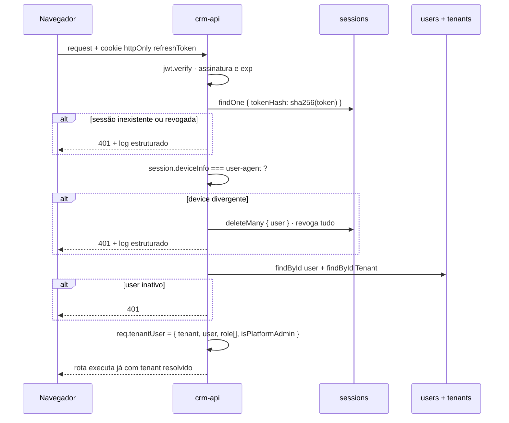

# Foundation: Tenancy & Auth — Design

**Spec**: `.specs/features/foundation-tenancy-auth/spec.md`
**Status**: Approved
**Escopo de execução**: FND-01..19. FND-20 (P2), FND-21 (P2) e FND-22 (P3) não têm fase
atribuída na tabela de rastreabilidade do spec — este design deixa a costura pronta e
documentada para cada um, sem implementá-los.

---

## Architecture Overview

Uma fatia vertical em monorepo pnpm: `packages/contracts` (Zod, fonte única) e
`packages/db` (Mongoose, dono único dos schemas) são consumidos pelo `crm-api`, que expõe
as rotas de plataforma, convite e sessão; o `ai-gateway` nasce como esqueleto para honrar
AD-002 e o critério de `/health` nos dois back-ends; o `web` entrega três telas que provam
o contrato de sessão no navegador.

O eixo do design é o **contrato de sessão**: nada no sistema lê tenant de entrada externa.
`req.tenantUser` é produzido por um único middleware, a partir do banco, e é a única fonte
de `Tenant` para toda feature futura (AD-010).



### Fluxo de sessão — o contrato que todas as features consomem



**Por que a leitura do banco não é opcional:** P1-3/AC1 exige `req.tenantUser` populado a
partir do banco, não do payload do token. Isso também é o que faz papel revogado, usuário
desativado (FND-20) e tenant suspenso (FND-22) valerem no próximo request, sem esperar
expiração de token.

---

## Code Reuse Analysis

### Existing Components to Leverage

Não há código neste repositório. Todo reuso vem dos projetos de referência, portado com os
ajustes anotados na coluna direita.

| Component | Location | How to Use |
| --- | --- | --- |
| `createAuthMiddleware` + injeção de `AuthProvider` | `../DentalEase/DentalEase-BackEnd/src/middlewares/authentication.middleware.ts` | **Portar a forma, reescrever o corpo**: mantém a fábrica com provider injetado (testável sem HTTP); troca o array embutido por lookup em `sessions`, remove os `console.log` de credencial e corrige o parse do header (ver Risks 1, 2 e 4) |
| `checkRole` + aliases por papel | `.../src/middlewares/authorization.middleware.ts` | Portar quase literal; papéis passam a `admin \| gestor \| operador` e os aliases a `isAdmin`, `isGestor`, `isOperador` |
| `clinicAssignmentCheck` (424) | `.../src/middlewares/clinicAssign.middleware.ts` | Portar como `tenantAssignmentCheck` — mesma semântica, mesmo 424 (FND-05/AC4) |
| `validBody / validParams / validQuery` | `.../src/middlewares/validation.middleware.ts` | Portar a interface, reescrever a implementação para Zod 4 (`error.issues`) e para **um único** `next()` (Risk 4) |
| `errorHandler` + `CustomError` | `.../src/middlewares/errorHandler.middleware.ts` | Portar; `console.error` de stack vira log estruturado com `requestId` |
| `respObj / badRespObj / returnMessage / returnData` | `.../src/helpers/responsePattern.helper.ts` | Portar para `packages/contracts` — o front tipa a resposta a partir do mesmo lugar |
| `env` por Zod, parse no import | `.../src/config/env.config.ts` | Portar o padrão; mensagem de falha passa a **nomear a variável** ausente (FND-18) |
| `cookieOptions` / `clearCookieOptions` | `.../src/config/cookie.config.ts` | Portar literal |
| `dbConnect` + `dbReqResTime` timer no repositório | `.../src/config/db.config.ts`, `.../src/repositories/user.repository.ts` | Portar; boot ganha `process.exit(1)` explícito (FND-18) e o timer por operação atende FND-17 |
| `platformSubscriptionGuard` (rate limit com `keyGenerator` async) | `.../src/middlewares/platform-subscription-guard.middleware.ts` | Referência de uso de `express-rate-limit` v8 para FND-14; nossa versão é síncrona e por e-mail/IP |
| `toDomain` / `DbX → DomainX` no repositório | `.../src/repositories/user.repository.ts` | Portar o padrão: `ObjectId` nunca escapa do repositório |
| Infra de teste com `MongoMemoryServer` + `clearCollections` | `.../tests/setup/globalSetup.ts`, `.../tests/helpers/db.helper.ts` | Portar a mecânica para `globalSetup` do Vitest (AD-015) |
| `client.api.ts` (`credentials: 'include'`, `{success,data,message}`) | `../DentalEase/DentalEase/src/lib/api/client.api.ts` | Portar simplificado: sem o ramo de `accessToken` em Zustand (não temos access token — AD-014) |
| `_private.tsx` com `beforeLoad` + `redirect` | `../DentalEase/DentalEase/src/routes/_private.tsx` | Portar a forma; a verdade da sessão vem de `ensureQueryData(GET /auth/session)`, não de Zustand (ver Tech Decisions) |
| Página = `createFileRoute` + `<Card asPage>`, `t()` em toda string | `../DentalEase/DentalEase/CLAUDE.md` | Regra obrigatória desde a primeira tela |

### Integration Points

| System | Integration Method |
| --- | --- |
| MongoDB | Conexão única por processo em `packages/db`; `crm-api` e `ai-gateway` usam a mesma connection string e **nunca** se chamam (AD-002) |
| SMTP | Porta `MailProvider` com duas implementações: `nodemailer` e `log` (dev/test). Falha não derruba operação (FND-12/18) |
| Prometheus | `prom-client` com `reqResTime` (HTTP) e `dbReqResTime` (por operação de banco) — só o instrumento, sem dashboard (FND-17) |
| `apps/web` → `crm-api` | `fetch` com `credentials: 'include'`; CORS com origem explícita e `credentials: true` |
| Collections desta feature | `tenants`, `users`, `invites`, `sessions` — todas propriedade de escrita do `crm-api` na tabela do `docs/architecture.md`. `invites` e `sessions` são novas e precisam entrar naquela tabela |

---

## Components

### `packages/contracts`

- **Purpose**: fonte única de validação e tipos, mais o registry que o teste estrutural do AD-010 percorre.
- **Location**: `packages/contracts/src/`
- **Interfaces**:
  - `provisionTenantSchema`, `createInviteSchema`, `acceptInviteSchema`, `signinSchema`, `inviteTokenParamSchema`, `idSchema`
  - `type Role = 'admin' | 'gestor' | 'operador'`; `type TenantUser = { tenant?: string; user: string; role: Role[]; isPlatformAdmin: boolean }`
  - `type ApiResponse<T> = { success: boolean; data?: T; message?: string }` + `respObj`, `badRespObj`, `returnData`, `returnMessage`
  - `schemaRegistry: ReadonlyArray<{ name: string; schema: ZodType }>` — todo schema de entrada é registrado aqui
  - `TENANT_FORBIDDEN_KEYS = ['tenant', 'tenantid', 'tenant_id', 'orgid', 'org_id', 'clinic', 'company']`
- **Dependencies**: `zod@4`
- **Reuses**: estilo de `src/schemas/*.schema.ts` e `responsePattern.helper.ts` do DentalEase.

### `packages/db`

- **Purpose**: único lugar do projeto onde Mongoose existe — models, conexão e índices.
- **Location**: `packages/db/src/`
- **Interfaces**:
  - `connect(uri: string): Promise<void>` — falha propaga para o boot; `disconnect(): Promise<void>`
  - `Tenant`, `User`, `Invite`, `Session` (models) + `syncIndexes(): Promise<void>`
  - `tenantScoped<F extends { Tenant: string }>(filter: F): F` — assinatura que torna filtro sem `Tenant` erro de tipo; é a semente do `TenantScopedRepo` do AD-010 que o `ai-kit` vai consumir na feature 9
- **Dependencies**: `mongoose@9`
- **Reuses**: `src/database/*.database.ts` do DentalEase (forma do schema, `timestamps: true`).

### `apps/crm-api` — middlewares

- **Purpose**: aplicar o contrato de sessão, validação e limites antes de qualquer service.
- **Location**: `apps/crm-api/src/middlewares/`
- **Interfaces**:
  - `createAuthMiddleware(deps: AuthDeps)` → `{ validToken }` — `AuthDeps = { findSessionByHash, revokeAllSessions, getUserById, getTenantById }`
  - `checkRole(allowed: Role[])`, `isAdmin`, `isGestor`, `isOperador`
  - `platformAdminOnly` — 403 antes de qualquer acesso a dados (FND-01/AC3)
  - `tenantAssignmentCheck` — 424 (FND-05/AC4)
  - `validBody(schema)`, `validParams(schema)`, `validQuery(schema)`
  - `signinRateLimit`, `inviteRateLimit` (FND-14)
  - `errorHandler`, `responseTime`
- **Dependencies**: `packages/contracts`, services do próprio app (injetados no barrel, como no `middlewares/index.ts` de referência)
- **Reuses**: os cinco middlewares do DentalEase listados no Code Reuse.

### `apps/crm-api` — módulo `platform`

- **Purpose**: provisionar tenant e convidar o primeiro admin.
- **Location**: `apps/crm-api/src/{routers,controllers,services,repositories}/platform.*`
- **Interfaces**:
  - `POST /platform/tenants` → 201 `{ id }` (FND-01)
  - `POST /platform/tenants/:id/invites` → 201, ou **202 quando o e-mail falhou** (FND-02, FND-12)
  - `provisionTenant(data: ProvisionTenant): Promise<{ id: string }>`
  - `inviteToTenant(tenantId: string, data: CreateInvite, invitedBy: string): Promise<InviteResult>`
- **Dependencies**: `platformAdminOnly`, `inviteRateLimit`, `MailProvider`, repositórios de tenant/user/invite
- **Reuses**: fluxo `emailValidation` do `auth.service.ts` de referência — inclusive a lição do rollback quando o envio falha, aqui resolvida sem rollback (o convite fica e é reenviável).

### `apps/crm-api` — módulo `invite` (público)

- **Purpose**: mostrar o convite e transformá-lo em usuário com sessão.
- **Location**: `apps/crm-api/src/{routers,controllers,services,repositories}/invite.*`
- **Interfaces**:
  - `GET /invites/:token` → `{ tenantName, email }` sem autenticação (FND-03/AC1)
  - `POST /invites/:token/accept` → cria `User`, marca convite `accepted`, abre sessão (FND-03/AC2, FND-15)
  - `peekInvite(token: string)` — 410 distinguindo `expirado` de `inválido`, sem revelar e-mail (FND-03/AC3)
  - `acceptInvite(token: string, data: AcceptInvite, deviceInfo: string)`
- **Dependencies**: repositório de invite, `bcrypt`, serviço de sessão
- **Reuses**: `signup` do `auth.service.ts` (validação de código/estado antes de criar usuário).

### `apps/crm-api` — módulo `auth`

- **Purpose**: emitir e resolver sessão.
- **Location**: `apps/crm-api/src/{routers,controllers,services,repositories}/auth.*`
- **Interfaces**:
  - `POST /auth/signin` → cookie `refreshToken` + `{ message }` (FND-04)
  - `GET /auth/session` → `{ tenant: { id, name, status }, user: { id, name, email }, role[] }` (FND-05, alimenta o shell)
  - `signin(data: SignIn, deviceInfo: string)`, `issueSession(userId, tenantId, deviceInfo)`, `revokeAllSessions(userId)`
- **Dependencies**: `signinRateLimit`, `bcrypt`, `jsonwebtoken`, repositório de sessão
- **Reuses**: `signin` / `generateRefreshToken` / `saveRefreshToken` do `auth.service.ts` — com o `await` que falta no original (Risk 5).
- **Costura para FND-21**: `revokeAllSessions` e `deleteSessionByHash` já existem aqui; `POST /auth/logout` e `POST /auth/logout-all` são uma task cada quando o requisito entrar.

### `apps/crm-api` — boot

- **Purpose**: subir com env validado e Mongo conectado, ou não subir.
- **Location**: `apps/crm-api/src/{server.ts,app.ts,config/}`
- **Interfaces**: `buildApp(): Express` (sem `listen`, para o supertest) · `start(): Promise<void>` (valida env → conecta → `syncIndexes` → `listen`)
- **Dependencies**: `packages/db`, `zod`
- **Reuses**: `env.config.ts` e `db.config.ts` de referência, com fail-fast explícito (FND-18).

### `apps/ai-gateway` — esqueleto

- **Purpose**: existir, para que AD-002 e o critério de sucesso dos dois `/health` sejam verdadeiros desde a feature 1.
- **Location**: `apps/ai-gateway/src/`
- **Interfaces**: `GET /health` → `{ success: true, data: { service: 'ai-gateway', db: 'up' } }`
- **Dependencies**: `packages/db` (só conexão), `zod`
- **Reuses**: o mesmo `buildApp`/`start` do `crm-api`.

### `apps/web` — telas mínimas

- **Purpose**: provar a fatia vertical no navegador.
- **Location**: `apps/web/src/`
- **Interfaces**:
  - `_public/auth/index.tsx` — login (FND-10/AC2, AC4)
  - `_public/invite/index.tsx` — aceite; token via **search param** (`?token=`), nunca `$id`, conforme a regra de rotas do front de referência (FND-10/AC1)
  - `_private.tsx` — guarda por `beforeLoad` + `ensureQueryData(sessionQuery)`; `_private/index.tsx` — shell com nome do tenant e papel (FND-10/AC2, AC3)
  - `lib/api/client.api.ts` — `request()` + `GET/POST`, `credentials: 'include'`, retorna `ApiResponse<T>` de `packages/contracts`
  - `query/session.ts` — `sessionKeys` + `sessionQuery` (TanStack Query é dono da verdade)
- **Dependencies**: React 19, TanStack Router/Query, ShadCN, Tailwind 4, react-hook-form + `@hookform/resolvers`, `packages/contracts`
- **Reuses**: `client.api.ts` e `_private.tsx` do front de referência; `<Card asPage>`, `<DefaultLoading>`, `t()`.

---

## Data Models

### `tenants` — escrita: `crm-api`

```typescript
interface Tenant {
  _id: ObjectId
  name: string            // 3..120
  document: string        // CNPJ normalizado, só dígitos
  status: 'provisioned' | 'active' | 'suspended'
  createdAt: Date
  updatedAt: Date
}
// índices: { document: 1 } unique
```

**Máquina de estados (FND-19):** `provisioned → active` no primeiro convite aceito ·
`active ⇄ suspended` (FND-22, não implementado). Transições por
`findOneAndUpdate({ _id, status: <origem> })` — a guarda é a query, não um `if`.

### `users` — escrita: `crm-api`

```typescript
interface User {
  _id: ObjectId
  name: string                 // 3..80
  email: string                // sempre lowercase + trim
  password: string             // bcrypt, cost 10
  Tenant?: ObjectId            // ausente somente quando isPlatformAdmin
  role: Role[]                 // ['admin' | 'gestor' | 'operador']
  isPlatformAdmin: boolean     // default false — NUNCA aceito por rota
  active: boolean              // default true
  createdAt: Date
  updatedAt: Date
}
// índices: { email: 1 } unique
// validação de schema: Tenant obrigatório  ⟺  !isPlatformAdmin
```

**Relationships**: `User.Tenant → Tenant._id`. `Invite` produz exatamente um `User`.

**E-mail é globalmente único e um `User` pertence a um único `Tenant` na v1.** O AC4 de P1-1
fala de "e-mail que já pertence a um usuário **deste mesmo** Tenant", o que admitiria
unicidade por tenant — mas nenhum AC de P1-3 prevê desambiguação de empresa no login, e
`POST /auth/signin` recebe só e-mail e senha. Unicidade global mantém o login determinístico
e ainda satisfaz o AC4 (responde 409 no caso que o AC descreve; o caso "e-mail em outro
tenant" o AC não especifica). Consequência assumida: a mesma pessoa em duas empresas precisa
de dois e-mails. Registrado como **AD-016**.

### `invites` — escrita: `crm-api` · collection nova

```typescript
interface Invite {
  _id: ObjectId
  Tenant: ObjectId
  email: string                // lowercase + trim
  role: Role
  tokenHash: string            // sha256 do token opaco de 32 bytes
  status: 'pending' | 'accepted' | 'revoked'
  expiresAt: Date              // criação + 7 dias
  invitedBy: ObjectId
  sentAt?: Date                // ausente = e-mail não saiu (FND-12)
  createdAt: Date
  updatedAt: Date
}
// índices:
//   { tokenHash: 1 } unique
//   { Tenant: 1, email: 1 } unique  partialFilterExpression: { status: 'pending' }
//   { Tenant: 1, status: 1 }
```

**O token nunca é gravado — só o hash.** A URL do convite carrega o token opaco; o servidor
busca por `sha256(token)`. Vazamento do banco não produz convite utilizável.

**Sem índice TTL, de propósito.** FND-16 pede TTL de 7 dias, mas P1-2/AC3 exige **distinguir
expirado de inválido** — apagar o documento destruiria a informação que o AC pede. Expiração
é lógica (`expiresAt < now` → 410 "expirado"; documento ausente → 410 "inválido"). Limpeza
física, se um dia importar, é job de arquivamento, não TTL.

**Reenvio (FND-13):** `updateMany({ Tenant, email, status: 'pending' }, { status: 'revoked' })`
e só então cria o novo. O índice único parcial garante que nunca existam dois `pending` para
o mesmo par — o invariante é do banco, não do código.

**Aceite concorrente (FND-15):** `findOneAndUpdate({ tokenHash, status: 'pending', expiresAt: { $gt: now } }, { $set: { status: 'accepted' } })`. Quem recebe `null` responde 410. O
`{ email: 1 }` unique de `users` é a segunda barreira. Não há transação — e não pode haver:
o `MongoMemoryServer` sobe standalone, sem replica set.

### `sessions` — escrita: `crm-api` · collection nova

```typescript
interface Session {
  _id: ObjectId
  user: ObjectId
  Tenant?: ObjectId
  tokenHash: string        // sha256 do JWT emitido
  deviceInfo: string       // user-agent no momento da emissão
  expiresAt: Date
  createdAt: Date
}
// índices:
//   { tokenHash: 1 } unique
//   { user: 1 }
//   { expiresAt: 1 } expireAfterSeconds: 0    ← TTL real (FND-16)
```

**Por que collection separada, e não `refreshToken[]` dentro do `User` como no DentalEase:**
índice TTL do MongoDB apaga o **documento**; num array de datas ele usa a data mais antiga e
apagaria o **usuário inteiro**. Com collection própria, FND-16 é um índice, FND-06 e FND-21
são `deleteMany({ user })`, e o documento de usuário para de crescer sem limite.

---

## Error Handling Strategy

| Error Scenario | Handling | User Impact |
| --- | --- | --- |
| Body/params/query fora do schema | `validBody` agrega `error.issues` numa mensagem e chama `next()` **uma vez** | 400 com o campo e o motivo em pt-BR |
| Senha abaixo de 8 caracteres | Zod no `acceptInviteSchema`, antes de qualquer escrita | 400, usuário não criado (FND-03/AC4) |
| Corpo com `Tenant`/`tenantId`/`orgId` | Schemas com `.strict()`; o campo nem chega ao service. O valor de tenant vem só de `req.tenantUser` | Campo ignorado; nenhuma escrita cruzada (FND-07) |
| Sem cookie e sem `Authorization` | `validToken` lança 401 antes de qualquer query | Front redireciona ao login, sem loop |
| Token válido mas sessão ausente do banco | 401 + log estruturado `{ event: 'session.replay', userId }` | 401 |
| `user-agent` divergente do da sessão | `deleteMany({ user })` → 401 + log `{ event: 'session.device_mismatch' }` | Todas as sessões caem (FND-06/AC2) |
| Usuário desativado | 401 na resolução da sessão | 401 (costura de FND-20) |
| Papel fora da lista da rota | `checkRole` responde antes de tocar dados | 403 (FND-08) |
| Rota de plataforma sem `isPlatformAdmin` | `platformAdminOnly` antes do controller | 403, nada criado (FND-01/AC3) |
| Usuário sem `Tenant` em rota de tenant | `tenantAssignmentCheck` | 424 orientando concluir o vínculo (FND-05/AC4) |
| E-mail já cadastrado | Índice único + checagem prévia | 409 sem convite duplicado (FND-01/AC4) |
| Convite expirado · aceito · inexistente | Comparação de `expiresAt` e `status`; mensagens distintas, **sem** eco do e-mail | 410 "expirado" ou 410 "inválido" (FND-03/AC3) |
| Aceite concorrente do mesmo convite | `findOneAndUpdate` guardado; perdedor recebe `null` | Um único usuário criado; segundo recebe 410 (FND-15) |
| SMTP indisponível no convite | Convite persiste, `sentAt` fica ausente, resposta 202 | 202 "convite criado, envio falhou" + reenvio disponível (FND-12/18) |
| Excesso de tentativas de login/convite | `express-rate-limit` por e-mail normalizado + IP | 429 com mensagem legível (FND-14) |
| Mongo indisponível no boot | `connect` rejeita → log + `process.exit(1)` | Processo não sobe; nenhum tráfego aceito (FND-18) |
| Variável de ambiente ausente | `envSchema.safeParse` no boot, mensagem **nomeando** a variável | Boot falha com o nome do que falta (FND-18) |
| Erro não previsto | `errorHandler` → 500 com `badRespObj`; stack em log estruturado, nunca na resposta | 500 com mensagem genérica |
| Falha de request no front | Toda tela lê `message` do `ApiResponse` | Mensagem do back-end, nunca erro cru (FND-10/AC4) |

---

## Risks & Concerns

Concerns levantados na leitura dos projetos de referência — é de lá que este código nasce,
então o débito de lá é risco daqui.

| Concern | Location (file:line) | Impact | Mitigation |
| --- | --- | --- | --- |
| Credencial em log: o header `Authorization` inteiro e o device vão para `console.log` em todo request | `DentalEase-BackEnd/src/middlewares/authentication.middleware.ts:15` | Token utilizável exposto em log agregado; sessão de qualquer usuário sequestrável a partir do log | Portar sem esses logs. O log estruturado de anomalia (FND-17) registra `event`, `userId`, `sessionId` e motivo — nunca token, nunca header |
| Parse do header com `&&` onde a lógica pede `||`: `mobileUser?.length !== 2 && mobileUser?.[0] !== "Ease"` só rejeita quando **ambas** as condições falham | `.../authentication.middleware.ts:16` | Header malformado com scheme correto (ou o inverso) passa da validação | Reescrever a extração do token como função pura testada nos 4 casos (ausente, scheme errado, partes erradas, válido); a borda do edge case "cookie ausente + `Authorization` presente" do spec cai exatamente aqui |
| `refreshToken[]` embutido no documento de usuário, sem limite de tamanho e sem expiração física | `.../src/database/user.database.ts:8` | Documento cresce indefinidamente; FND-16 impossível de atender com TTL sem apagar o usuário | Collection `sessions` com índice TTL em `expiresAt` (ver Data Models) |
| `next()` chamado dentro do `for` sobre os erros de validação — um request pode chamar `next` N vezes | `.../src/middlewares/validation.middleware.ts:30` | `ERR_HTTP_HEADERS_SENT` e resposta indeterminada quando há mais de um campo inválido | Reescrever agregando os `issues` numa única mensagem, com um único `next()`; teste com dois campos inválidos no mesmo body |
| `saveRefreshToken(...)` chamado sem `await` no `signin` | `.../src/services/auth.service.ts:70` | Corrida real: o cookie pode chegar ao cliente antes de a sessão existir no banco, e o primeiro request autenticado toma 401 | `await` na emissão de sessão; teste que faz `signin` seguido de `GET /auth/session` na mesma sequência |
| Zod 4 renomeou o acesso a erros: `e.errors` → `e.issues` | `.../src/middlewares/validation.middleware.ts:33` | Porte literal cai no `else` e devolve mensagem crua de exceção em vez de 400 descritivo | Middleware escrito contra Zod 4 desde o início, com teste que afirma a **mensagem**, não só o status |
| `dbConnect` faz `throw` mas o boot não garante saída do processo | `.../src/config/db.config.ts:24` | Serviço pode ficar de pé aceitando tráfego sem banco | `start()` com `catch` explícito → log + `process.exit(1)` (FND-18) |
| `MongoMemoryServer` sobe standalone: sem replica set, sem transações | `.../tests/setup/globalSetup.ts:6` | Qualquer design que dependa de transação não é testável no CI | Nenhuma transação no design: atomicidade vem de `findOneAndUpdate` guardado e de índices únicos (FND-15) |
| `bcrypt` é addon nativo e exige aprovação de build no pnpm 11 | `DentalEase-BackEnd/pnpm-workspace.yaml:1` | Instalação silenciosamente sem binário → falha em runtime, não no install | `allowBuilds: { bcrypt: true, mongodb-memory-server: true }` no `pnpm-workspace.yaml` desde o primeiro commit |
| Teste estrutural baseado em registry dá falso verde se um schema novo não for registrado | (código a criar) | O guardrail mais importante do projeto (AD-010) apodrece em silêncio conforme features são adicionadas | Dupla checagem no mesmo teste: varre o filesystem por `*.schema.ts`, exige que todo export Zod encontrado esteja no `schemaRegistry`, **e** percorre o registry rejeitando chaves de `TENANT_FORBIDDEN_KEYS`. Um schema não registrado falha o CI |
| Nenhum model Mongoose fora de `packages/db` é invariante sem dono automático | (código a criar) | Erosão gradual — um `new mongoose.Schema` num app passa em code review distraído | O mesmo teste estrutural varre `apps/**` por `from 'mongoose'` e falha; `packages/db` é a única exceção permitida |
| TypeScript 7.0.2 é o `latest` do registry e é o compilador nativo recém-lançado | (toolchain) | O gate de tipos — que decide se uma task fechou — passaria a depender de um major novo, com `@types/*` ainda calibrados para TS 5 | Pinar `typescript@5.9.3` (a linha usada nos dois projetos de referência). Subir para 7 é PR isolado depois do CI verde |

---

## Tech Decisions

| Decision | Choice | Rationale |
| --- | --- | --- |
| Modelo de sessão | Token único DB-verificado: cookie httpOnly é a credencial de todo request | P1-3/AC1 exige carregar `tenantUser` do banco em toda requisição — um access token curto não pouparia leitura e adicionaria rotação e fila de retry no front. **AD-014** |
| Runner de testes | Vitest 4 em workspace, um `projects` na raiz | Um gate para back-ends, packages isomórficos e `web`; sem transform ts-jest e sem atrito de ESM em pnpm workspace. Desvio consciente do Jest do projeto de referência. **AD-015** |
| Identidade | E-mail globalmente único; um `User` pertence a um `Tenant` | Login determinístico sem seletor de empresa (nenhum AC prevê um). **AD-016** |
| Admin da plataforma | Flag `isPlatformAdmin` no `User`, sem `Tenant` | Evita segundo sistema de identidade; a flag nunca é aceita por rota (só seed/script) e `Tenant` é obrigatório para quem não a tem |
| Token de convite e de sessão em repouso | Apenas `sha256` gravado; o valor claro só existe na URL/cookie | Vazamento de banco não produz credencial utilizável. Divergência deliberada do DentalEase, que guarda o token cru |
| Expiração de convite | Lógica (`expiresAt`), sem índice TTL | P1-2/AC3 exige distinguir "expirado" de "inválido" — TTL apagaria a evidência |
| Consumo entre packages | Source-first: `exports: './src/index.ts'`, sem etapa de build em dev | `tsx` e Vite resolvem TS direto; typecheck por `tsc --noEmit` com project references. Menos peça móvel que watch de `dist` |
| Orquestrador de monorepo | `pnpm -r` puro, sem Turborepo | 5 workspaces não justificam cache distribuído; entra quando o CI doer |
| Guarda de rota no front | `beforeLoad` + `ensureQueryData(GET /auth/session)` | A sessão é cookie httpOnly — o JS não pode inspecioná-la. Espelhar `isAuthenticated` em Zustand (como no referência) criaria segunda fonte de verdade e é o caminho clássico para o loop de redirecionamento que o AC3 proíbe |
| Versões pinadas | Node 26 · pnpm 11 · Express 5 · Mongoose 9 · Zod 4 · Vitest 4 · Biome 2.5 · **TypeScript 5.9.3** | Correntes onde a API usada é estável; conservador no compilador, que é o gate (ver Risks) |
| Papéis | `admin`, `gestor`, `operador` em `role[]` (array, como no referência) | Array já suportado pelo `checkRole` portado e permite acumular papéis sem migração |

> **Project-level decisions:** AD-014, AD-015 e AD-016 vão para `.specs/STATE.md`.
> As demais linhas são locais desta feature.

---

## Requirement → Component

| ID | Onde é implementado | Onde é provado |
| --- | --- | --- |
| FND-01 | `platform.route` + `tenant.service.provisionTenant` | e2e: 201 + 403 sem flag |
| FND-02 | `platform.route` + `invite.service.inviteToTenant` | e2e: `Invite` com hash, papel `admin`, `expiresAt` +7d |
| FND-03 | `invite.route` (`GET`/`POST accept`) | e2e: aceite cria user + cookie; reuso → 410 |
| FND-04 | `auth.route POST /auth/signin` | e2e: cookie httpOnly emitido; senha errada → 401 |
| FND-05 | `createAuthMiddleware` + `GET /auth/session` | integration: `tenantUser` vem do banco, não do payload |
| FND-06 | `createAuthMiddleware` (device check) | integration: user-agent divergente derruba todas as sessões |
| FND-07 | `.strict()` nos schemas + `schemaRegistry` | **estrutural**: registry × `TENANT_FORBIDDEN_KEYS`; e2e com `Tenant` forjado no body |
| FND-08 | `checkRole` / `platformAdminOnly` | unit: matriz papel × rota; e2e: 403 antes de tocar dados |
| FND-09 | Escopo por `req.tenantUser` em todo repositório | integration: dois tenants espelhados, zero cruzamento |
| FND-10 | `apps/web`: 3 rotas + `client.api` + `sessionQuery` | unit de componente + percurso manual no navegador |
| FND-11 | `validBody/Params/Query` + schemas | unit: dois campos inválidos → um 400 agregado |
| FND-12 | `inviteToTenant` com `MailProvider` falhando | integration: SMTP down → 202 e convite persistido |
| FND-13 | Índice único parcial + revogação do `pending` anterior | integration: dois convites → um único `pending` |
| FND-14 | `signinRateLimit`, `inviteRateLimit` | integration: N+1 tentativas → 429 |
| FND-15 | `findOneAndUpdate` guardado no aceite | integration: `Promise.all` de dois aceites → 1 user + 1× 410 |
| FND-16 | TTL em `sessions.expiresAt` + `expiresAt` lógico do convite | integration: índice TTL existe; convite expirado → 410 |
| FND-17 | `dbReqResTime`, `reqResTime`, log estruturado de anomalia | unit: anomalia de auth emite evento com campos esperados |
| FND-18 | `env` Zod + boot fail-fast + `MailProvider` tolerante | unit: env sem variável → erro nomeando-a; Mongo down → exit |
| FND-19 | Transições por `findOneAndUpdate` guardado | unit: transição inválida rejeitada |
| FND-20/21/22 | Costura documentada, **não implementado** | — |

---

## Handoff para Tasks

Estimativa: ~20-24 tasks em 6 fases — (1) workspace + toolchain, (2) `contracts`,
(3) `db` + índices, (4) `crm-api` middlewares e boot, (5) rotas de plataforma/convite/auth,
(6) `ai-gateway` esqueleto + `web`. Isso passa de um batch de ~7 tasks, então a fase Execute
vai começar pela oferta de sub-agentes (offer-then-confirm), com o Verifier independente
rodando automaticamente depois da última task.
