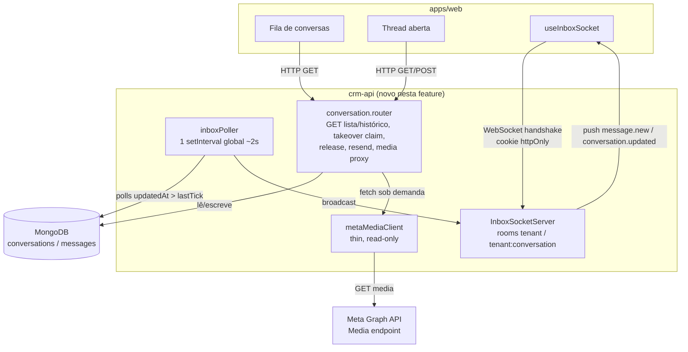

# Inbox Realtime Design

**Spec**: `.specs/features/inbox-realtime/spec.md`
**Status**: Draft

---

## Architecture Overview

`ws` puro, anexado ao mesmo `http.Server` que `app.listen()` já retorna (mesmo molde de
`StartHandle` que `apps/ai-gateway/src/server.ts` já usa pros 3 workers de intervalo).
Handshake autenticado pelo cookie httpOnly (AD-014), fora do pipeline Express normal — a
mesma lógica de validação de sessão é extraída para uma função pura reusada pelos dois
caminhos (HTTP middleware e handshake WS). Um poller global (~2s, AD-006) varre
`messages` atualizadas desde o último tick, restrito aos tenants com pelo menos um socket
conectado, e distribui por duas "salas" em memória: `tenant:<id>` (fila) e
`tenant:<id>:conversation:<id>` (thread aberta) — literal do fluxo já descrito em
`docs/architecture.md`.



---

## Code Reuse Analysis

### Existing Components to Leverage

| Component | Location | How to Use |
| --- | --- | --- |
| `createAuthMiddleware`/`extractToken` | `apps/crm-api/src/middlewares/authentication.middleware.ts` | Refatorar: extrair a validação (jwt→hash→session→device→user→tenant) para uma função pura `authenticateSession`, reusada pelo handshake WS. `validToken` vira um wrapper fino em cima dela — zero duplicação de lógica de sessão |
| `apps/ai-gateway/src/server.ts` (`StartOptions`/`StartHandle`) | `apps/ai-gateway/src/server.ts:14-26` | Espelhar a mesma forma em `apps/crm-api/src/server.ts`: capturar o `httpServer` de `app.listen()`, injetar porta/intervalos efêmeros para e2e |
| `startOutboxConsumer`/`startIdleTakeoverSweep` (padrão de worker) | `apps/ai-gateway/src/workers/*.ts` | Mesmo molde `setInterval` + catch+log + `{stop}` para `inboxPoller.ts`; tick isolado exportado (`pollOnce`) para teste direto, sem esperar o intervalo real |
| `claimTurnLock`/`claimQueuedMessage` (claim atômico condicional) | `packages/db/src/models/conversation.model.ts:74-80`, `apps/ai-gateway/src/workers/outboxConsumer.ts:24-28` | Mesmo padrão `findOneAndUpdate` condicional para o novo `takeover()` — só societa quando `mode:'bot'` ou já é o mesmo `assignee` |
| `apps/ai-gateway/src/providers/metaClient.ts` (`getMediaUrl`/`downloadMedia`) | `apps/ai-gateway/src/providers/metaClient.ts:97-113` | Duplicar a metade de leitura (thin, 2 métodos) num cliente local do `crm-api` — mesmo precedente já aceito no `design.md` do `ai-gateway` para a duplicação fina de `Customer`/`Process` |
| `channel.service.ts` (decrypt do `accessTokenEnc`) | `apps/crm-api/src/services/channel.service.ts:28` | Mesma chave `env.CHANNEL_ENC_KEY`, mesmo helper `decrypt` de `@crm/db` — já provado no `crm-api`, só reusar |
| `validListCustomersQuery` (workaround Express 5 `req.query`) | `apps/crm-api/src/routers/customer.router.ts:29-42` | Mesmo workaround (`Object.defineProperty`) para os query params de `GET /conversations` e `GET /:id/messages` |
| `query/customer.ts` (queryOptions + keys factory + `buildQueryString`) | `apps/web/src/query/customer.ts` | Mesmo formato para `query/conversation.ts`/`query/message.ts` |
| `routes/_private/customers/*` (list/details/@components/@interface/@utils) | `apps/web/src/routes/_private/customers/` | Mesma convenção de diretório para `routes/_private/inbox/` |
| `<DataTable>`/`<Card asPage>`/`<DefaultLoading>`/`<DefaultEmptyData>` | `apps/web/src/components/ui/*` | Fila usa `<DataTable>` server-driven (AD-028); página inteira usa `<Card asPage>` |

### Integration Points

| System | Integration Method |
| --- | --- |
| MongoDB (`conversations`, `messages`) | Leitura pura para os novos `GET`; escrita só onde já era permitida (`takeover`/`release` em `conversations`; `messages` `out` só criação, nunca transição de `status` — reenvio cria documento novo) |
| Meta Graph API (Media) | Chamada direta do `crm-api` (não é chamada entre serviços — é `crm-api` chamando a Meta, igual o `ai-gateway` já faz) — só sob demanda, nunca no fluxo automático |
| WebSocket (browser nativo) | `apps/web` usa `WebSocket` nativo do navegador — zero dependência nova no front |

---

## Components

### 1. `authenticateSession` (extração)

- **Purpose**: validar um token de sessão (jwt → hash → `Session` → device match →
  `User`/`Tenant`) como função pura, reusável fora do pipeline Express.
- **Location**: `apps/crm-api/src/middlewares/authentication.middleware.ts` (refatoração)
- **Interfaces**:
  - `authenticateSession(token: string, deviceInfo: string, deps: AuthDeps): Promise<TenantUser>` — lança `CustomError(msg, 401)` em qualquer falha (mesmas mensagens/eventos de log já existentes)
  - `validToken` (existente) passa a ser um wrapper: extrai token/deviceInfo do `Request`, chama `authenticateSession`, popula `req.tenantUser`
- **Dependencies**: `AuthDeps` (já existe, sem mudança de shape)
- **Reuses**: 100% da lógica atual de `createAuthMiddleware`, só reorganizada

### 2. `InboxSocketServer` (novo)

- **Purpose**: anexar um `WebSocketServer` (`ws`) ao `http.Server`, autenticar cada
  handshake pelo cookie httpOnly, manter as duas "salas" em memória e expor broadcast.
- **Location**: `apps/crm-api/src/ws/inboxSocket.ts`
- **Interfaces**:
  - `createInboxSocketServer(httpServer: http.Server, authDeps: AuthDeps): InboxSocketServer`
  - `InboxSocketServer.broadcastToTenant(tenantId: string, event: InboxWsEvent): void`
  - `InboxSocketServer.broadcastToConversation(tenantId: string, conversationId: string, event: InboxWsEvent): void`
  - `InboxSocketServer.getConnectedTenantIds(): string[]` — consumido pelo poller (AD-006: "só varre tenants com socket conectado")
  - `InboxSocketServer.close(): void`
  - `type InboxWsEvent = { type: 'conversation.updated'; conversationId: string; lastActivityAt: string; unread: boolean } | { type: 'message.new'; conversationId: string; message: MessageWirePayload }`
- **Dependencies**: `ws`, `cookie` (parse manual — `cookieParser()` do Express nunca roda
  no evento `upgrade` cru), `authenticateSession`
- **Reuses**: `authenticateSession` (componente 1)

Fluxo de conexão: lê `req.headers.cookie` cru → `cookie.parse()` → extrai `refreshToken`
→ `authenticateSession(token, req.headers['user-agent'] ?? 'unknown', authDeps)` → falha
fecha o socket com código `4401` antes de aceitar qualquer mensagem; sucesso entra na sala
`tenant:<tenantId>`. Mensagens do cliente `{type:'subscribe'|'unsubscribe', conversationId}`
entram/saem da sala `tenant:<tenantId>:conversation:<conversationId>` (ex.: ao
abrir/fechar a thread). Ao desconectar, o socket sai de todas as salas.

### 3. `inboxPoller` (novo worker)

- **Purpose**: um único `setInterval` global (~2s) que busca `Message`s atualizadas desde
  o último tick, só para tenants com socket conectado, e distribui via
  `InboxSocketServer`.
- **Location**: `apps/crm-api/src/workers/inboxPoller.ts`
- **Interfaces**:
  - `pollOnce(socketServer: InboxSocketServer, since: Date): Promise<Date>` — um tick
    isolado, retorna o próximo cursor `since`; testável diretamente sem esperar o
    intervalo real (mesmo estilo de `processNextOutboxMessage`/`sweepIdleConversations`)
  - `startInboxPoller(socketServer: InboxSocketServer, intervalMs = 2000): { stop(): void }`
- **Dependencies**: `@crm/db` (`Message`, `Conversation`), `InboxSocketServer`
- **Reuses**: mesmo padrão `setInterval` + catch+log de
  `startOutboxConsumer`/`startIdleTakeoverSweep`

Uma única query por tick, independente de quantos tenants estão conectados:
`Message.find({ updatedAt: { $gt: since }, Tenant: { $in: connectedTenantIds } })`. Para
cada mensagem encontrada: `broadcastToConversation` (evento `message.new`, thread aberta)
e `broadcastToTenant` (evento `conversation.updated`, atualiza a fila — `lastActivityAt`/
`unread` recalculados a partir da própria `Conversation`).

### 4. Extensões de `conversation.{repository,service,controller,router}`

- **Purpose**: leitura (fila, histórico), claim condicional de `takeover`, reenvio como
  clone, proxy de mídia sob demanda.
- **Location**: `apps/crm-api/src/{repositories,services,controllers,routers}/conversation.*`
- **Interfaces** (novas, nos arquivos já existentes):
  - `listConversations(tenantId, filters: {mode?, assignee?}, pagination): Promise<{items: ConversationListItem[]; total: number}>` — `unread` computado em memória (`lastInboundAt > lastActivityAt`), sem filtro Mongo dedicado (ver Risks)
  - `getMessages(tenantId, conversationId, pagination): Promise<{items: MessageRecord[]; total: number} | null>`
  - `takeover` (reescrito): `findOneAndUpdate({_id, Tenant, $or:[{mode:'bot'},{assignee:userId}]}, {$set:{mode:'human',assignee:userId,lastActivityAt:new Date()}})` — `null` quando a conversa existe mas está com outro `assignee`; o service então busca o `User.name` atual e lança `ConversationAlreadyAssignedError(assigneeName)` → controller traduz para 409
  - `release` — sem mudança (continua incondicional, decisão do Discuss)
  - `resendMessage(tenantId, conversationId, messageId): Promise<MessageRecord>` — exige a `Message` original `status:'failed'`, cria um clone `status:'queued'`
  - `getMessageMedia(tenantId, conversationId, messageId, encKey): Promise<{buffer: Buffer; mime?: string}>` — usa `metaMediaClient`
- **Dependencies**: `tenantScoped`, `withDbTiming` (já existentes)
- **Reuses**: idioma 404 (`ConversationNotFoundError`) e tradução de erro no service já
  estabelecidos por `sendManualMessage`

### 5. `metaMediaClient` (novo, local ao `crm-api`)

- **Purpose**: cliente fino e **só leitura** da Media API da Meta (sem capacidade de
  envio — `crm-api` nunca envia, só o `ai-gateway`).
- **Location**: `apps/crm-api/src/providers/metaMediaClient.ts`
- **Interfaces**:
  - `createMetaMediaClient(channel: {phoneNumberId: string; accessTokenEnc: EncryptedSecret}, encKey: string): { getMediaUrl(mediaId: string): Promise<{url: string; mimeType?: string}>; downloadMedia(url: string): Promise<Buffer> }`
- **Dependencies**: `decrypt` de `@crm/db`, `fetch`
- **Reuses**: mesmo shape de 2 etapas de `apps/ai-gateway/src/providers/metaClient.ts`
  (`getMediaUrl`/`downloadMedia`) — duplicado deliberadamente, ver Risks & Concerns

### 6. Telas de Inbox (`apps/web`)

- **Purpose**: fila + thread + composer sensível à janela de 24h + indicador de
  `mode`/`assignee` + reenvio + preview de mídia sob demanda.
- **Location**: `apps/web/src/routes/_private/inbox/`
  - `index.tsx` — página única (não é hub: só há um destino, `CLAUDE.md` já reserva hub
    pra >1 destino), split view fila+thread, conversa selecionada via `search:{id}` (AD-030)
  - `@components/conversation-queue.tsx`, `thread.tsx`, `composer.tsx`, `media-card.tsx`,
    `takeover-badge.tsx`
  - `@interface/inbox.interface.ts` — `z.object({ id: idSchema.optional() })` (search schema)
- **Interfaces**: nenhuma nova pública além das rotas — consome `query/conversation.ts`/
  `query/message.ts` e o hook `useInboxSocket`
- **Dependencies**: `<Card asPage>`, `<DataTable>`, `<DefaultLoading>`/`<DefaultEmptyData>`,
  `t()`, TanStack Query
- **Reuses**: convenção inteira de `routes/_private/customers/*`

Novo hook `apps/web/src/hooks/useInboxSocket.ts`: `WebSocket` nativo do navegador
(cookie httpOnly vai junto automaticamente, mesmo domínio), reconexão com backoff simples
no cliente, eventos recebidos aplicados no cache do TanStack Query (`setQueryData`/
`invalidateQueries` nas chaves de `conversation`/`message`) — nunca um segundo estado
global (`CLAUDE.md`: "TanStack Query é a única fonte de verdade").

---

## Data Models

Nenhum model novo, nenhum campo novo. Reusa integralmente:

```typescript
// ConversationDocument (packages/db/src/models/conversation.model.ts) — sem mudança de schema
// takeover: condição da query muda ($or:[{mode:'bot'},{assignee:userId}]), shape do documento não

// MessageDocument (packages/db/src/models/message.model.ts) — sem mudança de schema
// resendMessage cria um documento NOVO com os mesmos campos do original
// (direction:'out', type, text|templateName/templateLanguage/templateParams),
// status:'queued', sem wamid/claimedBy/claimedAt/error — exatamente como uma
// Message 'out' recém-criada por createOutboundMessage já é hoje.
```

**Relationships**: inalteradas — `Message.Conversation`/`Message.Channel`/`Message.Customer`
continuam apontando pros mesmos documentos; o clone de reenvio referencia a mesma
`Conversation`/`Channel`/`Customer` da mensagem original.

---

## Error Handling Strategy

| Error Scenario | Handling | User Impact |
| --- | --- | --- |
| Handshake WS sem cookie válido/sessão expirada | Socket fechado com código `4401` antes de aceitar `subscribe` | Front trata como 401 HTTP — mostra "sessão expirada", redireciona pro `/auth` |
| `takeover` de conversa já assumida por outro operador | 409, mensagem nomeando o `assignee` atual (`User.name`) | Toast "Conversa já assumida por {nome}" |
| Reenvio de uma `Message` que não está `status:'failed'` | 400 (estado inválido) | Toast de erro — o botão nunca aparece pra outros status na UI, mas o backend valida de qualquer forma (defesa em profundidade) |
| Mídia indisponível/expirada na Meta | Erro tipado `MetaMediaUnavailableError` → 502 | Card de mídia mostra "Não foi possível carregar essa mídia agora" |
| `GET /conversations/:id`\|`.../messages` de outro tenant ou inexistente | 404 (mesmo idioma de `customer.service.ts`) | "Conversa não encontrada" |
| Poller falha num tick (erro de banco) | catch + log estruturado (mesmo padrão dos outros workers), próximo tick tenta de novo | Nenhum crash do processo; atraso de até +1 tick (~2s) na entrega ao vivo |
| Cliente WS perde conexão | Reconexão automática com backoff no `useInboxSocket` | UI mostra indicador sutil de "reconectando" (nunca trava a tela) |

---

## Risks & Concerns

| Concern | Location (file:line) | Impact | Mitigation |
| --- | --- | --- | --- |
| Duplicação de cliente Meta (`metaMediaClient` vs. `ai-gateway/providers/metaClient.ts`) | `apps/crm-api/src/providers/metaMediaClient.ts` (novo) | Uma mudança na Media API da Meta corrigida num lado e esquecida no outro diverge silenciosamente | Mesmo precedente já aceito em `.specs/features/ai-gateway/design.md` (linha 282, duplicação `Customer`/`Process`); cliente fica mínimo (2 métodos, só leitura), comentado com referência cruzada ao arquivo irmão |
| Handshake WS não passa pelo pipeline Express normal (`cookieParser()` só roda em `app.use`, nunca no evento `upgrade` cru) | `apps/crm-api/src/app.ts` | Reimplementar parsing de cookie errado abriria brecha de auth | `authenticateSession` extraído como função pura testável isoladamente; parsing usa a lib `cookie` (mesma base de `cookie-parser`) com teste unitário comparando o resultado com o middleware Express no mesmo cookie |
| Poller assume instância única do `crm-api` (Assumption já registrada no spec) | `apps/crm-api/src/workers/inboxPoller.ts` | Rodar 2 instâncias duplicaria broadcast (cada uma só vê seus próprios sockets) ou perderia eventos | Fora de escopo por decisão já tomada no Discuss — documentado, não mitigado nesta rodada (provável `ops-hardening`) |
| `unread` computado em memória após a query (`lastInboundAt > lastActivityAt`), sem filtro/índice dedicado no Mongo | `apps/crm-api/src/repositories/conversation.repository.ts` (`listConversations`, novo) | Nenhum hoje — o spec só pede o indicador, não filtro/ordenação por ele | Se uma feature futura pedir filtro/`orderBy` por `unread`, revisitar como índice dedicado (mesmo padrão de AD-025) |
| `GET /conversations` sem paginação real ainda testada em volume | `apps/crm-api/src/repositories/conversation.repository.ts` (novo) | Tenant com milhares de conversas pode pesar a query de fila | Mesma convenção AD-028 (paginação sempre server-side) mitiga o pior caso; sem otimização adicional nesta rodada |

---

## Tech Decisions (only non-obvious ones)

| Decision | Choice | Rationale |
| --- | --- | --- |
| Biblioteca WS | `ws` (não `socket.io`) | Confirmado com o usuário — footprint mínimo, sem client lib nova no `apps/web` (browser já tem `WebSocket` nativo), alinhado à filosofia de AD-002 ("sem broker, sem infra extra") |
| Modelo de "salas" | `Map` em memória, 2 níveis: `tenant:<id>` (fila) e `tenant:<id>:conversation:<id>` (thread) | Literal do fluxo já descrito em `docs/architecture.md` ("fan-out em salas WS tenant:conversation"); sem lib de pub/sub — coerente com a Assumption de instância única |
| Cadência/forma do poller | Um único `setInterval` global (~2s), `Message.find({updatedAt:{$gt:since}, Tenant:{$in:connectedTenantIds}})` | Mesmo estilo dos workers do `ai-gateway`; UMA query por tick independente de quantos tenants estão conectados |
| Claim condicional de `takeover` | `findOneAndUpdate({_id,Tenant,$or:[{mode:'bot'},{assignee:userId}]}, ...)` | Mesmo padrão de claim atômico já usado em `claimTurnLock`/`claimQueuedMessage` — decidido no Discuss |
| Reenvio de `Message failed` | Clona documento novo, nunca reseta o original | Decidido no Discuss — respeita a fronteira de escrita já documentada (`docs/architecture.md`) |
| Extração de `authenticateSession` | Refatorar `createAuthMiddleware` pra expor a função pura; `validToken` vira wrapper fino em cima dela | Reuso entre o middleware HTTP e o handshake WS sem duplicar a lógica de sessão (jwt+hash+device+user+tenant) |
| `apps/crm-api/src/server.ts` | Espelha `StartOptions`/`StartHandle` de `apps/ai-gateway/src/server.ts` | Já provado no mesmo monorepo; testar WS de verdade exige um `httpServer` real ouvindo — `supertest` sozinho não abre socket real |
| Nova dependência `cookie` (direta, não só transitiva via `cookie-parser`) | Adicionar em `apps/crm-api/package.json` | Necessária pra parsear `req.headers.cookie` cru no handshake WS, fora do pipeline Express (`cookie-parser` só expõe o middleware, não a função `parse` isolada como API pública estável) |
| Media proxy nunca persiste em disco | Response passthrough (stream/buffer direto na resposta HTTP) | Mantém o Out of Scope já herdado do `ai-gateway` (sem pipeline de asset/storage) |

---

## Notas para o Design.md do STATE.md

Nenhuma decisão aqui é de projeto o suficiente para virar `AD-NNN` novo — todas conformam
decisões já ativas (AD-002/AD-006/AD-014/AD-017/AD-028/AD-030) ou são escolhas
feature-locais (biblioteca `ws`, shape das salas em memória). Nenhuma entrada nova
proposta para `.specs/STATE.md` nesta fase.
