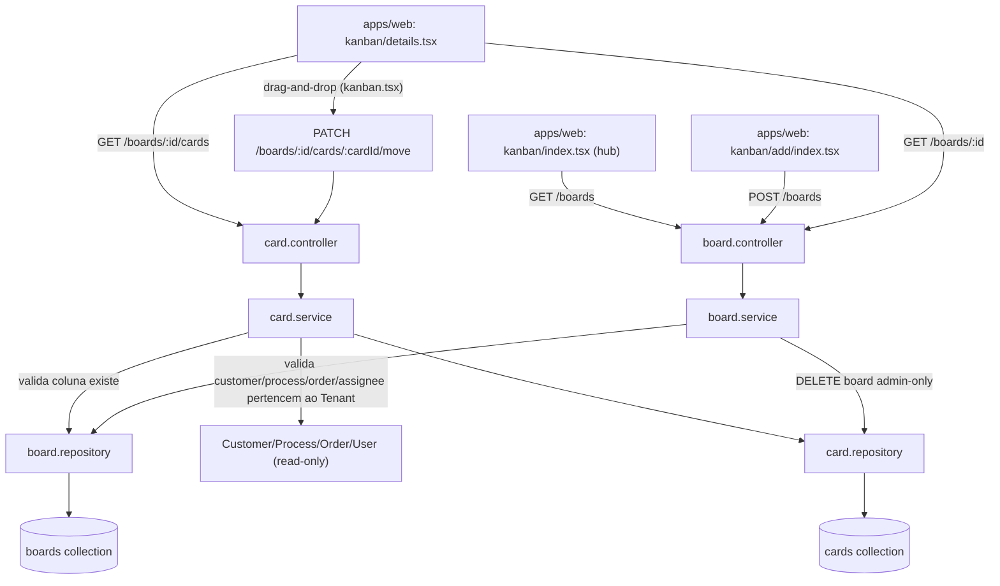

# kanban-tool Design

**Spec**: `.specs/features/kanban-tool/spec.md`
**Status**: Approved (persistência confirmada com o usuário — Board + Card como 2 collections separadas)

---

## Architecture Overview

Duas collections novas, Tenant-scoped (AD-010): `boards` (Board embute só `columns[]` — array
pequeno, curado manualmente) e `cards` (collection própria, referencia `board` + `column`).
Segue o padrão repository/service/controller/router já usado por `professional`/`space`/`order`
neste `crm-api` — não o formato literal de documento único do DentalEase (ver decisão confirmada
com o usuário na fase Design, abaixo).



---

## Code Reuse Analysis

### Existing Components to Leverage

| Component | Location | How to Use |
| --- | --- | --- |
| `KanbanProvider`/`KanbanBoard`/`KanbanCard`/`KanbanCards`/`KanbanHeader` | `apps/web/src/components/ui/kanban.tsx` | Reaproveitado tal como está — só troca os dados/colunas recebidos (mesmo componente já consumido por `customers/kanban/index.tsx`). Nenhuma mudança no arquivo. |
| Padrão repository (`tenantScoped` + `withDbTiming` + `.lean()`) | `apps/crm-api/src/repositories/professional.repository.ts` | Mesmo molde para `board.repository.ts`/`card.repository.ts` — `findOneAndUpdate(tenantScoped({Tenant,_id}), ...)`. |
| Padrão service (erro tipado `XNotFoundError`, clamp de paginação) | `apps/crm-api/src/services/professional.service.ts` | Mesmo molde para `board.service.ts`/`card.service.ts`. |
| Padrão controller (extrai `req.tenantUser.tenant`, traduz erro→`CustomError`) | `apps/crm-api/src/controllers/professional.controller.ts` | Mesmo molde para `board.controller.ts`/`card.controller.ts`. |
| Padrão router (`createXRouter({validToken})`, `tenantAssignmentCheck`, `checkRole`) | `apps/crm-api/src/routers/professional.router.ts` | Mesmo molde para `board.router.ts`; `isAdmin` (`authorization.middleware.ts`) reaproveitado tal como está para `DELETE /boards/:id`. |
| Move otimista com override local + revert em erro | `apps/web/src/routes/_private/customers/kanban/index.tsx` (`pendingMoves`) | Mesmo padrão para o board de card livre — override local por `cardId→columnId` até a mutação assentar. |
| Painel inline (nunca `Dialog`) | AD-037, `appointment-panel.tsx`/`block-panel.tsx` | Board/card/coluna: criar e editar sempre em painel inline empurrando o conteúdo, `onClose` como único contrato do componente. |
| `Card asPage`, `DefaultLoading`, `DefaultEmptyData`, `Item*` | `apps/web/CLAUDE.md` | Hub e detalhe do board seguem a mesma casca de toda outra rota. |
| `t()`/`translate.helper.js` | `apps/web/src/lib/helpers/translate.helper.js` | Toda string nova (`kanban.board.*`, `kanban.card.*`, `kanban.column.*`). |
| `dbReqResTime`/`withDbTiming` | `apps/crm-api/src/metrics/db.metric.js` | Toda função de repository nova instrumentada, sem decisão nova (Assumptions & Open Questions do spec). |

### Integration Points

| System | Integration Method |
| --- | --- |
| `packages/db` | 2 models novos (`Board`, `Card`) exportados por `packages/db/src/index.ts`, mesmo padrão de `Professional`/`Space`. |
| `packages/contracts` | 8 schemas Zod novos (`createBoard`, `updateBoard`, `createColumn`, `updateColumn`, `reorderColumns`, `createCard`, `updateCard`, `moveCard`), barril em `packages/contracts/src/index.ts`. |
| `apps/crm-api` | Router novo `board.router.ts`, montado em `app.ts`: `app.use('/boards', createBoardRouter({ validToken }))`. Sem mudança em nenhum router existente. |
| `apps/web` | Rotas novas `_private/kanban/{index,add/index,details}.tsx` + `query/board.ts`. Sem mudança em `customers/kanban/index.tsx` (kanban de status, feature 4) nem em `components/ui/kanban.tsx`. |
| `Customer`/`Process`/`Order`/`User` (leitura) | `card.service.ts` valida existência+Tenant antes de gravar uma referência opcional (`Customer.exists`/`Process.exists`/`Order.exists`/`User.exists`) — só leitura, nenhuma escrita cross-collection nova (não reabre AD-032, que é só sobre propriedade de ESCRITA). |

---

## Components

### `Board` model

- **Purpose**: Documento de um quadro kanban do tenant, com suas colunas embutidas.
- **Location**: `packages/db/src/models/board.model.ts`
- **Interfaces**: exporta `Board` (Mongoose model) e o tipo `BoardDocument`.
- **Dependencies**: nenhuma (raiz da feature).
- **Reuses**: mesmo formato de `professional.model.ts` (Tenant required + timestamps + índice `{Tenant,updatedAt}` para a ordenação do hub).

### `Card` model

- **Purpose**: Documento de um card, sempre pertencente a um `Board` e uma de suas colunas.
- **Location**: `packages/db/src/models/card.model.ts`
- **Interfaces**: exporta `Card` (Mongoose model) e o tipo `CardDocument`.
- **Dependencies**: `Board` (só para o índice/validação de escopo — sem `populate` obrigatório no schema).
- **Reuses**: mesmo formato de `order.model.ts` (referências opcionais por `ObjectId`, sem `required`).

### `board.repository.ts`

- **Purpose**: Acesso a dados de `Board` — CRUD, manipulação do array `columns[]`, listagem com contagem de cards.
- **Location**: `apps/crm-api/src/repositories/board.repository.ts`
- **Interfaces**:
  - `createBoard(data): Promise<BoardRecord>`
  - `findById(tenantId, id): Promise<BoardRecord | null>`
  - `listBoards(tenantId): Promise<BoardWithCardCount[]>` — 1 aggregation com `$lookup` em `cards` + `$group` por `board`, para não fazer N+1 (mitigação do Risco 1 abaixo).
  - `updateBoard(tenantId, id, data): Promise<BoardRecord | null>`
  - `deleteBoard(tenantId, id): Promise<{ deletedCount: number }>`
  - `addColumn(tenantId, boardId, column): Promise<BoardRecord | null>` — `$push` em `columns`.
  - `updateColumn(tenantId, boardId, columnId, data): Promise<BoardRecord | null>` — `$set` posicional (`columns.$[col].label`, filtro por `arrayFilters`).
  - `reorderColumns(tenantId, boardId, columnIds): Promise<BoardRecord | null>` — recalcula `order` a partir da posição no array recebido.
  - `removeColumn(tenantId, boardId, columnId): Promise<BoardRecord | null>` — `$pull`.
- **Dependencies**: `Board` (`@crm/db`), `tenantScoped`, `withDbTiming`.
- **Reuses**: `professional.repository.ts` (findOneAndUpdate + tenantScoped).

### `card.repository.ts`

- **Purpose**: Acesso a dados de `Card` — CRUD e populate leve das referências opcionais para exibição.
- **Location**: `apps/crm-api/src/repositories/card.repository.ts`
- **Interfaces**:
  - `createCard(data): Promise<CardRecord>`
  - `listByBoard(tenantId, boardId): Promise<CardRecord[]>` — populate seletivo (`customer.name`, `process.stage`+`template.name`, `order.totalPrice`+`status`, `assignee.name`).
  - `findById(tenantId, boardId, cardId): Promise<CardRecord | null>`
  - `updateCard(tenantId, boardId, cardId, data): Promise<CardRecord | null>`
  - `moveCard(tenantId, boardId, cardId, column, position): Promise<CardRecord | null>`
  - `deleteCard(tenantId, boardId, cardId): Promise<{ deletedCount: number }>`
  - `existsInColumn(tenantId, boardId, columnId): Promise<boolean>` — usado pelo `board.service.ts` pra bloquear remoção de coluna não-vazia (KAN-10).
  - `deleteAllByBoard(tenantId, boardId): Promise<{ deletedCount: number }>` — cascata da KAN-22.
- **Dependencies**: `Card` (`@crm/db`), `tenantScoped`, `withDbTiming`.
- **Reuses**: `order.repository.ts` (populate seletivo de referência opcional).

### `board.service.ts`

- **Purpose**: Regras de negócio de Board e colunas — sempre ≥1 coluna, coluna não-vazia não pode ser removida, cascata ao apagar board.
- **Location**: `apps/crm-api/src/services/board.service.ts`
- **Interfaces**:
  - `createBoard(tenantId, data): Promise<BoardRecord>` — rejeita `columns.length === 0` (KAN-02).
  - `listBoards(tenantId): Promise<BoardWithCardCount[]>`
  - `getBoardById(tenantId, id): Promise<BoardRecord>` — `BoardNotFoundError` se ausente (KAN-06).
  - `updateBoard(tenantId, id, data): Promise<BoardRecord>`
  - `deleteBoard(tenantId, id): Promise<void>` — `board.repository.deleteBoard` + `card.repository.deleteAllByBoard`, nessa ordem (KAN-22).
  - `addColumn`/`updateColumn`/`reorderColumns`/`removeColumn` — `removeColumn` chama `card.repository.existsInColumn` (KAN-10) e rejeita se `columns.length === 1` (KAN-11).
- **Dependencies**: `board.repository.ts`, `card.repository.ts` (só para o guard de coluna vazia e a cascata).
- **Reuses**: `professional.service.ts` (erro tipado `BoardNotFoundError`).

### `card.service.ts`

- **Purpose**: Regras de negócio de Card — coluna precisa existir no board, referências opcionais precisam pertencer ao Tenant.
- **Location**: `apps/crm-api/src/services/card.service.ts`
- **Interfaces**:
  - `createCard(tenantId, boardId, data): Promise<CardRecord>` — valida coluna (KAN-15) e cada referência informada (KAN-14).
  - `listCardsByBoard(tenantId, boardId): Promise<CardRecord[]>`
  - `updateCard(tenantId, boardId, cardId, data): Promise<CardRecord>` — nunca aceita `column`/`position` (isso é só via `moveCard`, KAN-16).
  - `moveCard(tenantId, boardId, cardId, column, position): Promise<CardRecord>` — valida coluna (KAN-21).
  - `deleteCard(tenantId, boardId, cardId): Promise<void>`
- **Dependencies**: `card.repository.ts`, `board.repository.ts` (validar coluna), `Customer`/`Process`/`Order`/`User` de `@crm/db` (só leitura, `.exists()`).
- **Reuses**: mesmo formato de validação cross-collection de `order.service.ts` (valida `product` existe antes de montar `Order.items`).

### `board.controller.ts` / `card.controller.ts`

- **Purpose**: Tradução HTTP — extrai `req.tenantUser.tenant`, injeta `req.tenantUser.role` onde relevante, traduz erro tipado→`CustomError`.
- **Location**: `apps/crm-api/src/controllers/board.controller.ts`, `apps/crm-api/src/controllers/card.controller.ts`
- **Reuses**: `professional.controller.ts` (idêntico, incluindo o `try/catch` com `next(e)`).

### `board.router.ts`

- **Purpose**: Único arquivo de rotas do domínio (board + sub-rotas de coluna e card) — mesmo formato de arquivo único do `kanban.route.ts` do DentalEase, adaptado ao Express/Zod deste repo.
- **Location**: `apps/crm-api/src/routers/board.router.ts`
- **Interfaces** (todas atrás de `validToken` + `tenantAssignmentCheck`; `canOperate = checkRole(['admin','gestor','operador'])`):
  - `POST /boards` (`canOperate`, `validBody(createBoardSchema)`)
  - `GET /boards` (`canOperate`)
  - `GET /boards/:id` (`canOperate`, `validParams`)
  - `PATCH /boards/:id` (`canOperate`, `validBody(updateBoardSchema)`)
  - `DELETE /boards/:id` (`isAdmin` — único endpoint mais restrito, KAN-23)
  - `POST /boards/:id/columns` (`canOperate`, `validBody(createColumnSchema)`)
  - `PATCH /boards/:id/columns/reorder` (`canOperate`, `validBody(reorderColumnsSchema)`) — rota estática ANTES de `:columnId` (mesma ordem de rota do Express que `appointment.router.ts` já usa pra `/blocks` vs `/:id`).
  - `PATCH /boards/:id/columns/:columnId` (`canOperate`, `validBody(updateColumnSchema)`)
  - `DELETE /boards/:id/columns/:columnId` (`canOperate`)
  - `POST /boards/:id/cards` (`canOperate`, `validBody(createCardSchema)`)
  - `GET /boards/:id/cards` (`canOperate`)
  - `PATCH /boards/:id/cards/:cardId` (`canOperate`, `validBody(updateCardSchema)`)
  - `PATCH /boards/:id/cards/:cardId/move` (`canOperate`, `validBody(moveCardSchema)`)
  - `DELETE /boards/:id/cards/:cardId` (`canOperate`)
- **Dependencies**: `board.controller.ts`, `card.controller.ts`.
- **Reuses**: `professional.router.ts` (estrutura idêntica); `isAdmin` de `authorization.middleware.ts` (já existe, sem mudança).

### `apps/web/src/query/board.ts`

- **Purpose**: Hooks TanStack Query — espelha `query/professional.ts`.
- **Location**: `apps/web/src/query/board.ts`
- **Interfaces**: `boardKeys`, `boardsQuery()`, `boardQuery(id)`, `boardCardsQuery(boardId)`, `createBoardMutation`, `updateBoardMutation`, `deleteBoardMutation`, `addColumnMutation`, `updateColumnMutation`, `reorderColumnsMutation`, `removeColumnMutation`, `createCardMutation`, `updateCardMutation`, `moveCardMutation`, `deleteCardMutation`.
- **Reuses**: `query/professional.ts` (molde de `queryOptions`+`UseMutationOptions`+invalidação por `queryKey` prefixo).

### `apps/web/src/routes/_private/kanban/index.tsx` (hub)

- **Purpose**: Lista os boards do tenant (nome, descrição, contagem de cards), atalho pra criar um novo.
- **Location**: `apps/web/src/routes/_private/kanban/index.tsx`
- **Reuses**: `Card asPage`, `Item/ItemGroup` (CLAUDE.md), `DefaultEmptyData` (hub vazio, Edge Case do spec), `Link to="/kanban/add"` e `Link to="/kanban/details" search={{id}}` (AD-030 — nunca `$id`).

### `apps/web/src/routes/_private/kanban/add/index.tsx`

- **Purpose**: Formulário de criação de board — nome, descrição, lista de colunas iniciais (mínimo 1, `useFieldArray` do `react-hook-form`).
- **Reuses**: `Form/FormField/...` (CLAUDE.md), `createBoardMutation`.

### `apps/web/src/routes/_private/kanban/details.tsx`

- **Purpose**: Tela do board — `KanbanProvider` do primitivo existente, painel inline de card (criar/editar) e painel inline de gerenciar colunas (AD-037).
- **Location**: `apps/web/src/routes/_private/kanban/details.tsx` + `@components/{card-panel,column-manager-panel,kanban-card-content}.tsx`
- **Interfaces**: `search: { id: string }` (Zod `validateSearch`, mesmo padrão de `appointments`/`professionals`).
- **Reuses**: `KanbanProvider`/`KanbanBoard`/`KanbanCard`/`KanbanCards`/`KanbanHeader` (`components/ui/kanban.tsx`, sem mudança); o padrão de override otimista `pendingMoves` de `customers/kanban/index.tsx`; `appointment-panel.tsx`/`block-panel.tsx` como referência de painel inline.

---

## Data Models

### `Board`

```typescript
interface BoardColumn {
  _id: ObjectId;
  label: string; // 1..60
  order: number;
  color?: string; // hex #RRGGBB
}

interface BoardDocument {
  _id: ObjectId;
  Tenant: ObjectId;
  name: string; // 3..80
  description?: string; // <=500
  columns: BoardColumn[]; // sempre length >= 1 (invariante do service)
  createdAt: Date;
  updatedAt: Date;
}
```

**Índices**: `{ Tenant: 1, updatedAt: -1 }` (hub, KAN-03).

### `Card`

```typescript
interface CardDocument {
  _id: ObjectId;
  Tenant: ObjectId;
  board: ObjectId; // ref Board
  column: ObjectId; // = um dos Board.columns[]._id
  title: string; // 1..120
  description?: string; // <=2000
  position: number; // ordem dentro da coluna
  customer?: ObjectId; // ref Customer
  process?: ObjectId; // ref Process
  order?: ObjectId; // ref Order (nome de campo != `position`, evita colisão com o Order de negócio)
  assignee?: ObjectId; // ref User
  createdAt: Date;
  updatedAt: Date;
}
```

**Índices**: `{ Tenant: 1, board: 1, column: 1, position: 1 }` (leitura primária: cards de um
board agrupados por coluna, já ordenados — cobre `{Tenant,board}` como prefixo, sem índice
redundante).

**Relationships**: `Card.board` → `Board._id` (obrigatório); `Card.column` → um `_id` dentro de
`Board.columns[]` (validado no `card.service.ts`, não pelo Mongoose — não há FK real dentro de um
array embutido de outro documento); `customer`/`process`/`order`/`assignee` são referências
opcionais e independentes, cada uma validada por `.exists({Tenant,_id})` no momento da escrita.

---

## Error Handling Strategy

| Error Scenario | Handling | User Impact |
| --- | --- | --- |
| Criar board sem nenhuma coluna | `board.service.createBoard` rejeita antes de chamar o repository | 400 com mensagem "board precisa de ao menos 1 coluna" |
| Remover a última coluna de um board | `board.service.removeColumn` rejeita | 400 |
| Remover coluna com card(s) dentro | `board.service.removeColumn` consulta `card.repository.existsInColumn` antes | 400 com mensagem indicando que a coluna precisa estar vazia |
| Card referenciando `customer`/`process`/`order`/`assignee` de outro tenant ou inexistente | `card.service` valida com `.exists({Tenant,_id})` antes de gravar | 400 (nunca 404 revelando o id de outro tenant — mesmo cuidado do AD-010) |
| Card/coluna referenciando um board de outro tenant | `board.repository.findById`/`tenantScoped` — filtro já exclui | 404 (nunca 403 — não revela que o id existe em outro tenant) |
| `DELETE /boards/:id` por role sem `admin` | `isAdmin` middleware barra antes do controller | 403 |
| Mover card pra uma coluna que não existe naquele board | `card.service.moveCard` valida contra `board.columns` | 400 |
| Falha de rede/servidor ao mover card (drag-and-drop) | UI reverte o override otimista (`pendingMoves`) e mostra toast — mesmo padrão de `customers/kanban/index.tsx` | Card volta visualmente pra coluna de origem, erro visível |
| Apagar um board (cascata) falha a meio caminho (crash entre `deleteBoard` e `deleteAllByBoard`) | Sem transação nativa (Mongo standalone, AD-002/AD-006) — mesma janela de risco já aceita em AD-024/AD-033/AD-034 | Ação de baixíssima frequência (admin apagando um board obsoleto); um card órfão sem board é invisível (nenhuma tela lista card sem passar por `GET /boards/:id/cards`) e pode ser limpo por uma reexecução futura se necessário — não tratado nesta feature |

---

## Risks & Concerns

| Concern | Location (file:line) | Impact | Mitigation |
| --- | --- | --- | --- |
| N+1 ao listar boards com contagem de cards | `board.repository.ts` (`listBoards`, novo) | Uma query de `countDocuments` por board no hub deixaria a tela lenta conforme o tenant acumula boards | `listBoards` usa 1 única aggregation (`$lookup` em `cards` + `$group`), nunca N chamadas — já definido na interface do componente acima, não fica como débito |
| `Card.column` não é uma referência Mongoose real (é um `_id` dentro do array embutido de outro documento) | `card.model.ts` (novo) | Nenhuma validação de schema do Mongoose impede um `column` inválido — só o `card.service.ts` garante isso em runtime | Toda escrita de `column` (criar/mover) passa por `card.service.ts`, que sempre valida contra `board.columns` antes de chamar o repository; coberto por teste de integração dedicado (Tasks) |
| Cascata de apagar board sem transação nativa | `board.service.deleteBoard` (novo) | Crash entre as duas operações deixa cards órfãos (sem board) | Mesmo trade-off já aceito em AD-024/AD-033/AD-034 (Mongo standalone); documentado na Error Handling Strategy acima, ação de baixa frequência e admin-only |

> Nenhum outro risco encontrado na varredura do código existente (`kanban.tsx`, `professional.*`, `customer.model.ts`) além dos três acima.

---

## Tech Decisions (only non-obvious ones)

| Decision | Choice | Rationale |
| --- | --- | --- |
| Persistência de Board/Card | 2 collections separadas (`boards` embute só `columns[]`; `cards` é collection própria) — não o documento único embutido do DentalEase | Confirmado com o usuário nesta sessão de Design. Segue a convenção emergente deste `crm-api` (toda entidade individualmente endereçável é sua própria collection Tenant-scoped — `Professional`/`Space`/`Order`/etc.) em vez do formato literal do DentalEase, evitando introduzir um estilo de repository (manipulação de array embutido via operador posicional `$`) que nenhuma feature anterior usa. `columns[]` continua embutido no `Board` por ser um array pequeno, curado manualmente por humano (poucas mudanças, nunca cresce sem limite) — o mesmo raciocínio não vale para `cards`. |
| Identificador de coluna | `_id` do subdocumento (`Board.columns[]._id`), sem um campo `key` (slug) redundante | O DentalEase usa `key`+`_id` porque o `key` tem significado externo (rota, i18n). Aqui nenhuma rota nem vocabulário externo depende de um slug de coluna — reusar o `_id` já gerado evita um campo duplicado sem consumidor. |
| Campo de posição do card vs. referência a `Order` de negócio | Campo de ordenação chama-se `position`; a referência opcional ao model `Order` chama-se `order` | Evita colisão de nome — `order` (posição) vs. `Order` (pedido) coexistiriam no mesmo documento com o nome literal do DentalEase (`order: number`). |
| Board delete cascata | `board.repository.deleteBoard` seguido de `card.repository.deleteAllByBoard`, sem transação | Mesmo precedente de AD-024/AD-033/AD-034 — Mongo standalone (AD-002/AD-006), ação `admin`-only de baixa frequência. |
| Populate de referências do Card pra exibição | `card.repository.listByBoard` faz populate seletivo (só os campos necessários: `customer.name`, `process.stage`+join no `template.name`, `order.totalPrice`+`status`, `assignee.name`) em vez de devolver o documento cru | Evita vazar campos sensíveis/irrelevantes (`values` do Process, `password`/`email` do User) pra tela do kanban — mesmo cuidado que `customer.repository`/`order.repository` já tomam em outras listagens. |

> Nenhuma das decisões acima estabelece uma convenção nova de projeto além do já coberto por
> AD-010/AD-024/AD-026/AD-032 — não é necessário um novo `AD-NNN` em `.specs/STATE.md`.
