# Ops-Hardening Design

**Spec**: `.specs/features/ops-hardening/spec.md`
**Status**: Draft

---

## Architecture Overview

Cinco componentes independentes, cada um seguindo um precedente já existente no repo em vez de
introduzir um padrão novo. Nenhum toca o mesmo arquivo que outro.

```mermaid
graph TD
    subgraph "CI (sem tráfego)"
        A[".github/workflows/ci.yml<br/>node-version: 24"]
    end

    subgraph "apps/crm-api"
        B["GET /metrics<br/>(prom-client register)"] --> B2["ops/grafana/*.json<br/>dashboard-as-code"]
    end

    subgraph "apps/ai-gateway (workers, mesmo padrão do reaper)"
        C["startRetentionPurge()<br/>RETENTION_PURGE_ENABLED=false default"] --> C2[(Conversation/Message/AiSession)]
    end

    subgraph "packages/ai-kit (scaffolding, roda sob demanda)"
        D["scripts/auditCacheThreshold.ts<br/>tsx, chamada real à API"] --> D2["SYSTEM_PROMPT + TOOL_DEFINITIONS"]
    end

    subgraph "evals/replay (scaffolding, roda sob demanda)"
        E["cli.ts (tsx, client REAL)"] --> E2["samples/*.json"]
        E --> E3["baselines/*.json"]
        E4["runReplay.int.test.ts<br/>(client FAKE, gate de CI)"] -.testa plumbing sem rede.-> E
    end
```

**Por que 5 componentes isolados, não um "módulo ops"**: nenhum dos 5 itens compartilha estado,
schema ou fluxo de execução com os outros — forçar uma abstração comum (ex.: um pacote
`@crm/ops`) seria abstração prematura sem nenhum consumidor real além destes 5 casos.

---

## Code Reuse Analysis

### Existing Components to Leverage

| Component                                                    | Location                                              | How to Use                                                                                     |
| -------------------------------------------------------------- | -------------------------------------------------------- | -------------------------------------------------------------------------------------------------- |
| `startReaper`/`reapStuckMessages` (padrão de worker de intervalo) | `apps/ai-gateway/src/workers/reaper.ts`               | Copiar a forma exata (`start<X>(intervalMs, otherParam)` retornando `{stop}`) para `startRetentionPurge` |
| `apps/ai-gateway/src/server.ts` (composição de workers)       | linha 47-63                                           | Adicionar o quarto worker ao `stopWorkers`, condicional a `env.RETENTION_PURGE_ENABLED`         |
| `dbReqResTime`/`reqResTime` (Histograms já registrados)       | `apps/crm-api/src/metrics/db.metric.ts`, `.../middlewares/responseTime.middleware.ts` | `prom-client`'s `register` global já os contém — `/metrics` só chama `register.metrics()`        |
| `app.get('/health', ...)` (endpoint sem auth)                 | `apps/crm-api/src/app.ts:69`                          | Mesmo padrão para `/metrics` — sem `validToken`                                                 |
| `createAnthropicClient`/`AnthropicClient` (injetável)         | `packages/ai-kit/src/providers/anthropicClient.ts`    | Reusado tal como está pelo script de auditoria de cache e pelo `cli.ts` do replay                |
| `SYSTEM_PROMPT`/`contextBuild.ts`                              | `packages/ai-kit/src/contextBuild.ts:28-51`           | Lido (import), nunca modificado, pelo script de auditoria                                        |
| `TOOL_DEFINITIONS`                                             | `packages/ai-kit/src/tools/toolDefinitions.ts`        | Lido (import) pelo script de auditoria — mesma superfície fixa do Anel A (AD-004)                |
| `expectTool`/`collectToolCalls` (helpers de asserção estrutural) | `evals/runner/expectTool.ts`                          | Reusados pelo `runReplay.int.test.ts` para extrair a sequência de tools do client FAKE            |
| Fixture pattern de golden set (`createHappyPathClient`, setup de Tenant/Channel/Customer/FieldTemplate) | `evals/cases/happyPath.int.test.ts`                   | Molde para os fixtures sintéticos de `evals/replay/samples/`                                     |
| `packages/db/tests/setup/globalSetup.ts` (MongoMemoryServer)  | —                                                      | Reusado pelo `runReplay.int.test.ts` (project `integration`); o `cli.ts` real usa `connect()` normal |
| `MAIL_PROVIDER: z.enum([...]).default('log')` (padrão de flag opcional no env Zod) | `apps/crm-api/src/config/env.config.ts`               | Molde para `RETENTION_PURGE_ENABLED: z.enum(['true','false']).default('false')`                  |
| `tsx` (já devDependency raiz)                                  | `package.json`                                        | Roda `scripts/auditCacheThreshold.ts` e `evals/replay/cli.ts` sem build step, mesmo padrão de `"dev": "tsx watch src/server.ts"` (AD-018) |

### Integration Points

| System                          | Integration Method                                                                                     |
| ---------------------------------- | ----------------------------------------------------------------------------------------------------------- |
| GitHub Actions (`ci.yml`)        | Só o campo `node-version` muda; o job `build-gate` e o comando `pnpm run check` continuam idênticos (AD-031) |
| `prom-client` (registro global)  | `/metrics` lê o `register` default, o mesmo que `db.metric.ts`/`responseTime.middleware.ts` já escrevem — nenhum registro novo |
| Anthropic API (rede real)        | Usada por dois scripts *fora* do gate de CI: auditoria de cache (`countTokens`) e `cli.ts` do replay (`createMessage`) — nunca em teste automatizado |
| `packages/db` (Mongo)            | Worker de retenção usa `Conversation`/`Message`/`AiSession` já exportados por `@crm/db`, sem model novo   |

---

## Approach Exploration (itens com decisão arquitetural real)

Os outros 3 componentes (pin de Node, `/metrics`, script de auditoria) são extensão direta de um
padrão existente, sem alternativa real a considerar — vão direto pra seção Components. Os 2
abaixo tinham mais de um caminho viável.

### 1. Onde/como roda o worker de retenção

- **A — Worker de intervalo in-process em `ai-gateway`, mesmo padrão do `reaper` (recomendado).**
  Zero infra nova; consistente com os 4 workers que já vivem lá (reaper, outbox, idle sweep,
  asaasReconcile); a flag `RETENTION_PURGE_ENABLED=false` faz `server.ts` nem instanciar o
  `setInterval` — custo zero quando desligado, exatamente o que o Discuss pediu.
- **B — Script externo disparado por cron/scheduler de infra.** Mais "correto" para uma tarefa de
  manutenção periódica em produção real, mas exige a própria infra de deploy que esta feature
  decidiu deixar de fora (Out of Scope) — não dá para agendar um cron que não tem onde rodar
  ainda.
- **Decisão**: A. B fica documentado como o caminho natural de migração quando houver deploy real
  (o `purgeExpiredConversations` puro exportado serve aos dois futuros igualmente — só muda quem
  chama).

### 2. Como o pipeline de replay compara comportamento sem depender de conversa real

- **A — Script standalone (`tsx`), client Anthropic REAL, diff estrutural próprio contra baseline JSON (recomendado).**
  A única forma de um replay ter valor de regressão é rodar o modelo de verdade contra o prompt
  atual — um client FAKE determinístico responde sempre o mesmo, então o "diff" seria sempre
  zero, não importa o que mude no prompt. Isso exige rede real, então o replay em si não pode
  virar um teste automatizado (Vitest) — vira um script (`evals/replay/cli.ts`) rodado sob
  demanda, igual ao `audit:cache`. A lógica de orquestração (`runReplay.ts`) fica
  dependency-injected (mesmo formato de `AnthropicClient`), permitindo um teste de PLUMBING
  (`runReplay.int.test.ts`, client FAKE, sem rede) que valida leitura de samples/gravação de
  baseline/formato do relatório — sem validar comportamento real de modelo algum.
- **B — Testes de snapshot do Vitest (`toMatchSnapshot()`) sobre um client FAKE.** Reusa
  mecanismo de baseline pronto do Vitest (primeira execução grava, próximas comparam) — mas com
  um client FAKE o "diff" nunca reflete uma mudança real de prompt (mesmo problema da alternativa
  B acima), e forçar isso pra dentro do glob `evals/**/*.int.test.ts` faria cair automaticamente
  no gate de CI (`pnpm run check`), contradizendo ADR-0013 ("relatório, não placar" — replay é
  avaliado por humano antes de promover, não pass/fail automático).
- **Decisão**: A. Resolve as duas objeções de B ao mesmo tempo: cliente real dá valor de
  detecção de verdade, e viver fora de qualquer glob do Vitest (chamado só via
  `tsx evals/replay/cli.ts`) garante que nunca entra em `pnpm run check` sem precisar de
  configuração extra de exclusão.

---

## Components

### 1. CI Node pin

- **Purpose**: Fixar a versão de Node da CI em `24`, fechando o trade-off documentado no AD-031.
- **Location**: `.github/workflows/ci.yml` (campo `node-version`), `package.json` raiz (campo
  `engines`).
- **Interfaces**: n/a — mudança de configuração, não de código.
- **Dependencies**: nenhuma.
- **Reuses**: o job `build-gate` inteiro; só o valor de `node-version` muda (de `lts/*` para
  `'24'`).

### 2. `GET /metrics` + dashboard-as-code

- **Purpose**: Expor as métricas já instrumentadas em formato Prometheus e entregar um painel
  Grafana pronto para importar.
- **Location**: `apps/crm-api/src/app.ts` (nova rota, ao lado de `/health`);
  `ops/grafana/crm-api-dashboard.json` (novo).
- **Interfaces**:
  - `GET /metrics` → `200`, `Content-Type: text/plain; version=0.0.4; charset=utf-8`, corpo =
    `await register.metrics()`.
- **Dependencies**: `prom-client`'s `register` (import direto, já é dependência de
  `apps/crm-api`).
- **Reuses**: `dbReqResTime`, `reqResTime` — já registrados no `register` default no import de
  `db.metric.ts`/`responseTime.middleware.ts` (nenhum dos dois passa `registers: []`, então
  ambos já vivem no registry global). Nenhuma métrica nova é criada por este componente.

### 3. Worker de retenção/LGPD (`apps/ai-gateway`)

- **Purpose**: Hard-deletar `Conversation`/`Message`/`AiSession` vencidos, desligado por padrão.
- **Location**: `apps/ai-gateway/src/workers/retentionPurge.ts` (novo, mesma pasta do
  `reaper.ts`); `apps/ai-gateway/src/config/env.config.ts` (novo campo);
  `apps/ai-gateway/src/server.ts` (composição).
- **Interfaces**:
  - `purgeExpiredConversations(retentionMs: number): Promise<{ conversations: number; messages: number; aiSessions: number }>`
    — função pura, chamada tanto pelo worker quanto por teste direto (sem depender do `setInterval`, mesmo padrão de `reapStuckMessages`).
  - `startRetentionPurge(intervalMs?: number, retentionMs?: number): { stop: () => void }` — mesma
    assinatura de `startReaper`.
- **Dependencies**: `Conversation`/`Message`/`AiSession` de `@crm/db`; `env.RETENTION_PURGE_ENABLED`
  (novo, `z.enum(['true','false']).default('false')` em `env.config.ts`, mesmo padrão de
  `MAIL_PROVIDER`).
- **Reuses**: forma exata de `reaper.ts` (log de erro em JSON, `setInterval`/`clearInterval`,
  handle `{stop}`); composição em `server.ts` idêntica à dos outros 3 workers (`opts.*IntervalMs`
  para o e2e injetar intervalos curtos, mesmo padrão de `reaperIntervalMs`).
- **Ordem de exclusão (evita órfãos sem transação nativa do Mongo, mesmo espírito do AD-033/AD-024)**:
  1. Seleciona ids de `Conversation` com `createdAt` mais antigo que `retentionMs`.
  2. `Message.deleteMany({ Conversation: { $in: ids } })`.
  3. `AiSession.deleteMany({ Conversation: { $in: ids } })`.
  4. `Conversation.deleteMany({ _id: { $in: ids } })` — **por último**.
  Se o processo cair entre os passos 2-4, a próxima execução reseleciona a mesma `Conversation`
  (que ainda existe) e repete os `deleteMany` — os dois primeiros viram no-op idempotente sobre
  documentos já apagados, nunca deixando `Message`/`AiSession` órfão de uma `Conversation` já
  removida.

### 4. Script de auditoria do threshold de cache (`packages/ai-kit`)

- **Purpose**: Reportar a contagem real de tokens do prompt congelado + tools, sinalizando se
  cruza 4096 (AD-008).
- **Location**: `packages/ai-kit/scripts/auditCacheThreshold.ts` (novo).
- **Interfaces**:
  - `evaluateThreshold(tokenCount: number, limit = 4096): { overLimit: boolean; tokenCount: number; limit: number }`
    — função pura, testada com números sintéticos, sem rede.
  - CLI: `tsx packages/ai-kit/scripts/auditCacheThreshold.ts` → chama
    `client.messages.countTokens({ model, system: SYSTEM_PROMPT, tools: TOOL_DEFINITIONS, messages: [] })`
    (API real, confirmada em `@anthropic-ai/sdk@0.111.0`), passa o resultado para
    `evaluateThreshold`, imprime o número e sai com o código correspondente.
- **Dependencies**: `ANTHROPIC_API_KEY` (já obrigatória no ambiente do `ai-kit`/`ai-gateway`);
  `@anthropic-ai/sdk` (já dependência).
- **Reuses**: `SYSTEM_PROMPT` (`contextBuild.ts`), `TOOL_DEFINITIONS` (`toolDefinitions.ts`),
  `createAnthropicClient` — todos importados, nenhum modificado.

### 5. Scaffolding do pipeline de replay (`evals/replay/`)

- **Purpose**: Pipeline de anonimização + replay pronto para apontar a conversas reais quando
  existirem, validado hoje com transcripts sintéticos.
- **Location**: `evals/replay/anonymize.ts`, `evals/replay/runReplay.ts`, `evals/replay/cli.ts`,
  `evals/replay/samples/*.json`, `evals/replay/baselines/*.json` (todos novos).
- **Interfaces**:
  - `anonymizeTranscript(text: string): string` — substitui padrões de telefone BR/nome
    completo/CPF-CNPJ por `[TELEFONE]`/`[NOME]`/`[DOCUMENTO]`.
  - `runReplay(transcripts: ReplayTranscript[], deps: { createMessage: AnthropicClient['createMessage'] }): Promise<ReplayReport[]>`
    — para cada transcript: bootstrap de fixture (Tenant/Channel/Customer/FieldTemplate, molde de
    `happyPath.int.test.ts`), roda `runTurn` real por mensagem do cliente, coleta
    `{tool, order}[]` via `collectToolCalls` (reuso de `evals/runner/expectTool.ts`), compara
    contra `evals/replay/baselines/<name>.json` (grava se não existir — OPS-19; sinaliza
    divergência de nome/ordem de tool — nunca de texto exato — se existir, per ADR-0013 "LLM-judge
    só pra tom").
  - CLI: `tsx evals/replay/cli.ts` → lê `samples/*.json`, conecta Mongo real (efêmero, via
    `MongoMemoryServer` iniciado pelo próprio script) e client Anthropic REAL
    (`createAnthropicClient(env.ANTHROPIC_API_KEY)`), chama `runReplay`, imprime relatório,
    grava baselines atualizadas quando o usuário confirmar (flag `--update`, molde do `-u` do
    Vitest), sai com código não-zero se houver divergência não confirmada.
- **Dependencies**: `runTurn` (`@crm/ai-kit`), `MongoMemoryServer` (já devDependency via
  `packages/db/tests/setup`), `createAnthropicClient`.
- **Reuses**: `expectTool`/`collectToolCalls` (evals/runner), fixture pattern de
  `happyPath.int.test.ts`, `createAnthropicClient`.
- **Teste de plumbing (`runReplay.int.test.ts`, dentro do gate de CI)**: mesmo arquivo de teste
  do golden set, client FAKE determinístico (nunca a API real) — verifica que `runReplay` lê a
  fixture, chama `runTurn`, grava baseline na primeira vez, e sinaliza divergência quando o
  client FAKE muda a tool que retorna entre duas chamadas. **Nunca testa comportamento real de
  modelo** — só a mecânica de leitura/gravação/comparação. Fica sob `evals/**/*.int.test.ts`
  (glob já existente), portanto roda normalmente em `pnpm run check` — o que É desejado aqui,
  porque é um teste determinístico de código, não uma execução de replay de verdade.
- **Por que o `cli.ts` nunca entra no gate**: ele não é descoberto por nenhum `include` de
  `vitest.config.ts` (não é um arquivo `*.test.ts`) e só roda via `tsx evals/replay/cli.ts`
  (novo script `"replay"` no `package.json` raiz) — `pnpm run check` nunca invoca `tsx`.

---

## Data Models

Nenhum model novo. O único componente que toca dado existente é o worker de retenção, que só
**exclui** documentos já modelados por `Conversation`/`Message`/`AiSession` (`packages/db/src/models/`)
— nenhum campo novo, nenhuma migration.

---

## Error Handling Strategy

| Error Scenario                                                         | Handling                                                                                       | User Impact                                          |
| -------------------------------------------------------------------------- | ---------------------------------------------------------------------------------------------------- | --------------------------------------------------------- |
| Mongo indisponível durante um tick do worker de retenção                | Log `retentionPurge.tick_failed` (JSON, mesmo padrão de `reaper.tick_failed`); processo continua vivo | Nenhum — próximo tick tenta de novo, sem downtime         |
| `countTokens` falha (rede/API key ausente) no script de auditoria       | Script sai com mensagem distinta ("falha de rede/config"), código de saída não-zero, sem confundir com "acima do limite" | Dev vê o motivo real no terminal                          |
| `/metrics` chamado antes de qualquer request instrumentado              | `register.metrics()` retorna as séries com contagem/soma zero — resposta `200` normal            | Nenhum — painel carrega vazio, não erro                    |
| Transcript de replay referencia tool que não existe mais em `TOOL_DEFINITIONS` | `runReplay` marca esse transcript como `status:'stale'` no relatório e segue para o próximo       | Dev vê no relatório qual sample precisa de atualização    |
| `cli.ts` do replay roda sem `ANTHROPIC_API_KEY`                          | Falha rápida na config (mesmo padrão fail-fast de `env.config.ts`, FND-18), antes de tocar Mongo  | Erro claro nomeando a variável ausente                     |

---

## Risks & Concerns

| Concern                                                                                 | Location (file:line)                                    | Impact                                                                                       | Mitigation                                                                                                   |
| ------------------------------------------------------------------------------------------ | ------------------------------------------------------------ | -------------------------------------------------------------------------------------------------- | ------------------------------------------------------------------------------------------------------------------ |
| `/metrics` sem autenticação expõe nomes de rota/latência a qualquer request              | `apps/crm-api/src/app.ts` (nova rota)                    | Baixo — nenhum dado de tenant/PII nas labels (`method`, `route`, `status_code`, `operation`), mas é superfície nova sem controle de acesso | Assunção registrada no spec (segue precedente de `/health`); revisar quando houver deploy real e camada de rede (fora de escopo aqui) |
| Cascata de delete do worker de retenção não é transacional (Mongo sem transação nativa entre 3 collections) | `retentionPurge.ts` (novo)                               | Uma queda de processo entre os passos 2-4 deixa uma `Conversation` temporariamente sem `Message`/`AiSession`, mas nunca o inverso | Ordem de exclusão fixada (Message/AiSession antes de Conversation) garante que o pior caso é reprocessável, nunca órfão — ver Component 3 |
| Script de auditoria e `cli.ts` do replay fazem chamada real e paga à API Anthropic       | `auditCacheThreshold.ts`, `evals/replay/cli.ts` (novos)  | Rodar por engano num loop/CI geraria custo e dependência de rede inesperada                        | Nenhum dos dois é `*.test.ts` nem referenciado por `vitest.config.ts`; só existem como scripts `tsx` chamados manualmente — documentado explicitamente nos próprios arquivos |
| `evals/replay/baselines/*.json` versionados no git vão divergir toda vez que o replay real rodar (não-determinismo do modelo) | `evals/replay/baselines/`                                | Baseline pode ficar "sujo" (diffs de git) mesmo sem mudança de prompt intencional                  | `cli.ts` só sobrescreve baseline com `--update` explícito (nunca grava sozinho após a primeira vez) — divergência exige revisão humana antes de virar novo baseline, por design (ADR-0013) |

---

## Tech Decisions (only non-obvious ones)

| Decision                                                                                   | Choice                                                                                       | Rationale                                                                                                          |
| ----------------------------------------------------------------------------------------------- | -------------------------------------------------------------------------------------------------- | ------------------------------------------------------------------------------------------------------------------------ |
| Replay usa client Anthropic REAL, não FAKE                                                | `cli.ts` chama `createAnthropicClient(env.ANTHROPIC_API_KEY)`; só o teste de plumbing usa FAKE | Um client FAKE determinístico nunca detecta mudança de comportamento de prompt — o "diff" seria sempre zero          |
| Replay nunca é um arquivo `*.test.ts`/`*.int.test.ts`                                      | `cli.ts` é invocado só via `tsx`, novo script `"replay"` no `package.json` raiz               | Garante, por construção (nenhum glob do `vitest.config.ts` casa com o arquivo), que nunca entra em `pnpm run check` sem precisar de configuração de exclusão |
| Auditoria de cache usa a API real de contagem de tokens (`countTokens`), não estimativa por caracteres | Chamada real, script fora do gate                                                              | Precisão importa para uma decisão binária de limiar; nenhum tokenizer offline está no projeto hoje (Assumptions do spec) |
| Ordem de exclusão do worker de retenção: Message/AiSession antes de Conversation           | Ver Component 3                                                                                | Evita documento órfão em caso de falha parcial, sem precisar de transação Mongo nativa                              |
| `RETENTION_PURGE_ENABLED` é uma flag de env (Zod enum, default `'false'`), não um parâmetro de função | `apps/ai-gateway/src/config/env.config.ts`                                                     | É a ÚNICA peça que precisa ser "ligável sem novo deploy de código" (o pedido explícito do Discuss); o período (`retentionMs`) fica como parâmetro/constante, mesmo padrão de `staleAfterMs` do reaper |

> Nenhuma destas decisões estabelece uma convenção nova de projeto (todas seguem precedente
> ativo já registrado em `.specs/STATE.md`), então nenhuma vira `AD-NNN` novo.
