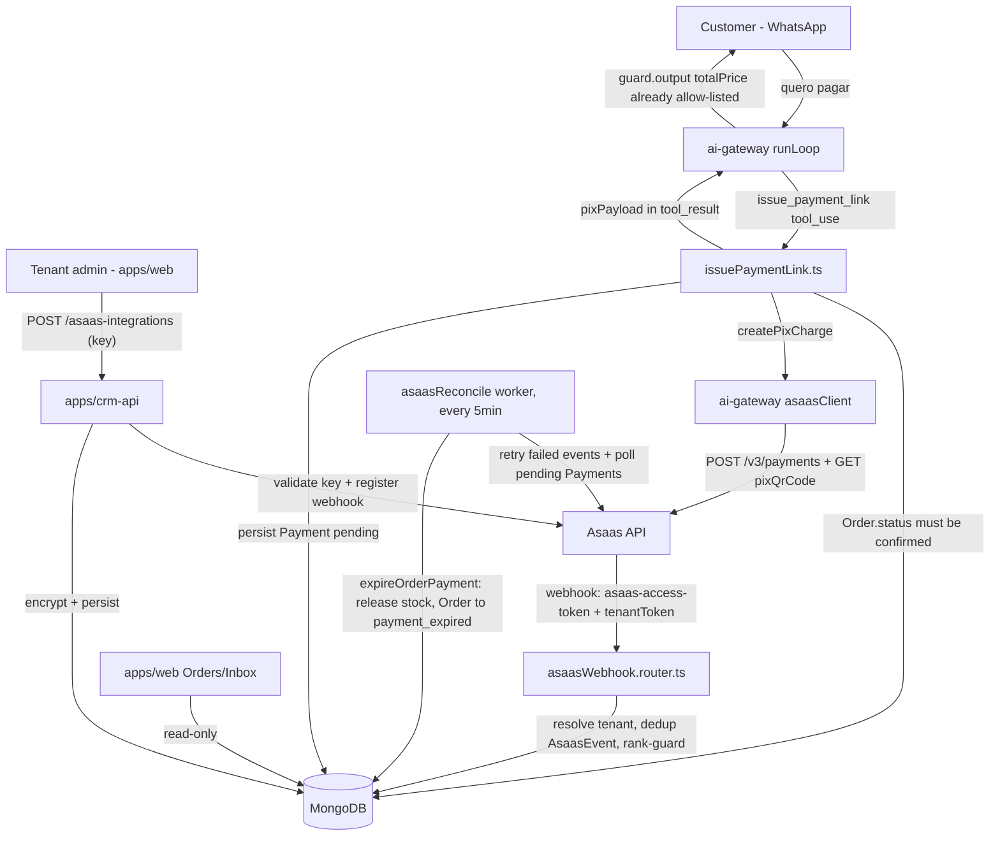

# payments-asaas Design

**Spec**: `.specs/features/payments-asaas/spec.md`
**Context**: `.specs/features/payments-asaas/context.md`
**Status**: Draft

---

## Research Provenance (read before anything else in this doc)

Per the Knowledge Verification Chain, in strict order:

1. **Codebase** — full read of `packages/db/src/crypto.helper.ts` (+ test), `orderTransitions.ts`,
   `packages/ai-kit/src/tools/createOrder.ts`, `toolDefinitions.ts`, `loop.ts`, `toolContext.ts`,
   `runTurn.ts`, `ingest.ts`, `guardOutput.ts`, `apps/ai-gateway/src/{app,server,index}.ts`,
   `middlewares/webhookSignature.middleware.ts`, `routers/webhook.router.ts`,
   `workers/reaper.ts`, `config/env.config.ts`, `apps/crm-api/src/{services,routers}/order.*`,
   `apps/crm-api/src/{services,controllers,routers}/channel.*`, `evals/cases/*.int.test.ts`,
   `evals/runner/expectTool.ts`.
2. **Project docs** — `.specs/STATE.md` Decisions (all 33 active entries at start of this Design,
   now 34), `docs/roadmap.md` item 8.
3. **Reference implementation named by AD-012** — `../DentalEase/DentalEase-BackEnd/src` (all 16
   Asaas-related files, read in full by a dedicated research pass; see citations throughout this
   doc). This is the literal precedent AD-012 names, not an analogy.
4. **Web search** — the Asaas MCP server configured in `.vscode/mcp.json` is **not actually
   connected in this session** (confirmed by `ToolSearch` returning no match for either `asaas` or
   the sibling `readme` server configured in the same file) — despite what the task briefing
   assumed. Per the Chain's Step 4 fallback, official Asaas documentation
   (`docs.asaas.com`) was fetched directly via WebSearch/WebFetch instead. Every external-API claim
   below cites its source; nothing about Asaas's live behavior is asserted without one.

**Asaas API facts confirmed via `docs.asaas.com` (not the reference code, not assumption):**

| Fact | Source |
| --- | --- |
| Auth header is `access_token: <key>` (not `Authorization: Bearer`) | [Autenticação](https://docs.asaas.com/docs/autentica%C3%A7%C3%A3o), [Chaves de API](https://docs.asaas.com/docs/chaves-de-api) |
| Key prefix `$aact_prod_...` = production, `$aact_hmlg_...` = sandbox; base URLs `api.asaas.com` vs. `api-sandbox.asaas.com` | same |
| `POST /v3/payments` — required `customer`, `billingType`, `value`, `dueDate`; `billingType` enum `PIX/BOLETO/CREDIT_CARD/UNDEFINED` | [Criar nova cobrança](https://docs.asaas.com/reference/criar-nova-cobranca) |
| Charge status enum includes `PENDING, RECEIVED, CONFIRMED, OVERDUE, REFUNDED, REFUND_REQUESTED, REFUND_IN_PROGRESS, CHARGEBACK_REQUESTED, CHARGEBACK_DISPUTE, AWAITING_CHARGEBACK_REVERSAL, ...` | same |
| PIX QR: `GET /v3/payments/{id}/pixQrCode` → `{encodedImage, payload, expirationDate}` | [Cobranças via Pix](https://docs.asaas.com/docs/cobrancas-via-pix) |
| Webhook auth: a configured `asaas-access-token` header value, sent on every callback; **never** the API key itself | [Webhooks](https://docs.asaas.com/docs/duvidas-frequentes-webhooks) |
| Webhook event payload: `{id, event, dateCreated, payment/subscription: {...}}`; `id` is the dedup key | [Introdução - Webhooks](https://docs.asaas.com/docs/about-webhooks) |
| Webhook retry: keeps retrying, pauses the queue after 15 consecutive failures; events retained 14 days | same |
| Webhooks must tolerate new/missing fields — payload shape evolves | [Erro 400 Bad Request nos logs de Webhooks](https://docs.asaas.com/docs/erro-400-bad-request) |
| Error body: `{"errors":[{"code","description"}]}`; status codes 200/204/400/401/403/404/429 (rate limit: 25000 req/12h, 50 concurrent GET)/500 | [Códigos HTTP das respostas](https://docs.asaas.com/reference/codigos-http-das-respostas) |

---

## Architecture Overview

Two independent write surfaces, matching this project's established multi-writer-per-collection
model (AD-032, extended by **AD-034**, appended to `.specs/STATE.md` as part of this Design):

- **`apps/crm-api`** — tenant admin configures the Asaas integration (a CRUD action, exactly
  parallel to how it already owns the WhatsApp `Channel`). Read-only visibility into `Payment`
  status for Orders/Inbox (P2).
- **`apps/ai-gateway`** — everything that touches money/Asaas at runtime: the `issue_payment_link`
  tool (inside the existing tool loop), the Asaas webhook receiver (new route, alongside the
  existing Meta webhook), and a reconciliation worker (new, alongside `reaper.ts`/
  `outboxConsumer.ts`/`idleTakeoverSweep.ts`).

No new call between the two services — coordination is Mongo-only (AD-002 intact).



---

## Code Reuse Analysis

### Existing Components to Leverage

| Component | Location | How to Use |
| --- | --- | --- |
| `encrypt`/`decrypt`/`maskSecret`/`sha256` | `packages/db/src/crypto.helper.ts` | Reused unmodified. `encrypt`/`decrypt`/`maskSecret` for `AsaasIntegration.apiKeyEnc` (same shape as `Channel.accessTokenEnc`); `sha256` for `AsaasIntegration.webhookAuthTokenHash` (unused by any other feature today — first real consumer). |
| `channel.service.ts`/`channel.controller.ts`/`channel.router.ts` pattern | `apps/crm-api/src/{services,controllers,routers}/channel.*` | Structural template for `asaasIntegration.{service,controller,router}.ts` — `createIntegration`/`getCurrentIntegration`, `isAdmin`-gated, mask-on-read, encrypt-before-persist. |
| `orderTransitions.ts` (`tryConfirmOrder`'s per-item `findOneAndUpdate`+rollback mechanics) | `packages/db/src/orderTransitions.ts` | `expireOrderPayment` (new, `paymentTransitions.ts`) reuses the identical per-item conditional-decrement-then-rollback shape, run in reverse (always restore, since nothing else can have re-consumed reserved stock while `confirmed`). |
| `webhook.router.ts` raw-body capture (`express.json({verify})`) + error-swallowing `handleIncoming` pattern | `apps/ai-gateway/src/routers/webhook.router.ts` | Structural template for `asaasWebhook.router.ts` — same raw-body capture (needed in case a future Asaas HMAC option is ever enabled; not required for the header-token check itself, but consistent and cheap), same "always 200, log failures" contract. |
| `reaper.ts` (`setInterval`-based worker, `start(intervalMs)` → `{stop}`) | `apps/ai-gateway/src/workers/reaper.ts` | Structural template for `asaasReconcile.ts` — this repo's own worker convention (not the reference's `node-cron`). |
| `ingest.ts`'s `isDuplicateKeyError` catch-and-refetch | `packages/ai-kit/src/ingest.ts:79-80` | Reused verbatim (same E11000 check) for `AsaasEvent` dedup and `Payment` unique-per-Order race handling. |
| `AnthropicClient`/`WhisperClient`/`DownloadAudio` injection pattern (type in `ai-kit`, real impl in `apps/ai-gateway/providers`, injected at the composition root) | `packages/ai-kit/src/providers/anthropicClient.ts`, `apps/ai-gateway/src/providers/audioDownloader.ts` | Exact template for `AsaasClient` — type declared in `ai-kit`, real HTTP implementation in `apps/ai-gateway/src/providers/asaasClient.ts`, injected via `app.ts` → `webhook.router.ts` deps → `runTurn` → `ToolContext`. |
| `guardOutput.ts`'s `PRICE_FIELD_NAMES` recursive collector | `packages/ai-kit/src/guardOutput.ts:25` | **Zero code change** — `issuePaymentLink`'s tool result reuses the field name `totalPrice` (already in the allow-listed set) for the charge amount, so the existing money-redaction guard already covers it. |
| `createOrder.ts`'s tenant/conversation defense-in-depth check | `packages/ai-kit/src/tools/createOrder.ts:105-108` | Same idiom reused in `issuePaymentLink.ts`: `Order` must resolve under `tenantScoped({Tenant: ctx.tenantId, ...})`, never trust an `orderId` alone. |
| `evals/cases/createOrderGuardrails.int.test.ts` structure (fake client, seeded `Order`, `runTurn`, assert via `Order`/`Payment` DB state + `expectNoLeak`) | `evals/cases/createOrderGuardrails.int.test.ts` | Direct template for the new `issuePaymentLinkGuardrails.int.test.ts` golden set case. |

### Integration Points

| System | Integration Method |
| --- | --- |
| Asaas API (charge creation, PIX QR, charge status) | New `apps/ai-gateway/src/providers/asaasClient.ts`, HTTP `fetch` with `access_token` header, base URL by `environment`. |
| Asaas API (key validation, webhook registration) | New `apps/crm-api/src/providers/asaasClient.ts` — separate, smaller client (see Tech Decisions: accepted duplication). |
| MongoDB | Three new collections (`payments`, `asaasIntegrations`, `asaasEvents`) via `packages/db`; additive fields on `customers` (`asaasCustomerId`) and `orders` (`status` enum gains `'payment_expired'`). |
| `packages/ai-kit` tool loop | New tool `issue_payment_link` registered in `TOOL_DEFINITIONS`/`executeTool` (8th tool); `get_order_status`'s result type extended (additive `payment?` field). |

---

## Components

### `Payment` model

- **Purpose**: One PIX charge per confirmed `Order` (P1 scope: at most one, ever, per Order).
- **Location**: `packages/db/src/models/payment.model.ts`
- **Interfaces**: Mongoose model, `tenantScoped` queries only (AD-010).
- **Dependencies**: `Order`, `Product` (via `paymentTransitions.ts`).
- **Reuses**: same `Tenant`-scoped/timestamped model shape as `Order`/`Product`.

### `AsaasIntegration` model

- **Purpose**: One encrypted Asaas credential + webhook registration per tenant.
- **Location**: `packages/db/src/models/asaasIntegration.model.ts`
- **Interfaces**: Mongoose model; unique index on `Tenant`, unique index on `webhookToken`.
- **Dependencies**: `packages/db/src/crypto.helper.ts` (`EncryptedSecret` type).
- **Reuses**: exact shape of `Channel.accessTokenEnc`.

### `AsaasEvent` model

- **Purpose**: Webhook inbox — dedup by `asaasEventId`, retry substrate for failed processing.
- **Location**: `packages/db/src/models/asaasEvent.model.ts`
- **Interfaces**: Mongoose model; unique index on `asaasEventId`.
- **Reuses**: same dedup idiom as `Message.wamid` (unique index + E11000 catch-and-refetch).

### `paymentTransitions.ts`

- **Purpose**: The one shared, multi-document Payment/Order/Product transition — never duplicated
  per app (AD-033/AD-034 precedent).
- **Location**: `packages/db/src/paymentTransitions.ts`
- **Interfaces**:
  - `applyAsaasPaymentStatus(tenantId: string, paymentId: string, asaasStatus: string, raw: unknown): Promise<Payment | {error}>` — maps `asaasStatus` → domain `status`, rank-guarded (never downgrades `paid`→`pending`), used by both the webhook handler and the reconciliation worker so the "never downgrade" invariant lives in exactly one place.
  - `expireOrderPayment(tenantId: string, paymentId: string): Promise<Payment | {error}>` — only transitions a still-`pending` `Payment` past its window; sets `Payment.status = 'expired'`, releases every item's stock (`Product.stock` `$inc` positive, same per-item shape as `tryConfirmOrder`'s rollback), sets `Order.status = 'payment_expired'`. No-ops (returns current state) if the Payment already left `pending` — safe to call repeatedly from a retried reconciliation tick.
- **Dependencies**: `Order`, `Product`, `Payment` models, `tenantScoped`.
- **Reuses**: `tryConfirmOrder`'s per-item `findOneAndUpdate`/rollback mechanics (`orderTransitions.ts`).

### `AsaasClient` (ai-gateway)

- **Purpose**: The only place `apps/ai-gateway` calls the real Asaas API from.
- **Location**: type in `packages/ai-kit/src/providers/asaasClient.ts`; real implementation in
  `apps/ai-gateway/src/providers/asaasClient.ts` (`createAsaasClient(masterEncKey: string): AsaasClient`).
- **Interfaces**:
  - `ensureCustomer(integration, customer: {name, phone, document?}): Promise<{asaasCustomerId: string}>` — looks up `Customer.asaasCustomerId`; if absent, calls Asaas `POST /v3/customers`, returns the id (caller persists it back onto `Customer`).
  - `createPixCharge(integration, params: {asaasCustomerId, value, description, dueDate}): Promise<{asaasChargeId, pixPayload?, pixEncodedImage?, pixExpirationDate?}>` — `POST /v3/payments` (`billingType: 'PIX'`) then best-effort `GET /v3/payments/{id}/pixQrCode`.
  - `getCharge(integration, asaasChargeId): Promise<{asaasStatus: string}>` — `GET /v3/payments/{id}`, used by the reconciliation worker.
- **Dependencies**: `decrypt` (per-call, never caches a decrypted key beyond the call), `fetch`.
- **Reuses**: same "type in `ai-kit`, real impl injected from `apps/ai-gateway`" shape as
  `DownloadAudio`/`WhisperClient`.

### `AsaasClient` (crm-api) — a **separate, smaller** client

- **Purpose**: The only place `apps/crm-api` calls the real Asaas API from — key validation and
  webhook self-registration only, at integration-save time.
- **Location**: `apps/crm-api/src/providers/asaasClient.ts`
- **Interfaces**:
  - `validateApiKey(apiKey, environment): Promise<boolean>` — `GET /v3/customers?limit=1`; `401` ⇒ `false`.
  - `registerWebhook(apiKey, environment, url, authToken): Promise<{asaasWebhookId: string}>` — Asaas's webhook-config endpoint.
- **Reuses**: same base-URL-by-environment convention as the `ai-gateway` client (see Tech
  Decisions: intentionally not shared as one package).

### `issue_payment_link` tool

- **Purpose**: The single new Ring B tool — creates one PIX charge for a confirmed Order.
- **Location**: `packages/ai-kit/src/tools/issuePaymentLink.ts`
- **Interfaces**: `issuePaymentLink(input: {orderId: string}, ctx: ToolContext): Promise<{orderId, status, billingType: 'PIX', totalPrice, pixPayload?, pixEncodedImage?} | {error}>`
- **Dependencies**: `Order`, `AsaasIntegration`, `Payment`, `Customer` (packages/db); `ctx.asaasClient` (new optional `ToolContext` field).
- **Reuses**: `createOrder.ts`'s tenant-scoped lookup + defense-in-depth idiom; `tryConfirmOrder`'s NOT_FOUND/ALREADY_TERMINAL error-shape convention.

### `get_order_status` (extended, not new)

- **Purpose**: Let the model answer "já caiu?" without a new tool (P1 AC5 / Out-of-Scope:
  no auto-notification).
- **Location**: `packages/ai-kit/src/tools/getOrderStatus.ts` (modify existing `OrderSummary` type
  and mapping function)
- **Interfaces**: `OrderSummary` gains `payment?: {status: 'pending'|'paid'|'expired', pixPayload?: string}`.
- **Reuses**: existing `toSummary`-style mapping; no new query pattern (one extra `Payment.findOne` by order).

### `asaasWebhook.router.ts` + `asaasWebhookAuth.middleware.ts`

- **Purpose**: Receive Asaas webhook calls, resolve tenant, verify, dedup, dispatch.
- **Location**: `apps/ai-gateway/src/routers/asaasWebhook.router.ts`, `apps/ai-gateway/src/middlewares/asaasWebhookAuth.middleware.ts`
- **Interfaces**: `POST /webhooks/asaas/:webhookToken` — middleware resolves `AsaasIntegration` by
  `webhookToken`, compares `sha256(req.header('asaas-access-token'))` against
  `integration.webhookAuthTokenHash`; on mismatch/missing → `401`, no data touched. On success,
  `insertEventIfNew` (dedup) → if new, `applyAsaasPaymentStatus`; handler always responds `200`
  regardless of internal outcome (mirrors `webhook.router.ts`'s `handleIncoming` catch-and-200).
- **Reuses**: `webhook.router.ts`'s raw-body-capture + always-200 structure.

### `asaasReconcile.ts` worker

- **Purpose**: Webhook safety net + automatic expiration, per spec P1 stories 2 and 3.
- **Location**: `apps/ai-gateway/src/workers/asaasReconcile.ts`
- **Interfaces**: `startAsaasReconcile(intervalMs = 300000): {stop: () => void}` (same shape as
  `startReaper`). Each tick, per `active` `AsaasIntegration`: (a) re-processes any `failed`
  `AsaasEvent`, (b) for every `pending` `Payment` older than the tenant-independent constant
  `PAYMENT_EXPIRATION_HOURS = 24`, calls `getCharge` once more (webhook-missed safety net) — if
  Asaas reports paid, `applyAsaasPaymentStatus`; if still unpaid and past the window,
  `expireOrderPayment`. One tenant's failure never blocks another's (independent try/catch per
  tenant, mirrors the reference's `reconcile()`).
- **Reuses**: `reaper.ts`'s `setInterval`/`{stop}` shape; `orderTransitions.ts`-style error
  containment (never throws out of the tick).

### `asaasIntegration.{service,controller,router}.ts` (crm-api)

- **Purpose**: Tenant admin CRUD for the Asaas credential.
- **Location**: `apps/crm-api/src/{services,controllers,routers}/asaasIntegration.*`
- **Interfaces**: `createIntegration(tenantId, apiKey)` (validate live → detect environment →
  encrypt → generate `webhookToken`/`authToken` → `registerWebhook` → persist
  `sha256(authToken)`), `getCurrentIntegration(tenantId)` (masked read). Routes: `POST /`, `GET /current`, both `isAdmin`-gated — identical shape to `channel.router.ts`.
- **Reuses**: `channel.service.ts` pattern verbatim (encrypt-before-persist, mask-on-read, `isAdmin`).

---

## Data Models

### `Payment`

```typescript
interface Payment {
  _id: ObjectId;
  Tenant: ObjectId;
  order: ObjectId;              // unique — at most one Payment per Order (P1 scope)
  asaasChargeId: string;        // unique
  asaasCustomerId: string;
  billingType: 'PIX';           // literal for P1; a future feature widens this enum
  value: number;                 // int cents, snapshot of Order.totalPrice at creation
  status: 'pending' | 'paid' | 'expired' | 'refunded' | 'canceled';
  asaasStatus: string;            // raw Asaas status string, for observability (mirrors reference)
  pixPayload?: string;            // copia-e-cola
  pixEncodedImage?: string;        // base64 QR (best-effort — may be absent)
  pixExpirationDate?: Date;        // Asaas's OWN QR validity (up to 12mo) — informational only, NOT what drives our expiration
  createdAt: Date;
  updatedAt: Date;
}
```

**Relationships**: `order` → `Order` (1:1 for this feature's scope). `asaasCustomerId` mirrors the
value persisted on `Customer.asaasCustomerId` once created.

### `AsaasIntegration`

```typescript
interface AsaasIntegration {
  _id: ObjectId;
  Tenant: ObjectId;               // unique
  apiKeyEnc: EncryptedSecret;      // packages/db/src/crypto.helper.ts, reused unmodified
  environment: 'sandbox' | 'production';  // auto-detected from key prefix, never a form field
  webhookToken: string;            // unique, opaque (crypto.randomBytes(24).toString('hex')) — path param that identifies the tenant to Asaas's callback
  webhookAuthTokenHash: string;    // sha256(authToken) — authToken itself sent to Asaas at registration, never stored raw
  asaasWebhookId?: string;         // Asaas-side webhook registration id, for future rotation/cleanup
  status: 'active' | 'inactive';
  createdAt: Date;
  updatedAt: Date;
}
```

**Relationships**: one per `Tenant`. Looked up by `Tenant` (tool/settings path) or by
`webhookToken` (webhook path) — never by any other key.

### `AsaasEvent`

```typescript
interface AsaasEvent {
  _id: ObjectId;
  Tenant: ObjectId;
  asaasEventId: string;   // unique — Asaas's own `id`, or a synthesized `${event}:${asaasChargeId}:${asaasStatus}` fallback (documented weaker-guarantee limitation, spec.md Edge Cases)
  event: string;           // raw Asaas event name, e.g. 'PAYMENT_CONFIRMED'
  payload: unknown;        // raw webhook body (Mixed) — never parsed strictly (Asaas payloads evolve)
  status: 'received' | 'processed' | 'failed';
  attempts: number;
  error?: string;
  receivedAt: Date;
  processedAt?: Date;
}
```

### Additive changes to existing models

- **`Customer`** (`packages/db/src/models/customer.model.ts`): `asaasCustomerId?: string` —
  populated lazily on first charge, reused thereafter. No index needed (never queried by this
  field).
- **`Order`** (`packages/db/src/models/order.model.ts`): `status` enum gains `'payment_expired'`
  alongside the existing `'pending_approval' | 'confirmed' | 'rejected'`. Every place that
  currently enumerates this union (`packages/contracts`, `apps/crm-api/src/routers/order.router.ts`'s
  `listOrdersQuerySchema`, any Zod schema mirroring it) must be updated in lockstep — enumerated
  precisely in Tasks.

---

## Error Handling Strategy

| Error Scenario | Handling | User Impact |
| --- | --- | --- |
| `issue_payment_link` called for a non-`confirmed` Order | `{error}`, no Asaas call, no `Payment` | Model tells the customer the order isn't ready to pay yet |
| Tenant has no `active` `AsaasIntegration` | `{error}` before any Asaas call | Model tells the customer payment isn't available right now (operator needs to configure it) |
| Asaas charge-creation call fails after retries | `{error}`, no `Payment` persisted | Customer can ask again later — naturally retries from scratch, no orphaned state |
| PIX QR fetch fails after charge succeeds | `Payment` persisted anyway, `pixPayload`/`pixEncodedImage` absent, `asaasChargeId` retained | Model relays what it has; reconciliation can't recover the QR itself but the charge is real and payable via Asaas's own channels |
| Webhook: invalid/missing tenant token or header hash mismatch | `401`, nothing touched | None (attacker-facing only) |
| Webhook: processing throws internally | Still `200`, error logged | None immediately — reconciliation worker retries the failed `AsaasEvent` |
| Webhook: duplicate `asaasEventId` | No-op, `200` | None |
| Webhook: stale/out-of-order status vs. already-stored rank | No-op (status not downgraded), `200` | None |
| Admin submits an invalid Asaas key | `createIntegration` rejects, nothing persisted | Admin sees an error, retries with a corrected key |
| Reconciliation: one tenant's Asaas poll fails | Logged, loop continues to the next tenant | None for other tenants |
| Reconciliation: `Payment` past expiration window, still pending | `expireOrderPayment` — stock released, `Order.status = 'payment_expired'` | Operator sees the new status; customer isn't automatically notified (Out of Scope) |

---

## Risks & Concerns

| Concern | Location (file:line) | Impact | Mitigation |
| --- | --- | --- | --- |
| `ToolContext` gains a new optional field (`asaasClient`), threaded through a new `RunTurnOptions.asaasClient` param | `packages/ai-kit/src/tools/toolContext.ts`, `runTurn.ts:70-73,139` | Touches a cross-cutting type used by all 7 existing tools | Fully optional, defaults to `undefined` everywhere else; zero behavior change for the 7 existing tools/tests — same "P1/P2 gradual rollout" shape already proven by `downloadAudio`/`whisperClient` on `IngestOptions`. |
| `evals/cases/promptInjection.int.test.ts`'s 2nd case fabricates a `tool_use` named `issue_payment_link` to prove an *unknown* tool name is never dispatched — that premise breaks the moment this feature makes the name real | `evals/cases/promptInjection.int.test.ts:126-163` | A previously-passing golden set assertion changes meaning silently if not updated | Task in Tasks phase: rename the fabricated tool_use to a name that's still genuinely nonexistent (e.g. `force_approve_order`), and update the hardcoded `collectOfferedToolNames` 7-tool list to the new 8-tool list. Same class of fix as catalog-orders' own Batch 2 ("golden set tinha superfície antiga hardcoded") — a strong candidate to promote a new confirmed lesson if this recurs a third time. |
| Two independent Asaas HTTP clients (`ai-gateway`, `crm-api`) instead of one shared package | `apps/ai-gateway/src/providers/asaasClient.ts`, `apps/crm-api/src/providers/asaasClient.ts` | Small duplication of the base-URL-by-environment convention | Accepted (Tech Decisions) — non-overlapping method sets, ~100 lines total; extract to a shared package only if a third consumer needs it. |
| Synthesized webhook dedup key (`event:chargeId:status`) when Asaas omits a stable `id` | `AsaasEvent.asaasEventId` derivation | Two genuinely distinct events with identical (event, charge, status) would collide and be treated as one | Inherited limitation from the reference and from Asaas's own documented payload variability — no code-level fix possible without an Asaas-side guarantee; documented in spec.md Edge Cases. |
| No key-rotation mechanism for the master `ASAAS_ENC_KEY` (single static env var) | `packages/db/src/crypto.helper.ts` (`resolveKey`) | If the master key ever needs rotation, every previously-encrypted `apiKeyEnc` becomes undecryptable | Same accepted gap already carried by `CHANNEL_ENC_KEY` since `ai-gateway` (feature 5) — no precedent anywhere in this codebase for key rotation; out of scope here, revisit only if `ops-hardening` (feature 11) tackles secret rotation generally. |
| Reconciliation worker's per-tenant Asaas polling is O(active tenants) per tick, sequential | `apps/ai-gateway/src/workers/asaasReconcile.ts` | Could slow down as tenant count grows | Acceptable at current project scale (judgment call already made for AD-025's wildcard-index trade-off); revisit only if profiling shows an actual bottleneck. |
| `expireOrderPayment` is a new multi-document write (Payment + N×Product + Order) without native Mongo transactions | `packages/db/src/paymentTransitions.ts` | A crash mid-release leaves a transient inconsistency (some stock restored, `Order.status` not yet flipped, or vice versa) | Same accepted risk window as AD-024/AD-033 — the next reconciliation tick naturally retries any `Payment` still `pending` past its window, converging without bespoke crash-recovery bookkeeping. |
| `apps/crm-api` gains its first outbound call to a third-party API (Asaas) at integration-save time — previously it never called out to the network synchronously in a request handler | `apps/crm-api/src/services/asaasIntegration.service.ts` | A slow/unreachable Asaas API makes the settings-save request handler slow or fail | Bounded — this is an explicit admin action (not a hot path), and DentalEase's own `call()` wrapper's retry/backoff convention (2 retries, exponential backoff) is reused, capping worst-case latency; on failure, the save is rejected with a clear error (no partial state persisted). |

> All identified concerns have a stated mitigation — none are unaddressed.

---

## Tech Decisions

| Decision | Choice | Rationale |
| --- | --- | --- |
| `issue_payment_link` call shape | Single-call tool (`{orderId}`), gate = `Order.status === 'confirmed'` — no two-call create/confirm dance like `create_order` | The "two conditions" gate (customer confirms + operator approves) already happened to reach `confirmed`; requiring a *second* independent approval loop just to issue a charge for an already-confirmed order would be undiscussed scope creep beyond AD-009's stated precondition ("nunca chamada antes da confirmação de um Order") — confirmed as the correct reading during Design. |
| Charge amount field name in the tool result | `totalPrice` (same name `OrderSummary` already uses) | Reuses `guardOutput.ts`'s existing `PRICE_FIELD_NAMES` allow-list with **zero code change** — deliberate naming choice, not an accident. |
| Where `AsaasClient` is injected | New optional `ToolContext.asaasClient`, threaded via a new sibling field on `RunTurnOptions` (not nested under `ingestOptions`) | `ingestOptions` feeds `ingest()` (pre-loop, audio-transcription-shaped); `issue_payment_link` is a Ring B *tool*, executed inside `runLoop`/`executeTool` — a flat sibling field on `RunTurnOptions` matches that a different pipeline stage needs it, without conflating the two provider-injection seams. |
| Webhook tenant resolution mechanism | Per-tenant opaque URL token (`webhookToken`) + hashed `asaas-access-token` header — **not** HMAC-of-body like the Meta webhook | This is Asaas's actual, documented mechanism (confirmed via WebSearch) and the DentalEase reference's proven pattern — not invented, and not interchangeable with Meta's scheme (different providers verify differently by design). |
| Reconciliation scheduling mechanism | `setInterval`-based worker (`apps/ai-gateway/src/workers/asaasReconcile.ts`), 5-minute default tick | Matches this repo's own established worker convention (`reaper.ts`/`outboxConsumer.ts`/`idleTakeoverSweep.ts`) rather than introducing the reference's `node-cron` dependency — no new library, same test-injectable-interval shape. |
| New Order status `'payment_expired'` + its own shared transition | Additive enum value; `expireOrderPayment` lives in `packages/db/src/paymentTransitions.ts`, mirroring `orderTransitions.ts` | Precedent explicitly set by AD-033 for exactly this situation ("uma feature futura com a mesma forma de escrita... deve seguir em vez de duplicar") — even with a single caller today, the convention is "multi-document business transitions live in `packages/db`." |
| Two independent Asaas HTTP clients vs. one shared package | Duplicate a small, non-overlapping client in each app | `ai-gateway` needs charge-creation/QR/status calls; `crm-api` needs key-validation/webhook-registration calls — near-zero overlap, ~100 lines total; a new pnpm workspace member for that footprint is disproportionate (AD-001's own rationale for `packages/field-engine` was "must run *identically* on both sides" — not the case here, this is I/O, not shared validated logic). |
| Self-registering the tenant's webhook with Asaas at integration-save time | `crm-api`'s `createIntegration` calls Asaas's webhook-config endpoint automatically | Mirrors the DentalEase reference exactly — avoids an operator manually configuring a webhook URL/token pair in the Asaas dashboard per tenant, which is both extra friction and a likely misconfiguration source. |
| Live key validation before persisting | `createIntegration` calls `GET /v3/customers?limit=1` with the submitted key before saving anything | Same reference precedent — catches a wrong/revoked key at configuration time instead of at the first real customer-facing charge attempt. |
| Expiration window | `PAYMENT_EXPIRATION_HOURS = 24`, a plain exported constant (`packages/db/src/paymentTransitions.ts` or a shared config) | Assumption, logged in spec.md — independent of Asaas's own PIX QR validity (up to 12 months); trivially tunable later without a schema change. |

---

## New Project-Level Decision

**AD-034** was appended to `.specs/STATE.md` `## Decisions` as part of this Design (extends
AD-032/AD-033, supersedes neither) — see that entry for the full write-ownership and
shared-transition rationale summarized in the Tech Decisions table above.
