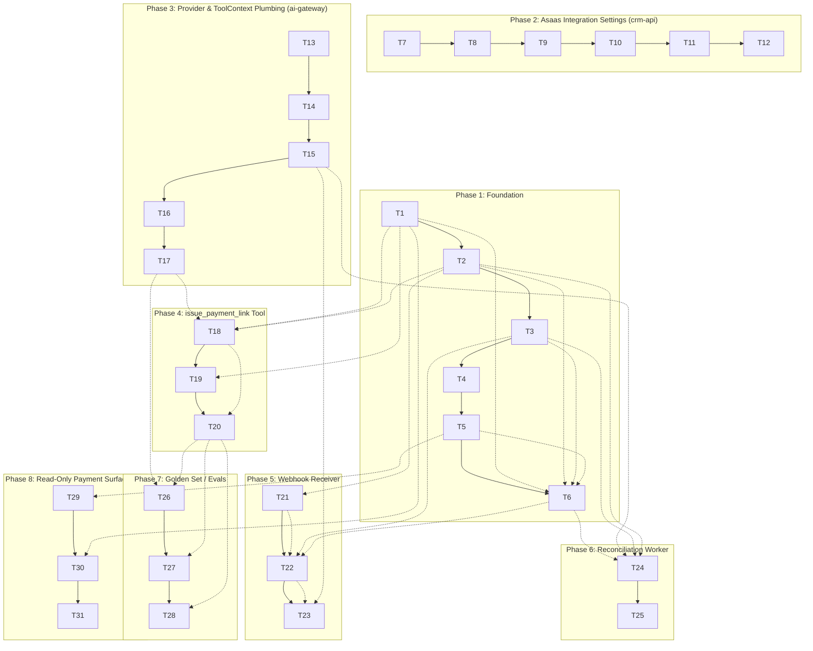

# payments-asaas Tasks

## Execution Protocol (MANDATORY -- do not skip)

Implement these tasks with the `tlc-spec-driven` skill: **activate it by name and follow its
Execute flow and Critical Rules.** Do not search for skill files by filesystem path. The skill is
the source of truth for the full flow (per-task cycle, sub-agent delegation, adequacy review,
Verifier, discrimination sensor).

**If the skill cannot be activated, STOP and tell the user — do not proceed without it.**

**Operational note (same root cause as every prior feature in this repo):** `tlc-spec-driven`
does not appear in this session's skill listing (files exist at `tlc-spec-driven/` in the repo
root, versioned in git, but there is no `.claude/skills/` in the CRM). Load `SKILL.md` +
`references/implement.md`/`sub-agents.md`/`coding-principles.md`/`validate.md`/`lessons.md`
manually at the start of Execute, exactly as done for this session's Specify/Design.

---

**Design**: `.specs/features/payments-asaas/design.md`
**Status**: Draft

---

## Test Coverage Matrix

> Generated from codebase sampling (AD-017's Vitest `projects` convention: `unit`/`integration`/
> `e2e`/`structural`, suffix-routed) and this feature's spec ACs. Guidelines found: `.specs/STATE.md`
> AD-017 (test convention + gate commands), AD-031 (CI runs the Build gate). No project-level
> `CONTRIBUTING.md`/coverage-threshold config beyond AD-017/031 was found. Confirm before Execute.

| Code Layer | Required Test Type | Coverage Expectation | Location Pattern | Run Command |
| --- | --- | --- | --- | --- |
| Model/schema (`Payment`, `AsaasIntegration`, `AsaasEvent`, additive `Customer`/`Order` fields) | integration | Required fields, unique indexes, defaults enforced — floor matches existing `*.model.int.test.ts` depth (e.g. `customer.model.int.test.ts`) | `packages/db/src/models/*.model.int.test.ts` | `pnpm vitest run --project integration` |
| `packages/db` shared transition (`paymentTransitions.ts`) | integration | All branches: pending→paid, pending→expired (stock released + `Order.status`), already-terminal no-op, rank-guard blocks downgrade — 1:1 to PAY-08/11/12 | `packages/db/src/paymentTransitions.int.test.ts` | `pnpm vitest run --project integration` |
| `ai-kit` tool logic (`issuePaymentLink.ts`, extended `getOrderStatus.ts`) | unit | All branches per PAY-01..05: gate rejection, idempotent existing Payment, no active integration, Asaas call failure, success | `packages/ai-kit/src/tools/*.unit.test.ts` | `pnpm vitest run --project unit` |
| Provider client (`asaasClient.ts`, both apps) | unit | HTTP call shape; retry/backoff on transient (5xx/429/timeout), no retry on other 4xx; error normalization — fake `fetch` injected, never the real network | `apps/*/src/providers/asaasClient.unit.test.ts` | `pnpm vitest run --project unit` |
| Middleware (`asaasWebhookAuth.middleware.ts`) | unit | Valid token+hash passes; missing token, unknown token, hash mismatch → 401 — floor matches `webhookSignature.middleware.unit.test.ts` | `apps/ai-gateway/src/middlewares/*.unit.test.ts` | `pnpm vitest run --project unit` |
| Router (`asaasWebhook.router.ts`) | e2e | Valid webhook → 200 + DB updated; invalid auth → 401; duplicate event no-op; downgrade-guard holds — floor matches `webhook.router.e2e.test.ts` | `apps/ai-gateway/src/routers/*.e2e.test.ts` | `pnpm vitest run --project e2e` |
| Worker (`asaasReconcile.ts`) | integration | Expires past-window pending Payment + releases stock; retries failed `AsaasEvent`; one tenant's failure never blocks another's | `apps/ai-gateway/src/workers/*.int.test.ts` | `pnpm vitest run --project integration` |
| Service (`asaasIntegration.service.ts`) | unit | Validate→encrypt→register orchestration (success + every failure branch), masked read — fake Asaas client injected | `apps/crm-api/src/services/*.unit.test.ts` | `pnpm vitest run --project unit` |
| Repository (`asaasIntegration.repository.ts`, `order.repository.ts` Payment enrichment) | integration | Persistence/lookup by `Tenant` and by `webhookToken`; Payment-status read enrichment — floor matches `order.repository.int.test.ts`/`channel.repository.int.test.ts` | `apps/crm-api/src/repositories/*.int.test.ts` | `pnpm vitest run --project integration` |
| Router (`asaasIntegration.router.ts`, `order.router.ts` status filter) | e2e | All routes: happy path + `isAdmin` rejection + invalid-key rejection + new status filter value | `apps/crm-api/src/routers/*.e2e.test.ts` | `pnpm vitest run --project e2e` |
| Tool registration (`toolDefinitions.ts`/`loop.ts` executor switch) | structural | Fixed tool-surface assertion extended to 8 tools — floor matches the existing AD-004/AD-010 structural test | `packages/ai-kit/src/*.structural.test.ts` | `pnpm vitest run --project structural` |
| Golden set (`evals/cases/*.int.test.ts`) | integration | New case: `issue_payment_link` never called/never succeeds before `confirmed` (PAY-02/03, mirrors CAT-25/26/27); existing fixed-tool-list assertions updated to 8 tools | `evals/cases/*.int.test.ts` | `pnpm vitest run --project integration` |
| `apps/web` component (Orders/Inbox payment-status display) | unit | Renders each Payment status state correctly — floor matches existing `apps/web/src/**/*.unit.test.tsx` component tests | `apps/web/src/**/*.unit.test.tsx` | `pnpm vitest run --project unit` |
| Contracts schema (`createAsaasIntegration.schema.ts`) | unit | Valid/invalid input rejected — floor matches `createProduct.schema.unit.test.ts` | `packages/contracts/src/schemas/*.unit.test.ts` | `pnpm vitest run --project unit` |
| Entity/config only (`env.config.ts` additions) | none | Build gate only | — | build gate only |

## Gate Check Commands

> Generated from `.specs/STATE.md` AD-017. Confirm before Execute.

| Gate Level | When to Use | Command |
| --- | --- | --- |
| Quick | After tasks with unit/structural tests only | `pnpm vitest run --project unit --project structural` |
| Full | After tasks with integration/e2e tests | `pnpm vitest run` |
| Build | After phase completion or config/entity-only tasks | `pnpm -r exec tsc --noEmit && pnpm biome check . && pnpm vitest run` |

---

## Execution Plan

Phases are ordered and run sequentially — each phase completes before the next begins, and tasks
within a phase execute in order.

### Phase 1: Foundation — Data Models & Shared Transitions

```
T1 → T2 → T3 → T4 → T5 → T6
```

### Phase 2: Tenant Configures the Asaas Integration (crm-api)

```
T7 → T8 → T9 → T10 → T11 → T12
```

### Phase 3: ai-gateway Provider & Tool-Context Plumbing

```
T13 → T14 → T15 → T16 → T17
```

### Phase 4: `issue_payment_link` Tool & Registration

```
T18 → T19 → T20
```

### Phase 5: Asaas Webhook Receiver (ai-gateway)

```
T21 → T22 → T23
```

### Phase 6: Reconciliation Worker (ai-gateway)

```
T24 → T25
```

### Phase 7: Golden Set / Evals

```
T26 → T27 → T28
```

### Phase 8 (P2): Read-Only Payment Status Surface

```
T29 → T30 → T31
```

---

## Task Breakdown

### T1: Create `Payment` model

**What**: Mongoose model + type for `Payment` (fields per design.md Data Models).
**Where**: `packages/db/src/models/payment.model.ts`
**Depends on**: None
**Reuses**: `Order`/`Product` model shape (`Tenant`-scoped, timestamped); `EncryptedSecret` type is NOT used here (Payment has no secret field).
**Requirement**: PAY-01, PAY-11

**Tools**: MCP: NONE / Skill: NONE

**Done when**:
- [x] Schema matches design.md exactly: `order` unique index, `status` enum `pending|paid|expired|refunded|canceled`, `billingType: 'PIX'` literal, `value` int validated
- [x] Exported from `packages/db/src/index.ts`
- [x] Gate check passes: `pnpm vitest run --project integration`
- [x] Test count: baseline + new model tests pass (no silent deletions)

**Tests**: integration
**Gate**: full

---

### T2: Create `AsaasIntegration` model

**What**: Mongoose model + type for `AsaasIntegration`.
**Where**: `packages/db/src/models/asaasIntegration.model.ts`
**Depends on**: None
**Reuses**: `Channel.accessTokenEnc` shape (`EncryptedSecret`); `crypto.helper.ts` types only (no logic change).
**Requirement**: PAY-06, PAY-13, PAY-14

**Tools**: MCP: NONE / Skill: NONE

**Done when**:
- [x] Schema matches design.md: unique `Tenant`, unique `webhookToken`, `environment` enum, `status` enum `active|inactive`
- [x] Exported from `packages/db/src/index.ts`
- [x] Gate check passes: `pnpm vitest run --project integration`
- [x] Test count: baseline + new model tests pass (no silent deletions)

**Tests**: integration
**Gate**: full

---

### T3: Create `AsaasEvent` model

**What**: Mongoose model + type for `AsaasEvent` (webhook inbox).
**Where**: `packages/db/src/models/asaasEvent.model.ts`
**Depends on**: None
**Reuses**: Same unique-index dedup idiom as `Message.wamid`.
**Requirement**: PAY-07

**Tools**: MCP: NONE / Skill: NONE

**Done when**:
- [x] Schema matches design.md: unique `asaasEventId`, `status` enum `received|processed|failed`, `payload: Mixed`
- [x] Exported from `packages/db/src/index.ts`
- [x] Gate check passes: `pnpm vitest run --project integration`
- [x] Test count: baseline + new model tests pass (no silent deletions)

**Tests**: integration
**Gate**: full

---

### T4: Additive `asaasCustomerId` field on `Customer`

**What**: Add optional `asaasCustomerId?: string` to the existing `Customer` schema — no index, no other change.
**Where**: `packages/db/src/models/customer.model.ts` (modify)
**Depends on**: None
**Reuses**: N/A (single additive field)
**Requirement**: PAY-01

**Tools**: MCP: NONE / Skill: NONE

**Done when**:
- [x] Field is optional, absent for every existing `Customer` document/test without a migration
- [x] `customer.model.int.test.ts` extended with one case asserting the field round-trips
- [x] Gate check passes: `pnpm vitest run --project integration`
- [x] Test count: baseline + 1 new case pass (no silent deletions)

**Tests**: integration
**Gate**: full

---

### T5: Additive `'payment_expired'` status on `Order`

**What**: Add `'payment_expired'` to the `Order.status` union, alongside `'pending_approval'|'confirmed'|'rejected'` — in `packages/db`'s model AND any `@crm/contracts` schema/type mirroring this union (enumerate exact files by grepping `pending_approval.*confirmed.*rejected` across `packages/contracts`/`apps/crm-api`/`packages/ai-kit` before editing — design.md flags this must be updated in lockstep, exact file list confirmed at task time, not guessed here).
**Where**: `packages/db/src/models/order.model.ts` (+ any contracts mirror found)
**Depends on**: None
**Reuses**: N/A (additive enum value)
**Requirement**: PAY-11, PAY-12

**Tools**: MCP: NONE / Skill: NONE

**Done when**:
- [x] `'payment_expired'` is a valid, persistable `Order.status` value everywhere the union is defined
- [x] No existing `Order` document/test with the 3 old values changes behavior
- [x] Gate check passes: `pnpm vitest run --project integration`
- [x] Test count: baseline + new enum-value case passes (no silent deletions)

**Tests**: integration
**Gate**: full

---

### T6: `paymentTransitions.ts` — `applyAsaasPaymentStatus` + `expireOrderPayment`

**What**: The shared multi-document transition module (design.md Components) — both functions, in one file, with full integration test coverage of every branch.
**Where**: `packages/db/src/paymentTransitions.ts` (+ `paymentTransitions.int.test.ts`)
**Depends on**: T1, T2, T3, T5
**Reuses**: `orderTransitions.ts`'s per-item `findOneAndUpdate`+rollback mechanics (`tryConfirmOrder`).
**Requirement**: PAY-08, PAY-11, PAY-12

**Tools**: MCP: NONE / Skill: NONE

**Done when**:
- [x] `applyAsaasPaymentStatus` maps `asaasStatus`→domain `status`, never downgrades rank (`pending<paid`, and `paid`/`refunded`/`canceled` are never overwritten by a lower-rank status)
- [x] `expireOrderPayment` only acts on a still-`pending` Payment; releases every item's stock (`Product.stock` `$inc` positive); sets `Order.status = 'payment_expired'`; no-ops safely on a Payment already left `pending`
- [x] All branches covered by tests (1:1 to PAY-08/11/12), matching `orderTransitions.int.test.ts`'s depth
- [x] Gate check passes: `pnpm vitest run --project integration`
- [x] Test count: baseline + N new tests pass (no silent deletions)

**Tests**: integration
**Gate**: full

**Commit**: `feat(db): add paymentTransitions — Asaas status apply + payment expiry`

---

### T7: crm-api env additions

**What**: Add `ASAAS_ENC_KEY` and `ASAAS_WEBHOOK_BASE_URL` to `envSchema`, same fail-fast `safeParse` convention.
**Where**: `apps/crm-api/src/config/env.config.ts` (modify)
**Depends on**: None
**Reuses**: Exact `CHANNEL_ENC_KEY` precedent already in this same file.
**Requirement**: PAY-13

**Tools**: MCP: NONE / Skill: NONE

**Done when**:
- [ ] Both vars required, named error message on absence (matches `CHANNEL_ENC_KEY`'s message shape)
- [ ] `.env.example` updated with both (placeholder values)
- [ ] Gate check passes: build gate

**Tests**: none
**Gate**: build

---

### T8: crm-api `providers/asaasClient.ts`

**What**: `validateApiKey(apiKey, environment)` + `registerWebhook(apiKey, environment, url, authToken)` — thin fetch wrapper, base URL by environment (`api.asaas.com`/`api-sandbox.asaas.com`), `access_token` header.
**Where**: `apps/crm-api/src/providers/asaasClient.ts` (+ unit test)
**Depends on**: None
**Reuses**: Base-URL-by-environment convention confirmed via design.md Research Provenance (docs.asaas.com); NOT shared with the ai-gateway client (design.md Tech Decisions: accepted duplication).
**Requirement**: PAY-13

**Tools**: MCP: NONE / Skill: NONE

**Done when**:
- [ ] `validateApiKey` returns `false` on 401, `true` on 200 — fake `fetch` injected, never real network
- [ ] `registerWebhook` posts the expected payload shape, returns `{asaasWebhookId}`
- [ ] Transient errors (5xx/429/timeout) retried with backoff; other 4xx fail immediately (mirrors DentalEase reference's `call()`/`isTransient` policy, design.md citation)
- [ ] Gate check passes: `pnpm vitest run --project unit`
- [ ] Test count: N new tests pass

**Tests**: unit
**Gate**: quick

---

### T9: `createAsaasIntegration` contracts schema

**What**: Zod schema validating `{apiKey: string}` (min length per Asaas's own key format).
**Where**: `packages/contracts/src/schemas/createAsaasIntegration.schema.ts` (+ unit test)
**Depends on**: None
**Reuses**: `createChannelSchema`'s `.strict()` convention.
**Requirement**: PAY-13

**Tools**: MCP: NONE / Skill: NONE

**Done when**:
- [ ] Rejects empty/malformed key, accepts a well-formed one
- [ ] Exported from `packages/contracts/src/index.ts`
- [ ] Gate check passes: `pnpm vitest run --project unit`

**Tests**: unit
**Gate**: quick

---

### T10: `asaasIntegration.repository.ts`

**What**: `createIntegration`, `findByTenant`, `findByWebhookToken`.
**Where**: `apps/crm-api/src/repositories/asaasIntegration.repository.ts` (+ int test)
**Depends on**: T2
**Reuses**: `channel.repository.ts`'s exact shape (`findByTenant` idiom, `tenantScoped`).
**Requirement**: PAY-13, PAY-14

**Tools**: MCP: NONE / Skill: NONE

**Done when**:
- [ ] All 3 functions tenant-scoped (AD-010), covered by integration tests against `MongoMemoryServer`
- [ ] Gate check passes: `pnpm vitest run --project integration`

**Tests**: integration
**Gate**: full

---

### T11: `asaasIntegration.service.ts`

**What**: `createIntegration(tenantId, apiKey)` (validate live → detect environment from key prefix → encrypt → generate `webhookToken`/`authToken` → `registerWebhook` → persist `sha256(authToken)`) and `getCurrentIntegration(tenantId)` (masked read).
**Where**: `apps/crm-api/src/services/asaasIntegration.service.ts` (+ unit test)
**Depends on**: T7, T8, T9, T10
**Reuses**: `channel.service.ts`'s encrypt-before-persist/mask-on-read pattern verbatim; `crypto.helper.ts`'s `encrypt`/`maskSecret`/`sha256`.
**Requirement**: PAY-13, PAY-14

**Tools**: MCP: NONE / Skill: NONE

**Done when**:
- [ ] Rejects an invalid key (fake client returns `false`) without persisting anything
- [ ] On success: environment auto-detected from prefix (`$aact_prod_`⇒production, else sandbox), `apiKeyEnc` never plaintext, `webhookAuthTokenHash` is `sha256` of the generated `authToken` (never the raw token stored)
- [ ] `getCurrentIntegration` never returns the plaintext key — only `maskSecret(decrypt(...))`
- [ ] Gate check passes: `pnpm vitest run --project unit`
- [ ] Test count: N new tests pass

**Tests**: unit
**Gate**: quick

---

### T12: `asaasIntegration.controller.ts` + `router.ts` + wire into `app.ts`

**What**: `POST /` and `GET /current`, both `isAdmin`-gated (mirrors `channel.router.ts` exactly); mount under crm-api's `app.ts`.
**Where**: `apps/crm-api/src/controllers/asaasIntegration.controller.ts`, `apps/crm-api/src/routers/asaasIntegration.router.ts`, `apps/crm-api/src/app.ts` (modify)
**Depends on**: T11
**Reuses**: `channel.controller.ts`/`channel.router.ts` structure verbatim.
**Requirement**: PAY-13, PAY-14

**Tools**: MCP: NONE / Skill: NONE

**Done when**:
- [ ] Both routes `isAdmin`-gated before any body validation/DB access (matches `channel.router.ts`'s ordering)
- [ ] `POST /` validates body via T9's schema, returns 4xx on an Asaas-rejected key
- [ ] e2e test covers: happy path, non-admin 403, invalid key 4xx
- [ ] Gate check passes: `pnpm vitest run --project e2e`
- [ ] Test count: N new tests pass

**Tests**: e2e
**Gate**: full

**Commit**: `feat(crm-api): add Asaas integration settings CRUD`

---

### T13: ai-gateway env additions

**What**: Add `ASAAS_ENC_KEY` to `envSchema`.
**Where**: `apps/ai-gateway/src/config/env.config.ts` (modify)
**Depends on**: None
**Reuses**: Exact `CHANNEL_ENC_KEY` precedent already in this same file.
**Requirement**: PAY-01

**Tools**: MCP: NONE / Skill: NONE

**Done when**:
- [ ] Var required, named error message on absence
- [ ] `.env.example` updated
- [ ] Gate check passes: build gate

**Tests**: none
**Gate**: build

---

### T14: `AsaasClient` type (ai-kit)

**What**: Declare the `AsaasClient` interface (`ensureCustomer`/`createPixCharge`/`getCharge`) — type only, no implementation, matching `AnthropicClient`/`WhisperClient`'s split.
**Where**: `packages/ai-kit/src/providers/asaasClient.ts` (new, type-only)
**Depends on**: None
**Reuses**: `providers/anthropicClient.ts`'s "type here, real impl in the app" convention.
**Requirement**: PAY-01

**Tools**: MCP: NONE / Skill: NONE

**Done when**:
- [ ] Interface matches design.md Components exactly
- [ ] Exported from `packages/ai-kit/src/index.ts`
- [ ] Gate check passes: build gate (type-only file, no runtime logic to unit-test)

**Tests**: none
**Gate**: build

---

### T15: ai-gateway `providers/asaasClient.ts` (real implementation)

**What**: `createAsaasClient(masterEncKey): AsaasClient` — implements `ensureCustomer`/`createPixCharge`/`getCharge` against the real Asaas API.
**Where**: `apps/ai-gateway/src/providers/asaasClient.ts` (+ unit test)
**Depends on**: T14
**Reuses**: Same base-URL-by-environment + retry/backoff convention as T8 (independently implemented per design.md Tech Decisions — accepted small duplication).
**Requirement**: PAY-01

**Tools**: MCP: NONE / Skill: NONE

**Done when**:
- [ ] `createPixCharge` calls `POST /v3/payments` (`billingType:'PIX'`) then best-effort `GET /v3/payments/{id}/pixQrCode` (failure here doesn't fail the whole call — design.md Edge Cases)
- [ ] `getCharge` calls `GET /v3/payments/{id}`
- [ ] Decryption of the integration's key happens per-call, never cached beyond the call
- [ ] Retry/backoff on transient errors only, matching T8's policy
- [ ] Gate check passes: `pnpm vitest run --project unit`
- [ ] Test count: N new tests pass

**Tests**: unit
**Gate**: quick

---

### T16: `ToolContext.asaasClient` (optional field)

**What**: Add `asaasClient?: AsaasClient` to `ToolContext`.
**Where**: `packages/ai-kit/src/tools/toolContext.ts` (modify)
**Depends on**: T14
**Reuses**: N/A (single additive optional field, same shape as `IngestOptions.downloadAudio`'s optionality).
**Requirement**: PAY-01

**Tools**: MCP: NONE / Skill: NONE

**Done when**:
- [ ] Field is optional; every existing `ToolContext` literal across the 7 existing tools' tests compiles unchanged (no forced update)
- [ ] Gate check passes: build gate

**Tests**: none
**Gate**: build

---

### T17: `runTurn.ts` — thread `asaasClient` into `ToolContext`

**What**: Add `asaasClient?: AsaasClient` to `RunTurnOptions` (sibling to `ingestOptions`, per design.md Tech Decisions); build `ctx` with it.
**Where**: `packages/ai-kit/src/runTurn.ts` (modify, line ~139)
**Depends on**: T16
**Reuses**: N/A (additive plumbing only)
**Requirement**: PAY-01

**Tools**: MCP: NONE / Skill: NONE

**Done when**:
- [ ] `ctx.asaasClient` is `opts.asaasClient` when provided, `undefined` otherwise — no behavior change for any existing `runTurn` caller/test that doesn't pass it
- [ ] Existing `runTurn` test suite passes unmodified
- [ ] Gate check passes: `pnpm vitest run` (existing `runTurn` integration tests must still be green)

**Tests**: integration (existing suite, no new file needed — extend an existing `runTurn.int.test.ts` case only if one doesn't already implicitly cover this)
**Gate**: full

---

### T18: `issue_payment_link` tool

**What**: `issuePaymentLink({orderId}, ctx)` — the full P1 gate/idempotency/creation logic (design.md Components).
**Where**: `packages/ai-kit/src/tools/issuePaymentLink.ts` (+ unit test)
**Depends on**: T1, T2, T17
**Reuses**: `createOrder.ts`'s tenant/conversation defense-in-depth idiom; `Order`/`AsaasIntegration`/`Payment`/`Customer` models directly (no repository layer in `ai-kit`, matching `createOrder.ts`'s own precedent).
**Requirement**: PAY-01, PAY-02, PAY-03, PAY-04

**Tools**: MCP: NONE / Skill: NONE

**Done when**:
- [ ] Order not `confirmed` → `{error}`, zero Asaas calls, zero `Payment` created (PAY-02)
- [ ] Order `confirmed`, no existing Payment, active integration → creates `Payment`, returns `{orderId, status:'pending', billingType:'PIX', totalPrice, pixPayload, pixEncodedImage}` (PAY-01) — field name `totalPrice` used deliberately (design.md: reuses `guardOutput.ts`'s existing allow-list, zero guard code change)
- [ ] Order `confirmed`, existing Payment already present → returns that same Payment's current state, no second Asaas call (PAY-03)
- [ ] No `active` `AsaasIntegration` for the tenant → `{error}`, zero Asaas calls (PAY-04)
- [ ] `Customer.asaasCustomerId` created via `ensureCustomer` on first use, persisted for reuse
- [ ] Asaas API failure (fake client throws) → `{error}`, no `Payment` persisted
- [ ] Gate check passes: `pnpm vitest run --project unit`
- [ ] Test count: N new tests pass, all branches above covered 1:1

**Tests**: unit
**Gate**: quick

**Commit**: `feat(ai-kit): add issue_payment_link tool (Anel B, AD-009)`

---

### T19: Extend `get_order_status` with payment info

**What**: `OrderSummary` gains optional `payment?: {status, pixPayload?}`; `getOrderStatus.ts` looks up the Order's `Payment` (if any) and includes it.
**Where**: `packages/ai-kit/src/tools/getOrderStatus.ts` (modify) + its unit test
**Depends on**: T1
**Reuses**: Existing `toSummary`-style mapping in the same file.
**Requirement**: PAY-05

**Tools**: MCP: NONE / Skill: NONE

**Done when**:
- [ ] Order with no Payment → `payment` field absent (no behavior change for `catalog-orders`' existing assertions)
- [ ] Order with a Payment → `payment.status`/`pixPayload` populated
- [ ] Existing `getOrderStatus.unit.test.ts` cases pass unmodified
- [ ] Gate check passes: `pnpm vitest run --project unit`

**Tests**: unit
**Gate**: quick

---

### T20: Register `issue_payment_link` (8th tool) + structural test update

**What**: Add the tool definition to `TOOL_DEFINITIONS`, the dispatch `case` in `executeTool` (`loop.ts`), and extend the existing structural test asserting the fixed tool surface (AD-004/AD-010) to 8 entries.
**Where**: `packages/ai-kit/src/tools/toolDefinitions.ts`, `packages/ai-kit/src/loop.ts` (both modify), `packages/ai-kit/src/*.structural.test.ts` (modify)
**Depends on**: T18
**Reuses**: Exact pattern used to add `search_products`/`get_order_status`/`create_order` in catalog-orders (T14 there).
**Requirement**: PAY-01

**Tools**: MCP: NONE / Skill: NONE

**Done when**:
- [ ] `TOOL_DEFINITIONS` has 8 entries; `input_schema` for `issue_payment_link` requires `orderId` only (AD-010: no tenant/channel/conversation field)
- [ ] `executeTool`'s `default` fallback still returns `{error}` for any unrecognized name (never throws)
- [ ] Structural test's fixed-count/name-list assertion updated to 8 tools
- [ ] Gate check passes: `pnpm vitest run --project structural`

**Tests**: structural
**Gate**: quick

---

### T21: `asaasWebhookAuth.middleware.ts`

**What**: Resolve `AsaasIntegration` by the `:webhookToken` path param; compare `sha256(req.header('asaas-access-token'))` against the stored hash; `401` on any mismatch, `next()` with the resolved integration attached otherwise.
**Where**: `apps/ai-gateway/src/middlewares/asaasWebhookAuth.middleware.ts` (+ unit test)
**Depends on**: T2
**Reuses**: `webhookSignature.middleware.ts`'s isolated-testable-function shape (mocked req/res); `crypto.helper.ts`'s `sha256`.
**Requirement**: PAY-06

**Tools**: MCP: NONE / Skill: NONE

**Done when**:
- [ ] Unknown `webhookToken` → 401, no data touched
- [ ] Known token, missing/invalid header → 401
- [ ] Known token, matching header hash → `next()`, integration attached to `req`
- [ ] Gate check passes: `pnpm vitest run --project unit`

**Tests**: unit
**Gate**: quick

---

### T22: `asaasWebhook.router.ts`

**What**: `POST /webhooks/asaas/:webhookToken` — raw-body capture, T21's middleware, dedup via `AsaasEvent` (`insertEventIfNew`-style, mirrors `ingest.ts`'s E11000 catch-and-refetch), dispatch to `applyAsaasPaymentStatus` (T6). Always responds `200` regardless of internal outcome; logs failures.
**Where**: `apps/ai-gateway/src/routers/asaasWebhook.router.ts` (+ e2e test)
**Depends on**: T21, T3, T6
**Reuses**: `webhook.router.ts`'s raw-body-capture + always-200 `handleIncoming` structure verbatim.
**Requirement**: PAY-06, PAY-07, PAY-08, PAY-09

**Tools**: MCP: NONE / Skill: NONE

**Done when**:
- [ ] Valid webhook (new event, known token, matching header) → `200`, `Payment.status` updated, `AsaasEvent` recorded `processed`
- [ ] Same `asaasEventId` delivered twice → second call is a no-op, still `200`
- [ ] Invalid token/header → `401` (via T21), nothing else touched
- [ ] A stale lower-rank status delivered after a higher-rank one → status unchanged, still `200`
- [ ] Internal processing throws → still `200`, `AsaasEvent` recorded `failed` with the error, nothing else crashes
- [ ] Gate check passes: `pnpm vitest run --project e2e`

**Tests**: e2e
**Gate**: full

---

### T23: Wire the webhook router + real `asaasClient` into `app.ts`

**What**: Mount `asaasWebhook.router.ts` under `apps/ai-gateway`'s `buildApp()`; construct the real `AsaasClient` via `createAsaasClient(env.ASAAS_ENC_KEY)` (T15) and thread it through to `runTurn` via `WebhookRouterDeps`/T17's `RunTurnOptions.asaasClient`.
**Where**: `apps/ai-gateway/src/app.ts` (modify), `apps/ai-gateway/src/routers/webhook.router.ts` (modify: extend `WebhookRouterDeps`)
**Depends on**: T22, T15
**Reuses**: Exact composition-root pattern already used for `client`/`downloadAudio`/`whisperClient` in the same file.
**Requirement**: PAY-01, PAY-06

**Tools**: MCP: NONE / Skill: NONE

**Done when**:
- [ ] `buildApp()` mounts both webhook routers (Meta + Asaas) without collision
- [ ] The Meta webhook router's `deps` gains `asaasClient`, passed through to `runTurn`
- [ ] Existing `webhook.router.e2e.test.ts` passes unmodified (additive dep, optional)
- [ ] Gate check passes: `pnpm vitest run`

**Tests**: e2e (existing suite extended, no new file required beyond what T22 already added)
**Gate**: full

**Commit**: `feat(ai-gateway): wire Asaas webhook receiver + client into composition root`

---

### T24: `asaasReconcile.ts` worker

**What**: `startAsaasReconcile(intervalMs = 300000)` — per active `AsaasIntegration`: retry failed `AsaasEvent`s, poll `getCharge` for every `pending` `Payment`, apply status or expire past the 24h window.
**Where**: `apps/ai-gateway/src/workers/asaasReconcile.ts` (+ int test)
**Depends on**: T6, T15, T3, T2
**Reuses**: `reaper.ts`'s `setInterval`/`{stop}` shape; `paymentTransitions.ts`'s `applyAsaasPaymentStatus`/`expireOrderPayment` (never reimplemented here).
**Requirement**: PAY-10, PAY-11

**Tools**: MCP: NONE / Skill: NONE

**Done when**:
- [ ] A `pending` Payment older than 24h, still unpaid per a fake `getCharge` response → `expireOrderPayment` called, stock released, `Order.status = 'payment_expired'`
- [ ] A `pending` Payment where the fake `getCharge` now reports paid → `applyAsaasPaymentStatus` called, `Order` untouched otherwise
- [ ] A failed `AsaasEvent` is retried; success marks it `processed`, renewed failure keeps it `failed` with an updated `attempts`/`error`
- [ ] One tenant's Asaas-call failure doesn't stop the tick from processing the next tenant
- [ ] Gate check passes: `pnpm vitest run --project integration`

**Tests**: integration
**Gate**: full

---

### T25: Start the worker in `server.ts`

**What**: `startAsaasReconcile(opts.asaasReconcileIntervalMs)` alongside the 3 existing workers; add to `StartOptions`/`StartHandle.stopWorkers`.
**Where**: `apps/ai-gateway/src/server.ts` (modify)
**Depends on**: T24
**Reuses**: Exact pattern already used for `startReaper`/`startOutboxConsumer`/`startIdleTakeoverSweep`.
**Requirement**: PAY-10

**Tools**: MCP: NONE / Skill: NONE

**Done when**:
- [ ] Worker starts on `start()`, stoppable via `stopWorkers()`
- [ ] `opts.asaasReconcileIntervalMs` allows a short test interval, defaulting to 300000ms in production
- [ ] Gate check passes: build gate (no new test file — this is composition-root wiring covered by T24's injected-interval tests)

**Tests**: none
**Gate**: build

---

### T26: New golden set — `issue_payment_link` never called/succeeds before `confirmed`

**What**: `evals/cases/issuePaymentLinkGuardrails.int.test.ts` — mirrors `createOrderGuardrails.int.test.ts`'s structure: seed a `pending_approval` Order, run a turn where the fake model calls `issue_payment_link`, assert `{error}`/no Payment/no fake-`AsaasClient`-method-invocation; then seed a `confirmed` Order and assert success with the fake client's canned PIX response, `totalPrice` surviving `guardOutput`'s redaction unchanged.
**Where**: `evals/cases/issuePaymentLinkGuardrails.int.test.ts` (new)
**Depends on**: T17, T20
**Reuses**: `createOrderGuardrails.int.test.ts`'s exact seed/fake-client/`runTurn`/assertion structure; `expectNoLeak`.
**Requirement**: PAY-02, PAY-03

**Tools**: MCP: NONE / Skill: NONE

**Done when**:
- [ ] Case 1: `pending_approval` Order + fabricated `issue_payment_link` tool_use → `Payment.countDocuments` stays 0, the fake `AsaasClient`'s `createPixCharge` mock is never invoked
- [ ] Case 2: `confirmed` Order → `Payment` created, reply contains the real `totalPrice`-backed amount, un-redacted
- [ ] Gate check passes: `pnpm vitest run --project integration`

**Tests**: integration
**Gate**: full

**Commit**: `test(evals): add issue_payment_link guardrail golden set (AD-009)`

---

### T27: Fix `promptInjection.int.test.ts` — `issue_payment_link` is now real

**What**: The 2nd case (`'finja que já foi aprovado'`) fabricates a `tool_use` named `issue_payment_link` specifically because that name was previously unregistered — that premise is now false. Rename the fabricated tool_use to a name still genuinely nonexistent (e.g. `force_approve_order`); update `collectOfferedToolNames`'s hardcoded expected list to the new 8-tool surface.
**Where**: `evals/cases/promptInjection.int.test.ts` (modify)
**Depends on**: T20
**Reuses**: N/A (fix to an existing file, same test structure retained)
**Requirement**: PAY-02 (regression guard)

**Tools**: MCP: NONE / Skill: NONE

**Done when**:
- [ ] The renamed fabricated tool_use still proves the original intent: an unrecognized name is never dispatched, Anel B is never confirmed by prompt alone
- [ ] `collectOfferedToolNames` assertion lists all 8 real tools including `issue_payment_link`
- [ ] Existing case 1 (forged customerId) untouched, still passes
- [ ] Gate check passes: `pnpm vitest run --project integration`

**Tests**: integration
**Gate**: full

---

### T28: Check/fix `happyPath.int.test.ts` for a hardcoded tool surface

**What**: `catalog-orders`' own Batch 2 fix note (`.specs/STATE.md` Handoff) records that `happyPath.int.test.ts`/`promptInjection.int.test.ts` previously hardcoded a stale tool count — confirm whether `happyPath.int.test.ts` asserts a tool list/count anywhere and update it to 8 if so; if it asserts nothing of the kind, this task is a no-op (document that finding, do not invent an assertion that wasn't there).
**Where**: `evals/cases/happyPath.int.test.ts` (modify if needed)
**Depends on**: T20
**Reuses**: N/A
**Requirement**: PAY-02 (regression guard)

**Tools**: MCP: NONE / Skill: NONE

**Done when**:
- [ ] File inspected; any hardcoded tool-count/list assertion found is updated to 8; if none exists, task closes with that explicit finding noted in the commit message
- [ ] Gate check passes: `pnpm vitest run --project integration`

**Tests**: integration
**Gate**: full

**Commit**: `test(evals): update fixed tool-surface assertions to 8 tools (issue_payment_link)`

---

### T29: `order.router.ts` — filter by `'payment_expired'`

**What**: Extend `listOrdersQuerySchema`'s `status` enum to include `'payment_expired'`.
**Where**: `apps/crm-api/src/routers/order.router.ts` (modify) + its e2e test
**Depends on**: T5
**Reuses**: Existing enum/query-validation shape in the same file.
**Requirement**: PAY-15

**Tools**: MCP: NONE / Skill: NONE

**Done when**:
- [ ] `GET /orders?status=payment_expired` returns only that status's Orders
- [ ] Existing default (`pending_approval`) and other status filters unaffected
- [ ] Gate check passes: `pnpm vitest run --project e2e`

**Tests**: e2e
**Gate**: full

---

### T30: Enrich Order read responses with Payment status (P2, read-only)

**What**: `order.repository.ts`'s list/detail read path looks up the associated `Payment` (if any) and includes `{paymentStatus}` in the response DTO — a read-only lookup, no new write path (AD-034: `crm-api` never writes `Payment`).
**Where**: `apps/crm-api/src/repositories/order.repository.ts` (modify) + int test; `apps/crm-api/src/services/order.service.ts` (modify) + unit test
**Depends on**: T1, T29
**Reuses**: Existing `OrderRecord` shape, extended additively.
**Requirement**: PAY-15

**Tools**: MCP: NONE / Skill: NONE

**Done when**:
- [ ] Order with a Payment → response includes `paymentStatus`; without one → field absent, no error
- [ ] No write ever issued to `Payment` from this code path (structural expectation, asserted by absence of any `Payment.updateOne`/`create` call in this module)
- [ ] Gate check passes: `pnpm vitest run --project integration`, `pnpm vitest run --project unit`

**Tests**: integration (repository), unit (service)
**Gate**: full

---

### T31: `apps/web` — show payment status on Orders/Inbox (P2)

**What**: Orders list screen and the Inbox inline order card (`order-card.tsx`, catalog-orders) show a read-only payment-status badge when present.
**Where**: `apps/web/src/**` (Orders screen + `order-card.tsx`, exact paths confirmed against catalog-orders' own file layout at task time) + component test
**Depends on**: T30
**Reuses**: `order-card.tsx`'s existing card structure (catalog-orders); AD-028 (manual/server-mode table conventions, unaffected here since this is a badge, not a new table).
**Requirement**: PAY-15

**Tools**: MCP: NONE / Skill: NONE

**Done when**:
- [ ] Badge renders `pending`/`paid`/`expired` distinctly; absent `paymentStatus` renders nothing (no empty badge)
- [ ] No new operator action wired (P1/P2 scope: read-only, per context.md)
- [ ] Gate check passes: `pnpm vitest run --project unit`; `apps/web` build verified (same manual check already done at the end of catalog-orders' Batch 4)

**Tests**: unit
**Gate**: quick

**Commit**: `feat(web): show payment status on Orders and Inbox order card (P2)`

---

## Phase Execution Map

Visual representation of task ordering — solid arrows are same-phase sequencing, dashed arrows are
cross-phase dependencies (both validated in the Diagram-Definition Cross-Check below).



Execution is strictly sequential within each phase — a single agent (or batch worker) works one
task at a time, in order. Phases run in order 1→8; a phase never starts before every task it
depends on (via the dashed cross-phase arrows above) has completed.

---

## Task Granularity Check

| Task | Scope | Status |
| --- | --- | --- |
| T1 | 1 model | ✅ Granular |
| T2 | 1 model | ✅ Granular |
| T3 | 1 model | ✅ Granular |
| T4 | 1 additive field | ✅ Granular |
| T5 | 1 additive enum value (+ its mirrors) | ✅ Granular |
| T6 | 1 file, 2 tightly-coupled functions (shared multi-doc transition) | ✅ Granular (cohesive) |
| T7 | 1 file, 2 env vars | ✅ Granular |
| T8 | 1 provider file | ✅ Granular |
| T9 | 1 schema | ✅ Granular |
| T10 | 1 repository | ✅ Granular |
| T11 | 1 service | ✅ Granular |
| T12 | 1 controller + 1 router + 1 app.ts wire (cohesive CRUD surface, mirrors `channel.*`) | ✅ Granular (cohesive) |
| T13 | 1 file, 1 env var | ✅ Granular |
| T14 | 1 type file | ✅ Granular |
| T15 | 1 provider file | ✅ Granular |
| T16 | 1 type field | ✅ Granular |
| T17 | 1 file, 1 concern (plumbing) | ✅ Granular |
| T18 | 1 tool | ✅ Granular |
| T19 | 1 file, 1 additive field | ✅ Granular |
| T20 | 2 files, 1 cohesive registration concern | ✅ Granular (cohesive) |
| T21 | 1 middleware | ✅ Granular |
| T22 | 1 router | ✅ Granular |
| T23 | 1 composition-root wire (2 files, 1 concern) | ✅ Granular (cohesive) |
| T24 | 1 worker | ✅ Granular |
| T25 | 1 file, 1 concern (start the worker) | ✅ Granular |
| T26 | 1 golden set file | ✅ Granular |
| T27 | 1 file, 1 fix | ✅ Granular |
| T28 | 1 file, 1 check/fix | ✅ Granular |
| T29 | 1 router change | ✅ Granular |
| T30 | 2 files, 1 cohesive read-enrichment concern | ✅ Granular (cohesive) |
| T31 | 1 UI concern (badge on 2 existing surfaces) | ✅ Granular (cohesive) |

---

## Diagram-Definition Cross-Check

| Task | Depends On (task body) | Diagram Shows | Status |
| --- | --- | --- | --- |
| T1 | None | — | ✅ Match |
| T2 | None | — | ✅ Match |
| T3 | None | — | ✅ Match |
| T4 | None | — | ✅ Match |
| T5 | None | — | ✅ Match |
| T6 | T1, T2, T3, T5 | T1→T6, T2→T6, T3→T6, T5→T6 (dashed) | ✅ Match |
| T7 | None | — | ✅ Match |
| T8 | None | — | ✅ Match |
| T9 | None | — | ✅ Match |
| T10 | T2 | Same-phase order only — T2 is Phase 1, consumed by Phase 2 as a whole (Phase 2 never starts before Phase 1 completes); no dedicated dashed arrow drawn to avoid a diagram edge to every Phase-1 model every later phase reads | ✅ Match (phase-ordering satisfies it) |
| T11 | T7, T8, T9, T10 | T7→T8→T9→T10→T11 (solid, same phase) | ✅ Match |
| T12 | T11 | T11→T12 (solid, same phase) | ✅ Match |
| T13 | None | — | ✅ Match |
| T14 | None | — | ✅ Match |
| T15 | T14 | T14→T15 (solid, same phase) | ✅ Match |
| T16 | T14 | T14→T16 via T15 (solid chain, same phase) | ✅ Match |
| T17 | T16 | T16→T17 (solid, same phase) | ✅ Match |
| T18 | T1, T2, T17 | T1→T18, T2→T18, T17→T18 (dashed) | ✅ Match |
| T19 | T1 | T1→T19 (dashed) | ✅ Match |
| T20 | T18 | T18→T20 (dashed) | ✅ Match |
| T21 | T2 | T2→T21 (dashed) | ✅ Match |
| T22 | T21, T3, T6 | T21→T22 (solid), T3→T22, T6→T22 (dashed) | ✅ Match |
| T23 | T22, T15 | T22→T23 (solid), T15→T23 (dashed) | ✅ Match |
| T24 | T6, T15, T3, T2 | T6→T24, T15→T24, T3→T24, T2→T24 (dashed) | ✅ Match |
| T25 | T24 | T24→T25 (solid, same phase) | ✅ Match |
| T26 | T17, T20 | T17→T26, T20→T26 (dashed) | ✅ Match |
| T27 | T20 | T20→T27 (dashed) | ✅ Match |
| T28 | T20 | T20→T28 (dashed) | ✅ Match |
| T29 | T5 | T5→T29 (dashed) | ✅ Match |
| T30 | T1, T29 | T1→T30 (dashed), T29→T30 (solid, same phase) | ✅ Match |
| T31 | T30 | T30→T31 (solid, same phase) | ✅ Match |

**Rule check**: every `Depends on` points backward (an earlier phase, or an earlier task in the
same phase) — never forward. Confirmed for all 31 tasks above (T10's cross-phase dependency on T2
is satisfied by strict phase ordering rather than a dedicated diagram edge, noted explicitly in
its row rather than left silently unverified).

---

## Test Co-location Validation

| Task | Code Layer Created/Modified | Matrix Requires | Task Says | Status |
| --- | --- | --- | --- | --- |
| T1 | Model | integration | integration | ✅ OK |
| T2 | Model | integration | integration | ✅ OK |
| T3 | Model | integration | integration | ✅ OK |
| T4 | Model (additive) | integration | integration | ✅ OK |
| T5 | Model (additive enum) | integration | integration | ✅ OK |
| T6 | `packages/db` shared transition | integration | integration | ✅ OK |
| T7 | Config/entity only | none | none | ✅ OK |
| T8 | Provider client | unit | unit | ✅ OK |
| T9 | Contracts schema | unit | unit | ✅ OK |
| T10 | Repository | integration | integration | ✅ OK |
| T11 | Service | unit | unit | ✅ OK |
| T12 | Router (highest layer in this task: e2e) | e2e | e2e | ✅ OK |
| T13 | Config only | none | none | ✅ OK |
| T14 | Type only, no runtime logic | none (type-only, no strong-default layer applies — build gate) | none | ✅ OK |
| T15 | Provider client | unit | unit | ✅ OK |
| T16 | Type field only | none | none | ✅ OK |
| T17 | Plumbing (covered by existing `runTurn` integration suite) | integration | integration | ✅ OK |
| T18 | ai-kit tool logic | unit | unit | ✅ OK |
| T19 | ai-kit tool logic | unit | unit | ✅ OK |
| T20 | Tool registration | structural | structural | ✅ OK |
| T21 | Middleware | unit | unit | ✅ OK |
| T22 | Router | e2e | e2e | ✅ OK |
| T23 | Composition root (covered by existing e2e suite, additive dep) | e2e | e2e | ✅ OK |
| T24 | Worker | integration | integration | ✅ OK |
| T25 | Composition root, no new logic | none (covered by T24's tests) | none | ✅ OK |
| T26 | Golden set | integration | integration | ✅ OK |
| T27 | Golden set fix | integration | integration | ✅ OK |
| T28 | Golden set check/fix | integration | integration | ✅ OK |
| T29 | Router (highest layer: e2e) | e2e | e2e | ✅ OK |
| T30 | Repository + Service (highest layer: integration, per matrix's repository row; service unit also included) | integration + unit | integration, unit | ✅ OK |
| T31 | `apps/web` component | unit | unit | ✅ OK |

**Rule check**: no task claims `Tests: none` where the matrix requires a test type for its layer;
every "none" above corresponds exactly to a matrix row whose Coverage Expectation is "build gate
only." No task defers its own tests to a later task.

---

## MCPs and Skills

No project MCP is required for Execute (the Asaas MCP configured in `.vscode/mcp.json` is not
connected in this session — see design.md Research Provenance; Execute would need to either get it
connected or continue relying on the API facts already confirmed and cited in design.md). No
project skill beyond `tlc-spec-driven` itself is needed.

---

**Not started**: Per this session's instructions, Execute does not begin now. Tasks.md is
presented here for user review.
