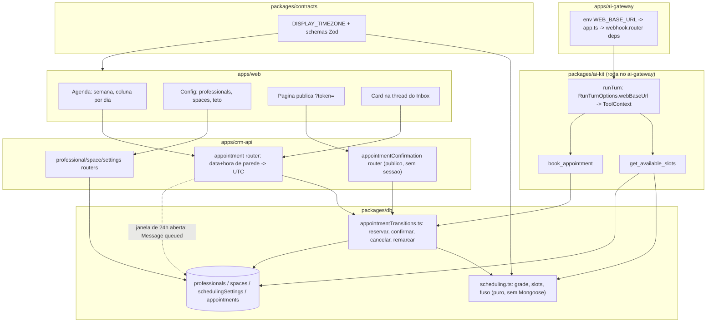

# scheduling Design

**Spec**: `.specs/features/scheduling/spec.md`
**Context**: `.specs/features/scheduling/context.md`
**Status**: Approved (abordagem confirmada com o usuário; duas correções feitas na fase Tasks — ver nota abaixo)

> **Correções feitas na fase Tasks (2026-09-11).** Duas afirmações do rascunho não sobreviveram
> ao detalhamento das tasks — as duas foram pegas antes do Execute, que é para isso que a fase
> existe (lição `L-026`):
>
> 1. **`ToolContext` muda.** O rascunho dizia "reusado sem alteração". Um grep mostrou **zero**
>    leituras de `process.env` em `packages/*/src`: valor de ambiente só chega a uma tool
>    injetado pelo composition root (precedente: `asaasClient`, payments-asaas T16/T17). O
>    `ToolContext` ganha o campo opcional `webBaseUrl`.
> 2. **`DISPLAY_TIMEZONE` mora em `packages/contracts`, não em `packages/db`.** O `apps/web`
>    precisa da constante e não pode importar `packages/db` (Mongoose no bundle do navegador).
>    Consequência: a API do operador recebe data e hora em hora de parede e o servidor converte;
>    o front só formata. Registrado como correção no próprio AD-036.
>
> As seções abaixo já refletem as duas correções.

---

## Research Provenance (ler antes do resto)

Knowledge Verification Chain, em ordem estrita:

1. **Codebase** — leitura completa de `packages/ai-kit/src/{loop,runTurn,contextBuild,guardOutput}.ts`,
   `tools/{toolDefinitions,toolContext,searchProducts,createOrder,getOrderStatus}.ts`,
   `packages/db/src/{index,tenantScoped,orderTransitions,paymentTransitions}.ts`,
   `models/{order,customer,conversation,process,user,tenant,invite}.model.ts`,
   `apps/crm-api/src/app.ts`, `{routers,controllers,services,repositories}/order.*`,
   `services/product.service.ts`, `middlewares/{authorization,rateLimit}.middleware.ts`,
   `routers/invite.router.ts`, `apps/web/src/routes/_private/orders/index.tsx`,
   `routes/_private/inbox/@components/{composer,order-card,thread}.tsx`, `query/order.ts`,
   `routes/{_public,_private/index}.tsx`, `components/mobile-dock.tsx`,
   `lib/helpers/formatDate.helper.ts`, `tests/structural/*.structural.test.ts`,
   `evals/cases/createOrderGuardrails.int.test.ts`, `vitest.config.ts`, ambos os `env.config.ts`.
   Na fase Tasks: `apps/ai-gateway/src/{app.ts,routers/webhook.router.ts}`,
   `apps/crm-api/src/repositories/conversation.repository.ts` (`createOutboundMessage`),
   `routers/customer.router.ts`, `apps/web/src/query/customer.ts` e o `package.json` de cada
   workspace.
2. **Project docs** — `.specs/STATE.md` (34 ADs ativos no início deste Design, 36 ao fim),
   `docs/roadmap.md` §9, `docs/architecture.md`, `docs/glossary.md`, `apps/web/CLAUDE.md`.
3. **Referência nomeada pelo usuário** — `../DentalEase/DentalEase-BackEnd/src/helpers/slots.helper.ts`,
   `use-cases/assistant-tools.ts`, `database/{schedule,clinic,passkey}.database.ts`,
   `services/{schedule,passkey}.service.ts`, `services/shared/{schedule,passkey}.ts`,
   `schemas/schedule.schema.ts`, e o front `routes/_public/schedule/$code/**`.
4. **Verificação por execução** (o que este Design NÃO presume):

| Afirmação | Como foi verificada | Resultado |
| --- | --- | --- |
| Hora de parede → instante UTC sem offset fixo | Script Node com `Intl.DateTimeFormat` + `timeZoneName:'longOffset'`, duas passadas | `2026-09-15 21:00` SP → `2026-09-16T00:00:00Z` (vira o dia em UTC); Manaus 08:00 → `12:00Z`. Node 26 com ICU completo |
| `$in` em `partialFilterExpression` | Índice criado contra o `mongodb-memory-server` do próprio repo | Aceito no mongod **8.2.6** |
| Índice único parcial resolve a corrida de dupla reserva | 5 inserções concorrentes no mesmo `(professional,start)` | **1 aceita, 4 rejeitadas** (E11000); cancelar libera o slot; vários cancelados coexistem |
| `guard.output` não redige o link de confirmação | Regex real (`/\b[0-9a-f]{24}\b/gi`) aplicada a formatos candidatos de token | `apt_`+base62 passa intacto; **base64url é inseguro** (um `-` cercando 24 hex dispara a redação); 24 hex puro é redigido |
| Como um valor de ambiente chega a uma tool | `grep process.env` em `packages/*/src` (fora de teste) | **Zero** ocorrências — só injeção pelo composition root |
| Onde a constante de exibição pode morar | `package.json` de cada workspace | `contracts` não depende de nenhum `@crm`; `db` e `ai-kit` dependem de `contracts`; `web` depende de `contracts` e **nunca** de `db` |

5. **Docs oficiais** — MongoDB, [Partial Indexes](https://www.mongodb.com/docs/manual/core/index-partial/):
   `$in` consta como operador suportado em `partialFilterExpression`, sem ressalva de versão.
6. **Context7/busca de biblioteca** — não usados: esta feature não introduz nenhuma dependência
   nova (o calendário é grid CSS próprio; `date-fns` e `Intl` já estão no projeto).

---

## Architecture Overview

Duas superfícies de escrita sobre a mesma coleção `appointments` — o operador pelo `crm-api` e a
IA pelo `ai-gateway` — exatamente a forma que AD-032/AD-033/AD-034 já estabeleceram para
`orders`/`payments`. A matemática da grade e a máquina de estados vivem uma única vez em
`packages/db` (decisão confirmada com o usuário), nunca duplicadas por app. A única peça de tempo
que o navegador precisa, a constante de exibição, mora em `packages/contracts`. Nenhuma chamada
entre os dois serviços (AD-002 intacto).



---

## Code Reuse Analysis

### Existing Components to Leverage

| Component | Location | How to Use |
| --- | --- | --- |
| `ToolContext` | `packages/ai-kit/src/tools/toolContext.ts` | Ganha **um** campo opcional, `webBaseUrl?: string`, pelo mesmo seam do `asaasClient` (payments-asaas T16/T17). Opcional para não tocar em nenhum teste/chamador existente; só `book_appointment` lê |
| `tenantScoped()` | `packages/db/src/tenantScoped.ts` | Todo filtro Mongo novo, nos models e em `appointmentTransitions.ts` |
| Padrão de handler de tool | `tools/getProcessTemplate.ts`, `searchProducts.ts` | `getAvailableSlots.ts`/`bookAppointment.ts`: import direto do model, nunca `throw`, ausência é `{error}`, lista vazia nunca é erro |
| `executeTool` switch + `TOOL_DEFINITIONS` | `packages/ai-kit/src/loop.ts`, `tools/toolDefinitions.ts` | 2 `case` novos e 2 entradas de `input_schema` literal (AD-004), sem tenant/canal/conversa (AD-010) |
| `orderTransitions.ts` / `paymentTransitions.ts` | `packages/db/src/` | Molde exato de `appointmentTransitions.ts`: módulo compartilhado pelos dois apps, retorno `Record | {error}`, nunca `throw` |
| `Invite.tokenHash` + `hashToken` + `invite.router.ts` | `packages/db/src/models/invite.model.ts`, `apps/crm-api/src/routers/invite.router.ts` | Precedente interno do token opaco hasheado e da rota pública sem `validToken` — usado no lugar do `Passkey.code` em texto claro da referência |
| `rateLimit.middleware.ts` (`rejectWithTooManyRequests`) | `apps/crm-api/src/middlewares/` | Rate limit da rota pública de confirmação, com gerador por IP |
| `withDbTiming` | `apps/crm-api/src/metrics/db.metric.js` | Todo método dos repositories novos |
| Padrão repository/service/controller/router + `CustomError` tipado | `apps/crm-api/src/**/order.*`, `product.*` | Molde de `professional.*`, `space.*`, `appointment.*` (404/409 traduzidos no controller) |
| Workaround de query paginada do Express 5 | `apps/crm-api/src/routers/order.router.ts` (`validListOrdersQuery`) | Reusado tal-e-qual nas listagens novas (inclusive a consulta por faixa de datas da agenda) |
| `conversation.repository.createOutboundMessage` | `apps/crm-api/src/repositories/conversation.repository.ts:177` | SCH-39/40: já cria a `Message` `out` `queued` (AD-007) e já lança `OutsideWindowError` (janela fechada, **antes** de inserir) e `ConversationNotFoundError`. O aviso traduz esses dois erros para o fallback wa.me, sem reimplementar a regra da janela |
| `GET /customers` + `customersQuery` | `apps/crm-api/src/routers/customer.router.ts:67`, `apps/web/src/query/customer.ts:53` | Seletor de cliente do agendamento manual — endpoint já existe (feature 3), nenhuma rota nova (L-026) |
| Fallback `wa.me` de janela fechada | `apps/web/src/routes/_private/inbox/@components/composer.tsx` | SCH-40 e o botão "Pedir confirmação": mesmo formato de link |
| `order-card.tsx` | `apps/web/src/routes/_private/inbox/@components/` | Molde do `appointment-card.tsx` (mesma query→card→sem render quando vazio) |
| `formatDate.helper.ts` (regra "datas sempre via helper") | `apps/web/src/lib/helpers/` | O helper existente usa `date-fns` na hora local do navegador. Horário de agenda passa por um helper irmão, `displayTime.helper.ts`, que formata com `Intl` em `DISPLAY_TIMEZONE` |
| Rotas file-based, hub de seção, `<Card asPage>`, `t()` | `apps/web/CLAUDE.md`, `routes/_private/customers/**` | `_private/schedule/` segue a convenção: `index.tsx` vira hub (calendário, profissionais, ambientes, config) |
| `createOrderGuardrails.int.test.ts` | `evals/cases/` | Molde do golden set novo (fake client + `runTurn` + asserção no banco) |

### Integration Points

| System | Integration Method |
| --- | --- |
| `tests/structural/toolInputSchema.structural.test.ts` | `EXPECTED_TOOL_NAMES` ganha 2 nomes e `toHaveLength(8)`→`(10)`; a varredura de chaves proibidas já é genérica |
| `evals/cases/promptInjection.int.test.ts:159` | Lista de 8 tools **hardcoded** vira 10 — mesma armadilha que já mordeu nas features 7 e 8 (ver Risks) |
| `packages/contracts` | Exporta `DISPLAY_TIMEZONE` (arquivo novo, fora do padrão `*.schema.ts`, então fora da varredura do registry) e todo schema Zod novo — que **precisa** ser registrado em `registry.ts`, porque o teste estrutural varre o filesystem |
| `packages/db/src/index.ts` (`syncIndexes`) | 4 models novos entram no barrel e no `Promise.all` de `createIndexes()` |
| `apps/crm-api/src/app.ts` | Monta `/professionals`, `/spaces`, `/scheduling-settings`, `/appointments` (com `validToken`) e `/appointment-confirmations` (**sem** `validToken`, como `inviteRouter`) |
| `WEB_BASE_URL` (`.env` da raiz, AD-018) | `crm-api` lê do próprio `env.config.ts`. `ai-gateway` lê no composition root e injeta: `app.ts` → `WebhookRouterDeps.webBaseUrl` → `RunTurnOptions.webBaseUrl` → `ToolContext.webBaseUrl`. `vitest.config.ts` ganha a var em `crmApiBaseEnv` (os dois `env.config.ts` validam no import) |

---

## Components

### `scheduling.ts` — matemática pura de grade (sem Mongoose)

- **Purpose**: traduzir grade semanal + ocupação em horários livres, e resolver fuso.
- **Location**: `packages/db/src/scheduling.ts` (a constante: `packages/contracts/src/displayTimezone.ts`)
- **Interfaces**:
  - importa `DISPLAY_TIMEZONE` de `@crm/contracts`; exporta `MAX_HORIZON_DAYS = 90`,
    `MIN_LEAD_MINUTES = 60`, `DEFAULT_MAX_SLOTS = 16`
  - `wallClockToUtc(date: 'YYYY-MM-DD', time: 'HH:mm', timeZone = DISPLAY_TIMEZONE): Date` —
    duas passadas de offset via `Intl` (verificado por execução), nunca offset fixo
  - `dateInDisplayTz(instant: Date): 'YYYY-MM-DD'`, `timeInDisplayTz(instant: Date): 'HH:mm'`,
    `weekdayInDisplayTz(date: 'YYYY-MM-DD'): 0..6`
  - `expandWindowsToSlots(windows, slotDurationMinutes, date): Array<{start: Date, end: Date}>` —
    só slots que cabem **inteiros** na janela (Edge Case do spec)
  - `computeFreeSlots({professionals, busy, date, now, maxSlots}): FreeSlot[]` — `FreeSlot = {start: Date, time: string, professionals: {id, name}[]}`; descarta slot que começa a menos de `MIN_LEAD_MINUTES`
  - `isSlotAligned(start: Date, professional): boolean`
  - `overlaps(a: {start, end}, b: {start, end}): boolean` — usado pelo caminho de encaixe
- **Dependencies**: `@crm/contracts` (a constante) e `Intl` — testável sem Mongo
- **Reuses**: a lógica de `computeFreeSlots`/`isSlotAligned` da referência, reescrita para grade
  por profissional com janelas múltiplas e sem a dimensão restritiva de sala

### `appointmentTransitions.ts` — máquina de estados compartilhada (AD-033/AD-035)

- **Purpose**: única implementação das transições de agendamento, chamada pelos dois apps.
- **Location**: `packages/db/src/appointmentTransitions.ts`
- **Interfaces** (todas `Promise<... | {error: string, code}>`, nunca `throw`; `code ∈
  {'not_found','expired','terminal','conflict','invalid'}` para quem chama traduzir em HTTP):
  - `bookAppointment({tenantId, professionalId, start, spaceId?, customerId, conversationId?, source})` →
    `{appointment, confirmationToken}` — valida alinhamento/lead/horizonte/1-por-cliente, resolve
    `end` pela duração do profissional, cria `pending` **confiando no índice único parcial** para
    a corrida (captura E11000 → `{error}`), e grava o **hash** do token no mesmo documento.
    O token em texto claro sai **uma única vez**, no retorno; quem chama monta a URL com a
    própria `WEB_BASE_URL` — `packages/db` não conhece URL
  - `createManualAppointment(...)` — caminho do operador: sem lead/horizonte/alinhamento
    (encaixe), mas com checagem de sobreposição por consulta de intervalo; também devolve o token
  - `createBlock({tenantId, professionalId, start, end, title})`, `deleteBlock(tenantId, blockId)`
  - `issueConfirmationToken(tenantId, appointmentId)` → `{confirmationToken}` — sobrescreve o hash
    (o token anterior morre, SCH-24) e fixa `confirmationExpiresAt = end`
  - `confirmByToken(tokenHash)` / `cancelByToken(tokenHash)` — resolvem o agendamento **pelo
    hash do token**, nunca por id (SCH-27)
  - `cancelByOperator(tenantId, appointmentId, userId, reason?)`
  - `rescheduleAppointment(tenantId, appointmentId, {start, professionalId?})` — mesmo `_id`,
    duração original preservada, volta a `pending` (a confirmação era do horário antigo)
  - `markAttendance(tenantId, appointmentId, userId, 'completed' | 'no_show')`
- **Observabilidade**: cada transição que muda estado emite
  `console.log(JSON.stringify({event: 'appointment_<acao>', ...}))` (SCH-36), no mesmo módulo —
  um só lugar para os dois apps
- **Dependencies**: models `Appointment`/`Professional`, `scheduling.ts`, `tenantScoped`, `hashToken`
- **Reuses**: forma de `orderTransitions.ts` (guarda na própria query, retorno tipado)

### Tools Anel A: `getAvailableSlots`, `bookAppointment`

- **Location**: `packages/ai-kit/src/tools/{getAvailableSlots,bookAppointment}.ts`
- **Interfaces**:
  - `getAvailableSlots({date, professionalId?}, ctx)` →
    `{date, slots: [{start, time, professionals: [{id, name}]}], upcomingAppointments: [...]}`
    ou `{error}`. O teto vem de `SchedulingSettings` do tenant (default 16).
  - `bookAppointment({professionalId, start, spaceId?}, ctx)` →
    `{appointmentId, date, time, professionalName, spaceName?, status: 'pending', confirmationUrl}`
    ou `{error}`. Resolve o `Customer` pela `Conversation` do `ToolContext` (nunca do input).
    Sem `ctx.webBaseUrl` → `{error}` **antes** de criar qualquer coisa (mesmo idioma de
    `issue_payment_link` sem integração ativa): agendar sem conseguir entregar o link violaria
    SCH-15.
- **Reuses**: padrão de `searchProducts.ts`/`createOrder.ts`

### Seam `webBaseUrl` (ai-gateway → ai-kit)

- **Purpose**: levar a origem pública do front até `book_appointment`, sem pacote ler ambiente.
- **Location**: `apps/ai-gateway/src/config/env.config.ts` (`WEB_BASE_URL`), `app.ts`,
  `routers/webhook.router.ts` (`WebhookRouterDeps.webBaseUrl?`), `packages/ai-kit/src/runTurn.ts`
  (`RunTurnOptions.webBaseUrl?`), `tools/toolContext.ts` (`webBaseUrl?`)
- **Reuses**: o caminho exato do `asaasClient` — mesmo formato de campo opcional em cada salto

### `apps/crm-api` — módulos novos

- `professional.*`, `space.*` — CRUD por `canOperate` (`GET /`, `GET /:id`, `POST /`,
  `PATCH /:id`), molde de `product.*`
- `schedulingSettings.*` — `GET /` + `PUT /` (teto por tenant)
- `appointment.*` — **toda data e hora de entrada chega em hora de parede e é convertida no
  service com `wallClockToUtc`** (AD-036):
  - `GET /?from=YYYY-MM-DD&to=YYYY-MM-DD` (datas na hora de exibição, `to` exclusivo, faixa de
    no máximo 42 dias; filtros `professional`/`space`)
  - `GET /upcoming?customer=` — próximo agendamento ativo do cliente (card do Inbox, SCH-38)
  - `POST /` (manual: `date` + `time`), `POST /:id/cancel`, `POST /:id/reschedule` (`date` +
    `time`), `POST /:id/attendance`, `POST /:id/confirmation-link` (devolve o `wa.me` pronto),
    `POST /blocks` (`startDate`/`startTime`/`endDate`/`endTime`), `DELETE /blocks/:id`
- `appointmentConfirmation.*` — **público**, sem `validToken`, com rate limit:
  `GET /:token`, `POST /:token/confirm`, `POST /:token/cancel`

### `apps/web`

- `lib/helpers/displayTime.helper.ts` — formata instante UTC em `DISPLAY_TIMEZONE` com `Intl`
  (nunca na hora local do navegador), "hoje" na hora de exibição e aritmética de dias sobre
  `YYYY-MM-DD`. Nenhuma conversão hora de parede → UTC no front
- `_private/schedule/index.tsx` — hub da seção (convenção do `CLAUDE.md`), com cards para
  Calendário, Profissionais, Ambientes e Configuração
- `_private/schedule/calendar/index.tsx` + `@components/week-grid.tsx`,
  `appointment-dialog.tsx`, `block-dialog.tsx` — grid CSS próprio (7 colunas × faixas de hora),
  sem biblioteca nova, sem drag-and-drop
- `_private/schedule/professionals/{index,add,details}.tsx` (com editor de grade semanal),
  `_private/schedule/spaces/{index,add,details}.tsx`, `_private/schedule/settings/index.tsx`
- `_public/appointment/index.tsx` — página de confirmação (`?token=`, AD-030), conteúdo
  espelhando a página da referência indicada pelo usuário
- `query/{professional,space,appointment,schedulingSettings,appointmentConfirmation}.ts`
- `_private/inbox/@components/appointment-card.tsx`, montado em `thread.tsx` ao lado do
  `order-card.tsx`; card no hub `_private/index.tsx` apontando para a Agenda

---

## Data Models

```typescript
// professionals
interface ScheduleWindow { weekday: number; start: string; end: string } // 0..6, 'HH:mm' hora de parede
interface ProfessionalDocument {
  _id: ObjectId; Tenant: ObjectId;
  name: string;
  slotDurationMinutes: number;      // 5..480
  weeklySchedule: ScheduleWindow[]; // janelas sem sobreposição no mesmo weekday
  active: boolean;                  // default true
  createdAt: Date; updatedAt: Date;
}
// índice: {Tenant:1, active:1}

// spaces — informativo, não restringe (context.md decisão 1)
interface SpaceDocument { _id; Tenant; name: string; active: boolean; createdAt; updatedAt }
// índice: {Tenant:1, active:1}

// schedulingSettings — um doc por tenant (molde de AsaasIntegration)
interface SchedulingSettingsDocument { _id; Tenant: ObjectId; maxSlotsPerResponse: number } // 1..50
// índice: {Tenant:1} unique

// appointments — discriminada por kind (decisão confirmada)
type AppointmentKind = 'appointment' | 'block';
type AppointmentStatus =
  | 'pending' | 'confirmed' | 'completed' | 'no_show'
  | 'canceled_by_customer' | 'canceled_by_operator';

interface AppointmentDocument {
  _id: ObjectId; Tenant: ObjectId;
  kind: AppointmentKind;
  professional: ObjectId;            // obrigatório nos dois kinds
  space?: ObjectId;                  // opcional, nunca restringe
  customer?: ObjectId;               // obrigatório quando kind='appointment'
  conversation?: ObjectId;           // presente quando criado pela IA
  title?: string;                    // usado pelo bloqueio
  notes?: string;
  start: Date; end: Date;            // SEMPRE UTC
  status: AppointmentStatus;
  source: 'ai' | 'operator';
  confirmationTokenHash?: string;    // sha256 do token opaco; texto claro nunca persistido
  confirmationExpiresAt?: Date;
  confirmedAt?: Date;
  canceledAt?: Date; canceledBy?: ObjectId; cancelReason?: string;
  attendanceMarkedAt?: Date; attendanceMarkedBy?: ObjectId;
  createdAt: Date; updatedAt: Date;
}
```

**Índices de `appointments`:**

| Índice | Papel |
| --- | --- |
| `{Tenant:1, professional:1, start:1}` **unique, partial** `status ∈ {pending, confirmed}` | A garantia anti-dupla-reserva (SCH-20), verificada por execução: 5 concorrentes → 1 vence. Cancelado sai do índice e libera o horário |
| `{Tenant:1, start:1}` | Faixa da semana (tela de Agenda) e varredura de ocupação do dia |
| `{Tenant:1, customer:1, start:1}` | Agendamentos futuros do cliente (SCH-14/SCH-18/SCH-38) |
| `{confirmationTokenHash:1}` unique sparse | Resolução da rota pública pelo token |

**Bloqueio**: nasce e permanece `status:'confirmed'` (ocupa) e é **removido por deleção**, nunca
cancelado — bloqueio não tem ciclo de vida de atendimento. Isso o mantém dentro do mesmo índice
único, então bloqueio e agendamento disputam o mesmo horário corretamente.

**Token**: `apt_` + 32 caracteres base62 (alfabeto do `generateSecureCode` da referência).
`base64url` foi **descartado por evidência**: `-` cercando 24 hex faz o `guard.output` redigir o
link. Persistido só como `sha256` (`hashToken`, `packages/db`).

---

## Error Handling Strategy

| Cenário | Tratamento | Impacto no usuário |
| --- | --- | --- |
| `date` inválida/passada/>90d em `get_available_slots` | `{error}`, sem consulta | IA explica e oferece outra data |
| Data sem horário livre | `{date, slots: []}` — nunca `{error}` (SCH-13) | IA oferece outro dia |
| `book_appointment` fora da grade/lead/horizonte | `{error}`, nada criado | IA pede outro horário |
| `book_appointment` sem `ctx.webBaseUrl` | `{error}` antes de qualquer escrita | IA diz que não conseguiu agendar agora (erro de configuração, nunca agendamento órfão) |
| Corrida no mesmo slot | E11000 do índice parcial capturado → `{error}` para o perdedor | Cliente é avisado que o horário acabou de sair e consulta de novo |
| Retry exato do mesmo agendamento | Devolve o existente, sem criar nem errar (SCH-18) | Nenhum |
| Cliente já tem agendamento futuro ativo | `{error}` (SCH-18) | IA explica o limite |
| Token inexistente / expirado / substituído | 404 / 410, sem revelar nada (SCH-23) | Página mostra "link inválido ou expirado" |
| Ação repetida no mesmo token | Idempotente, mesmo estado, sem erro (SCH-25) | Nenhum |
| Ação sobre agendamento terminal | 409 sem mudar nada (SCH-25) | Página/tela informa o estado atual |
| Encaixe do operador sobrepondo o mesmo profissional | 409 (checagem de intervalo) | Operador escolhe outro horário |
| `attendance` antes do horário de início | 409 (SCH-34) | Botão indisponível na tela |
| Faixa da agenda maior que 42 dias | 400 | Nunca acontece pela tela (a semana tem 7) |
| Agendamento de outro tenant / inexistente | 404, mesmo idioma de `order.service.ts` | Operador vê "não encontrado" |
| Sem `canOperate` | 403 | Acesso negado |
| Rota pública acima do limite | 429 | Cliente espera alguns minutos |
| Aviso: `OutsideWindowError` ou `ConversationNotFoundError` de `createOutboundMessage` | Nada enfileirado; resposta carrega o link `wa.me` pronto (SCH-40) | Operador manda manualmente pelo botão |

---

## Risks & Concerns

| Concern | Location | Impact | Mitigation |
| --- | --- | --- | --- |
| `SYSTEM_PROMPT` enumera só **4 tools** ("usando só as ferramentas disponíveis: 1..4") desde a feature 5, enquanto `TOOL_DEFINITIONS` já tem 8 — as features 7 e 8 não atualizaram o texto | `packages/ai-kit/src/contextBuild.ts:27-42` | O modelo recebe 10 definições de tool mas um system prompt que descreve 4; para agendamento, que exige uma sequência (consultar → escolher → reservar), a chance de o modelo não usar as tools novas é concreta | Task dedicada atualizando o prompt para descrever as 10 tools e a sequência de agendamento, com o golden set novo como rede (AD-013: mudança de prompt é mudança de comportamento) |
| Lista de tools **hardcoded** em teste: `promptInjection.int.test.ts` (8 nomes) e `toolInputSchema.structural.test.ts` (`toHaveLength(8)`) | `evals/cases/promptInjection.int.test.ts:159`, `tests/structural/toolInputSchema.structural.test.ts:42` | Já quebrou nas features 7 **e** 8; é a terceira recorrência | Os dois arquivos mudam **na mesma task** que registra as tools. Se recorrer na feature 10, vira lição confirmada (`lessons.py`) |
| `guard.output` redige qualquer 24 hex; o link de confirmação passa pela resposta da IA | `packages/ai-kit/src/guardOutput.ts:9`, `book_appointment` | Link redigido = cliente não consegue confirmar, falha silenciosa e visível só ao cliente | Formato `apt_`+base62 **verificado por execução** contra a regex real; teste de regressão no golden set assertando que o link sobrevive ao `guard.output` |
| `ToolContext`, `RunTurnOptions` e `WebhookRouterDeps` ganham o campo opcional `webBaseUrl` | `toolContext.ts`, `runTurn.ts`, `webhook.router.ts` | Toca um tipo transversal usado pelas 8 tools existentes | Campo opcional, `undefined` em todo chamador que não injeta — zero mudança de comportamento para as 8 tools; mesmo desenho já provado pelo `asaasClient`. `book_appointment` sem ele devolve `{error}` sem efeito colateral |
| O `formatDate` do front usa `date-fns` na hora **local do navegador** | `apps/web/src/lib/helpers/formatDate.helper.ts` | Operador com o navegador em outro fuso veria horários diferentes dos que a IA manda — e a CI roda em UTC, então o bug nem apareceria como falha | Helper irmão `displayTime.helper.ts` com `Intl` + `DISPLAY_TIMEZONE`; teste do `week-grid` com um instante que só cai no dia certo se a formatação usar o fuso de exibição (`2026-09-16T00:00Z` → coluna de 15/09, 21:00) |
| Sem transação nativa do Mongo (AD-002/AD-006) para "criar agendamento + emitir token" | `appointmentTransitions.bookAppointment` | Crash entre os dois passos deixaria agendamento sem token | Um único `Appointment.create()` com o hash do token **no mesmo documento** — não há dois documentos para coordenar (SCH-17 satisfeito por construção, não por compensação) |
| Sobreposição do encaixe do operador é checar-antes-de-gravar (o índice único só cobre `start` idêntico) | `createManualAppointment`/`rescheduleAppointment` | Dois encaixes concorrentes desalinhados podem se sobrepor | Aceito e documentado (AD-035): o caminho da IA (o de alta concorrência) é 100% coberto pelo índice; o do operador é ação humana de baixa concorrência. Teste cobre a rejeição sequencial |
| `$in` em índice parcial verificado no mongod 8.2.6; produção pode rodar versão bem anterior | `appointment.model.ts` | Índice recusado no boot em servidor antigo | Documentado nos docs oficiais sem ressalva de versão; fallback conhecido é um booleano `slotActive` com filtro de igualdade, sem mudar a semântica |
| `routeTree.gen.ts` só regenera com o dev server rodando | `apps/web/CLAUDE.md` | 8+ rotas novas, incluindo a primeira rota `_public` desde a feature 1 — `check` passa e o `build` quebra | Toda task que cria rota roda `pnpm --filter web run dev` antes do `build`, conforme o `CLAUDE.md` |
| `Space` não restringe nada (decisão do usuário) | `spaces` | Dois atendimentos podem ser marcados na mesma sala de uma cadeira | Consequência aceita e registrada em `context.md`/Assumptions; capacidade está em Deferred |
| Constante única de fuso; tenant fora do horário de Brasília vê horário deslocado | `scheduling.ts` | Agenda errada para tenant em Manaus/Acre | Aceito (decisão do usuário). A conversão usa `Intl` por data e recebe o fuso como parâmetro, então passar a fuso por tenant depois é trocar a constante por um campo, sem reescrever a matemática |
| `contextBuild` diz "Data e hora agora (America/Sao_Paulo)" com a constante repetida em código | `packages/ai-kit/src/contextBuild.ts:44-53` | Duas fontes da mesma constante divergirem | `contextBuild` passa a importar `DISPLAY_TIMEZONE` de `@crm/contracts` (AD-036) em vez de repetir a string |

---

## Tech Decisions

| Decision | Choice | Rationale |
| --- | --- | --- |
| Onde vive a lógica de agenda | `packages/db`: `scheduling.ts` (puro) + `appointmentTransitions.ts` | Confirmado com o usuário; precedente AD-033/AD-034. O `apps/web` não precisa da matemática porque o operador pode encaixar fora da grade e a API recebe hora de parede |
| Bloqueio | Mesma coleção, `kind: 'appointment' \| 'block'` | Confirmado com o usuário; uma consulta de ocupação e um índice único cobrindo os dois. Precedente do `targetType` (AD-020) |
| Garantia de dupla reserva | Índice único parcial `{Tenant, professional, start}` filtrado por status ativo | Verificado por execução (1 de 5 vence). Move a invariante para o banco em vez de checar-antes-de-gravar — que é exatamente o buraco que o Verifier da feature 8 achou (lição `L-027`) |
| Token de confirmação | Campo no próprio `Appointment` (`confirmationTokenHash`), não coleção separada | A referência tem `Passkey` separada porque serve 4 tipos distintos; aqui há um só. Um documento = nenhuma coordenação entre escritas, e reemitir é sobrescrever o hash (SCH-24 de graça) |
| Formato do token | `apt_` + base62(32), hasheado com `sha256` | Verificado contra a regex real do `guard.output`; base64url foi descartado por evidência |
| Quem monta a URL de confirmação | O chamador (tool ou service), nunca `packages/db` | `packages/db` devolve o token em texto claro uma única vez; a origem pública é configuração de app, não de domínio |
| Fuso | Instante sempre UTC; hora de parede + `DISPLAY_TIMEZONE` (em `packages/contracts`); offset resolvido pelo `Intl` em duas passadas | Decisão do usuário + verificação por execução. A referência crava `-03:00`, que quebra se o horário de verão voltar |
| Fronteira de fuso na API do operador | Entrada em hora de parede (`YYYY-MM-DD` + `HH:mm`), conversão no service; saída em ISO UTC | Mantém uma única implementação de hora de parede → UTC (em `packages/db`), que o navegador não pode importar. O front só formata |
| Duração do agendamento | `end` calculado na criação e **congelado** no documento; remarcação preserva a duração | Edge Case do spec: mudar a duração do profissional não pode reescrever agendamento já marcado |
| Teto de horários | `schedulingSettings`, um doc por tenant (molde `AsaasIntegration`), default 16, faixa `1..50` | Decisão do usuário. Horizonte e lead ficam constantes em `scheduling.ts` — só o teto foi pedido como configurável |
| URL pública de confirmação | Nova env `WEB_BASE_URL` nos dois apps; no `ai-gateway`, injetada até a tool pelo seam do `asaasClient` | `ai-gateway` não tem nenhuma var de origem do front e nenhum pacote lê `process.env`; usar a mesma var nos dois apps evita dois links diferentes por misconfig. O uso de `CORS_ORIGIN` pelo convite (feature 1) fica intocado |
| Aviso ao cliente | Reusa `createOutboundMessage`, traduzindo `OutsideWindowError`/`ConversationNotFoundError` em link `wa.me` | A regra da janela já vive ali e barra antes de inserir — reimplementá-la seria uma segunda fonte da mesma regra de negócio (AD-005) |
| Calendário | Grid CSS próprio, 7 colunas de dia, sem drag-and-drop | Decisão do usuário; evita portar ~1.800 linhas e não adiciona dependência |
| Navegação | `_private/schedule/index.tsx` como hub de seção | Convenção documentada em `apps/web/CLAUDE.md` para seção com mais de um destino |

> **Project-level decisions:** AD-035 e AD-036 apendadas a `.specs/STATE.md` `## Decisions` nesta
> sessão de Design; o AD-036 recebeu um bullet de correção na fase Tasks (onde mora
> `DISPLAY_TIMEZONE` e a fronteira de fuso da API). `docs/architecture.md` e `docs/glossary.md`
> são atualizados pela última task, T47.
