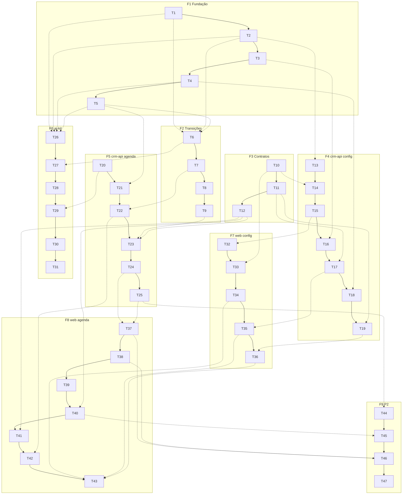

# scheduling Tasks

## Execution Protocol (MANDATORY -- do not skip)

Implement these tasks with the `tlc-spec-driven` skill: **activate it by name and follow its
Execute flow and Critical Rules.** Do not search for skill files by filesystem path. The skill is
the source of truth for the full flow (per-task cycle, sub-agent delegation, adequacy review,
Verifier, discrimination sensor).

**If the skill cannot be activated, STOP and tell the user — do not proceed without it.**

**Operational note (mesma causa raiz das features anteriores):** a skill não aparece no listing
porque vive em `.claude/tlc-spec-driven/`, fora de `.claude/skills/`. No início do Execute, ler
manualmente `SKILL.md` + `references/{implement,sub-agents,coding-principles,validate,lessons}.md`;
lições via `python3 .claude/tlc-spec-driven/scripts/lessons.py`.

**Regras implícitas em todo `Done when`** (escritas uma vez para não repetir 47 vezes): o gate da
task passa; contagem de testes = baseline + testes novos (nenhuma deleção silenciosa, nenhum
`skip`); nenhum `mongoose` importado sob `apps/**` (teste estrutural de AD-010); toda string
visível do `apps/web` passa por `t()`; todo filtro Mongo passa por `tenantScoped()`.

---

**Design**: `.specs/features/scheduling/design.md`
**Status**: Draft

---

## Test Coverage Matrix

> Generated from codebase sampling and the spec ACs. Guidelines found: `.specs/STATE.md` AD-017
> (convenção de `projects` do Vitest e comandos de gate), AD-031 (CI roda o Build gate),
> `apps/web/CLAUDE.md` (mock de router em teste de rota; `routeTree.gen.ts` só regenera com o dev
> server; `build` do web é o único passo que empacota). Nenhum limiar de cobertura configurado
> em `vitest.config.ts`/CI. Confirm before Execute.

| Code Layer | Required Test Type | Coverage Expectation | Location Pattern | Run Command |
| --- | --- | --- | --- | --- |
| `packages/db` puro (`scheduling.ts`) | unit | Todos os ramos; conversão provada numa data que vira o dia em UTC e num fuso ≠ SP; janelas múltiplas, último slot que não cabe, lead 60 min, horizonte 90 d, alinhamento | `packages/db/src/*.unit.test.ts` | `pnpm vitest run --project unit` |
| Model | integration | Obrigatórios, defaults, faixas e índices (inclusive o único parcial: ativo duplicado barrado, cancelado libera) — piso `order.model.int.test.ts` | `packages/db/src/models/*.model.int.test.ts` | `pnpm vitest run --project integration` |
| Transição compartilhada (`appointmentTransitions.ts`) | integration | Todos os ramos 1:1 às ACs; corrida com `Promise.all` **genuíno**, nunca chamadas sequenciais (lição `L-027`) | `packages/db/src/appointmentTransitions.int.test.ts` | `pnpm vitest run --project integration` |
| Schema de contracts | unit | Cada regra com caso válido e inválido — piso `createProduct.schema.unit.test.ts` | `packages/contracts/src/schemas/*.schema.unit.test.ts` | `pnpm vitest run --project unit` |
| Repository (`crm-api`) | integration | Consultas-chave + escopo de tenant + erro — piso `order.repository.int.test.ts` | `apps/crm-api/src/repositories/*.int.test.ts` | `pnpm vitest run --project integration` |
| Service (`crm-api`) | unit | Todos os ramos, cada erro tipado | `apps/crm-api/src/services/*.unit.test.ts` | `pnpm vitest run --project unit` |
| Router (`crm-api`, inclusive o público) | e2e | Toda rota: feliz + borda + erro (400/403/404/409/410/429 conforme a rota) — piso `order.router.e2e.test.ts` | `apps/crm-api/src/routers/*.e2e.test.ts` | `pnpm vitest run --project e2e` |
| Tool (`ai-kit`) | integration | 1:1 às ACs SCH-09..19, contra Mongo real — piso `searchProducts.int.test.ts` | `packages/ai-kit/src/tools/*.int.test.ts` | `pnpm vitest run --project integration` |
| Harness (`runTurn`, `contextBuild`) | integration | Seam do `webBaseUrl` chegando à tool; prompt descrevendo as 10 tools; invariantes existentes preservados | `packages/ai-kit/src/*.int.test.ts` | `pnpm vitest run --project integration` |
| Registro de tools | structural | Superfície fixa = 10, nenhuma chave proibida | `tests/structural/*.structural.test.ts` | `pnpm vitest run --project structural` |
| Golden set | integration | Nunca agenda fora da grade/ocupado; link sobrevive ao `guard.output`; agendamento pelo harness real | `evals/cases/*.int.test.ts` | `pnpm vitest run --project integration` |
| Query do web | unit | Toda função: URL, método, params, erro → `throw`, invalidação de cache — piso `query/order.unit.test.ts` | `apps/web/src/query/*.unit.test.ts` | `pnpm vitest run --project unit` |
| Componente/rota do web | unit | Cada estado (loading, vazio, erro, dados) + interação principal — piso `orders/index.unit.test.tsx` | `apps/web/src/**/*.unit.test.tsx` | `pnpm vitest run --project unit` |
| Config (env), docs | none | Build gate | — | build gate |

## Gate Check Commands

> Generated from AD-017 and `apps/web/CLAUDE.md`. Confirm before Execute.

| Gate Level | When to Use | Command |
| --- | --- | --- |
| Quick | Tasks só com testes unit/structural | `pnpm vitest run --project unit --project structural` |
| Full | Tasks com integration/e2e | `pnpm vitest run` |
| Build | Fim de fase, tasks de config/docs | `pnpm -r exec tsc --noEmit && pnpm biome check . && pnpm vitest run` |
| Web | Toda task que cria ou move rota | subir `pnpm --filter web run dev` até `routeTree.gen.ts` regenerar, depois `(cd apps/web && pnpm run build)` |

---

## Execution Plan

Fases em ordem; tasks em ordem dentro da fase.

### Phase 1: Fundação — matemática de grade e models (`packages/db`)

```
T1 → T2 → T3 → T4 → T5
```

### Phase 2: Transições compartilhadas (`appointmentTransitions.ts`)

```
T6 → T7 → T8 → T9
```

### Phase 3: Contratos Zod

```
T10 → T11 → T12
```

### Phase 4: `crm-api` — configuração da agenda

```
T13 → T14 → T15 → T16 → T17 → T18 → T19
```

### Phase 5: `crm-api` — agendamentos e confirmação pública

```
T20 → T21 → T22 → T23 → T24 → T25
```

### Phase 6: `ai-kit` — tools e harness

```
T26 → T27 → T28 → T29 → T30 → T31
```

### Phase 7: `apps/web` — configuração

```
T32 → T33 → T34 → T35 → T36
```

### Phase 8: `apps/web` — calendário, página pública e navegação

```
T37 → T38 → T39 → T40 → T41 → T42 → T43
```

### Phase 9 (P2): Inbox, aviso automático e docs

```
T44 → T45 → T46 → T47
```

**Empacotamento sugerido (~7 tasks por lote, fases inteiras):** B1 = F1 (5) · B2 = F2+F3 (7) ·
B3 = F4 (7) · B4 = F5 (6) · B5 = F6 (6) · B6 = F7 (5) · B7 = F8 (7) · B8 = F9 (4). Oito lotes →
a oferta de sub-agentes é obrigatória no início do Execute (offer-then-confirm).

---

## Task Breakdown

Salvo indicação na task: **Tools** — MCP: NONE / Skill: NONE (ver seção MCPs and Skills).

### T1: `scheduling.ts` + `DISPLAY_TIMEZONE`

**What**: Módulo puro de grade/slots/fuso e a constante isomórfica de exibição.
**Where**: `packages/contracts/src/displayTimezone.ts` (+ barrel), `packages/db/src/scheduling.ts` (+ `scheduling.unit.test.ts`, barrel)
**Depends on**: None
**Reuses**: `computeFreeSlots`/`isSlotAligned` de `../DentalEase/DentalEase-BackEnd/src/helpers/slots.helper.ts` (reescritos: grade por profissional, N janelas, sem sala); técnica de offset verificada no Design
**Requirement**: SCH-09, SCH-11, SCH-16 · AD-036

**Done when**:
- [x] `wallClockToUtc('2026-09-15','21:00')` → `2026-09-16T00:00:00.000Z`, e `timeInDisplayTz` do resultado → `'21:00'`; o mesmo teste com fuso ≠ SP passado explicitamente prova que não há `-03:00` cravado
- [x] Duas janelas no mesmo dia geram slots das duas e nenhum no intervalo; slot que não cabe inteiro na janela não é gerado
- [x] `computeFreeSlots` descarta início a menos de 60 min de `now`, respeita `maxSlots`, lista por slot só os profissionais livres, e um intervalo ocupado remove o slot só do profissional ocupado
- [x] `isSlotAligned` rejeita início fora do grid, fora da janela e em weekday sem janela
- [x] Nenhum import de `mongoose` em `scheduling.ts`

**Tests**: unit · **Gate**: quick
**Status**: ✅ Complete (commit 603c4dc)

---

### T2: Model `Professional`

**What**: Model + tipos de `Professional` (design.md Data Models).
**Where**: `packages/db/src/models/professional.model.ts` (+ int test, barrel, `syncIndexes`)
**Depends on**: T1 (tipo `ScheduleWindow`)
**Reuses**: `product.model.ts` (schema fixo, `Tenant`, timestamps)
**Requirement**: SCH-01, SCH-05

**Done when**:
- [x] `name`/`slotDurationMinutes`/`weeklySchedule` obrigatórios; `slotDurationMinutes` fora de `5..480` e `weekday` fora de `0..6` rejeitados; `active` default `true`
- [x] Índice `{Tenant:1, active:1}`; exportado no barrel e em `syncIndexes`

**Tests**: integration · **Gate**: full
**Status**: ✅ Complete (commit d5247de)

---

### T3: Model `Space`

**What**: Model + tipos de `Space` (informativo, não restringe).
**Where**: `packages/db/src/models/space.model.ts` (+ int test, barrel, `syncIndexes`)
**Depends on**: None
**Reuses**: `product.model.ts`
**Requirement**: SCH-04

**Done when**:
- [x] `name` obrigatório, `active` default `true`, índice `{Tenant:1, active:1}`, barrel e `syncIndexes`

**Tests**: integration · **Gate**: full
**Status**: ✅ Complete (commit ff4ea76)

---

### T4: Model `SchedulingSettings`

**What**: Um documento de configuração de agenda por tenant.
**Where**: `packages/db/src/models/schedulingSettings.model.ts` (+ int test, barrel, `syncIndexes`)
**Depends on**: None
**Reuses**: `asaasIntegration.model.ts` (um doc por tenant, `Tenant` único)
**Requirement**: SCH-06

**Done when**:
- [x] Segundo documento do mesmo tenant → E11000; `maxSlotsPerResponse` inteiro `1..50`, default `16`

**Tests**: integration · **Gate**: full
**Status**: ✅ Complete (commit e5c3f40)

---

### T5: Model `Appointment`

**What**: Coleção discriminada por `kind` com o índice único parcial anti-dupla-reserva.
**Where**: `packages/db/src/models/appointment.model.ts` (+ int test, barrel, `syncIndexes`)
**Depends on**: None
**Reuses**: `order.model.ts`; hook `pre('validate')` de `user.model.ts` para obrigatoriedade condicional
**Requirement**: SCH-20, SCH-21, SCH-33

**Done when**:
- [x] `customer` obrigatório só com `kind:'appointment'` (bloqueio sem cliente é válido; agendamento sem cliente é rejeitado); `status` com os 6 valores; `source` `ai|operator`
- [x] Índice único parcial `{Tenant, professional, start}` com `status ∈ {pending, confirmed}`: 2ª inserção ativa no mesmo slot → E11000; após `canceled_by_customer`, nova inserção no slot é aceita; dois cancelados coexistem
- [x] `{Tenant:1,start:1}`, `{Tenant:1,customer:1,start:1}` e `confirmationTokenHash` único sparse

**Tests**: integration · **Gate**: full
**Status**: ✅ Complete (commit bff51c4)

---

### T6: `bookAppointment` + `issueConfirmationToken`

**What**: Reserva pelo caminho da IA e emissão/reemissão de token, no módulo compartilhado.
**Where**: `packages/db/src/appointmentTransitions.ts` (+ `appointmentTransitions.int.test.ts`, barrel)
**Depends on**: T1, T2, T5
**Reuses**: `orderTransitions.ts` (forma de retorno); `hashToken` (`invite.model.ts`); alfabeto base62 do `generateSecureCode` da referência
**Requirement**: SCH-15, SCH-16, SCH-17, SCH-18, SCH-20, SCH-21, SCH-24, SCH-36

**Done when**:
- [ ] Caminho feliz: `pending`, `end = start + slotDurationMinutes`, `source` gravado; retorno com `confirmationToken` casando `/^apt_[0-9A-Za-z]{32}$/`; o documento guarda só o `sha256` (nenhum campo contém o token em claro); `confirmationExpiresAt === end`
- [ ] `{error}` sem criar nada para: desalinhado, passado, a menos de 60 min, além de 90 dias, profissional inativo ou de outro tenant, `spaceId` de outro tenant
- [ ] Cliente com agendamento futuro ativo → `{error}`; retry exato (mesmo cliente, profissional e `start`, ativo) → devolve o existente e `countDocuments` segue 1
- [ ] **Corrida genuína**: `Promise.all` de 5 reservas de clientes diferentes no mesmo `(professional, start)` → exatamente 1 ativo e 4 `{error}`
- [ ] `issueConfirmationToken`: token novo diferente; o hash antigo não existe mais no banco; validade = `end`
- [ ] Log `{event:'appointment_booked'}` emitido (spy de `console.log`, mesmo padrão da AIG-44)

**Tests**: integration · **Gate**: full

---

### T7: `confirmByToken` + `cancelByToken`

**What**: As duas ações do cliente, resolvidas pelo hash do token.
**Where**: `packages/db/src/appointmentTransitions.ts` (+ testes no mesmo arquivo de teste)
**Depends on**: T6
**Reuses**: guarda-na-query de `orderTransitions.ts`
**Requirement**: SCH-23, SCH-25, SCH-26, SCH-27, SCH-36

**Done when**:
- [ ] `pending` → `confirmed` com `confirmedAt`; repetir → mesmo estado, sem erro
- [ ] Cancelar → `canceled_by_customer`; em seguida uma reserva no mesmo `(professional,start)` é aceita
- [ ] Hash inexistente → `code:'not_found'`; validade vencida → `code:'expired'`; ação diferente sobre estado terminal → `code:'terminal'`, documento intacto
- [ ] Nenhuma das duas funções aceita id de agendamento — só `tokenHash`
- [ ] Logs `appointment_confirmed` / `appointment_canceled`

**Tests**: integration · **Gate**: full

---

### T8: `createManualAppointment` + `createBlock` + `deleteBlock`

**What**: Os caminhos de criação do operador (encaixe e bloqueio).
**Where**: `packages/db/src/appointmentTransitions.ts` (+ testes)
**Depends on**: T7
**Reuses**: `overlaps()` de `scheduling.ts`
**Requirement**: SCH-30, SCH-33, SCH-36

**Done when**:
- [x] Encaixe aceito fora da grade, além de 90 dias e sem antecedência mínima; `source:'operator'`; emite token como T6
- [x] Sobreposição com agendamento ativo ou bloqueio do mesmo profissional — inclusive desalinhada (09:15–09:45 contra 09:00–10:00) → `code:'conflict'`
- [x] Bloqueio: `kind:'block'`, `status:'confirmed'`, sem cliente; sobreposto a agendamento ativo → `conflict`; reserva no `start` do bloqueio falha pelo índice
- [x] `deleteBlock` remove só `kind:'block'` do tenant; id de agendamento ou de outro tenant → `not_found`

**Tests**: integration · **Gate**: full
**Status**: ✅ Complete (commit 7acd08a) — inclui checagem extra de tenant em `professionalId`/`spaceId` (AD-010), fechada pelo orquestrador ao retomar após o worker do Batch 2 atingir o limite de sessão da conta a meio da T8 (código já escrito, faltavam testes/gate/commit)

---

### T9: `cancelByOperator` + `rescheduleAppointment` + `markAttendance`

**What**: Ciclo de vida conduzido pelo operador.
**Where**: `packages/db/src/appointmentTransitions.ts` (+ testes)
**Depends on**: T8
**Reuses**: checagem de sobreposição de T8
**Requirement**: SCH-31, SCH-32, SCH-34, SCH-36

**Done when**:
- [x] Cancelar → `canceled_by_operator`, `canceledBy`, `cancelReason`; horário liberado
- [x] Remarcar mantém o **mesmo** `_id` (contagem não muda), preserva a duração original, volta a `pending`, limpa `confirmedAt` e move a validade do token para o novo `end`; sobreposição → `conflict`; terminal → `terminal`
- [x] `markAttendance` antes do `start` → `conflict`; só a partir de `pending`/`confirmed`; grava `attendanceMarkedBy`
- [x] Logs `appointment_rescheduled` / `appointment_canceled` / `appointment_attendance`

**Tests**: integration · **Gate**: full
**Status**: ✅ Complete (commit 5eb30e2)

---

### T10: Schemas de `Professional`

**What**: `createProfessional` e `updateProfessional`, com a validação da grade semanal.
**Where**: `packages/contracts/src/schemas/{createProfessional,updateProfessional}.schema.ts` (+ unit tests, `registry.ts`, barrel)
**Depends on**: None
**Reuses**: `createProduct.schema.ts` (`.strict()`)
**Requirement**: SCH-02, SCH-03

**Done when**:
- [x] Janela: `weekday` inteiro `0..6`; `start`/`end` em `^([01]\d|2[0-3]):[0-5]\d$`; `end > start`; janelas sobrepostas no mesmo `weekday` rejeitadas (`superRefine`), adjacentes (fim `12:00` / início `12:00`) aceitas
- [x] `slotDurationMinutes` inteiro `5..480`; `name` trim não vazio; `update` parcial com as mesmas regras
- [x] Registrados em `schemaRegistry` (teste estrutural verde)
**Status**: ✅ Complete (commit bd0b5c8) — `scheduleWindowSchema`/`weeklyScheduleSchema` também registrados (exports Zod próprios, exigido pela varredura estrutural)

**Tests**: unit · **Gate**: quick

---

### T11: Schemas de `Space` e da configuração de agenda

**What**: `createSpace`, `updateSpace`, `updateSchedulingSettings`.
**Where**: `packages/contracts/src/schemas/{createSpace,updateSpace,updateSchedulingSettings}.schema.ts` (+ unit tests, registry, barrel)
**Depends on**: None
**Reuses**: `createProduct.schema.ts`
**Requirement**: SCH-04, SCH-06

**Done when**:
- [x] `name` trim não vazio; `maxSlotsPerResponse` inteiro `1..50` (0 e 51 rejeitados); registrados

**Tests**: unit · **Gate**: quick
**Status**: ✅ Complete (commit f8cae38)

---

### T12: Schemas de agendamento

**What**: `createAppointment`, `rescheduleAppointment`, `cancelAppointment`, `markAttendance`, `createBlock`.
**Where**: `packages/contracts/src/schemas/*.schema.ts` (5 arquivos + unit tests, registry, barrel)
**Depends on**: None
**Reuses**: `idSchema`, `rejectOrder.schema.ts`
**Requirement**: SCH-30, SCH-31, SCH-32, SCH-33, SCH-34

**Done when**:
- [x] Data e hora do operador em **hora de parede** (`date` `YYYY-MM-DD` + `time` `HH:mm`) — nenhum campo de instante ISO nas entradas do operador (AD-036)
- [x] `createAppointment`: `customerId`, `professionalId`, `date`, `time`, `spaceId?`, `notes?` (≤500) · `reschedule`: `date`, `time`, `professionalId?` · `cancel`: `reason?` (≤500) · `attendance`: `status ∈ {completed, no_show}` · `createBlock`: `professionalId`, `startDate`, `startTime`, `endDate`, `endTime`, `title` (1..120), fim depois do início
- [x] Registrados

**Tests**: unit · **Gate**: quick
**Status**: ✅ Complete (commit 2189866)

---

### T13: `professional.repository`

**What**: Persistência de `Professional` escopada por tenant.
**Where**: `apps/crm-api/src/repositories/professional.repository.ts` (+ int test)
**Depends on**: T2
**Reuses**: `product.repository.ts` (`toRecord`, `withDbTiming`, paginação)
**Requirement**: SCH-01, SCH-05

**Done when**:
- [x] `createProfessional`, `listProfessionals` (paginada, filtro `active`), `findById`, `updateProfessional`; id de outro tenant → `null`

**Tests**: integration · **Gate**: full
**Status**: ✅ Complete (commit 6489f26)

---

### T14: `professional.service`

**What**: Regras de serviço de `Professional`.
**Where**: `apps/crm-api/src/services/professional.service.ts` (+ unit test)
**Depends on**: T13, T10
**Reuses**: `product.service.ts` (clamp de página, erro tipado)
**Requirement**: SCH-01, SCH-02, SCH-03, SCH-05

**Done when**:
- [x] `ProfessionalNotFoundError` em id ausente/de outro tenant; clamp de `page`/`limit`; cada ramo com teste

**Tests**: unit · **Gate**: quick
**Status**: ✅ Complete (commit e2c5406)

---

### T15: Rotas de `Professional`

**What**: Controller + router + montagem em `/professionals`.
**Where**: `apps/crm-api/src/{controllers,routers}/professional.*`, `app.ts`
**Depends on**: T14
**Reuses**: `product.controller.ts`/`product.router.ts`, `canOperate`
**Requirement**: SCH-01, SCH-02, SCH-03, SCH-05, SCH-07

**Done when**:
- [x] `GET /`, `GET /:id`, `POST /`, `PATCH /:id`: 201/200 no caminho feliz; 400 para sobreposição, `end ≤ start` e duração fora da faixa; 403 sem `canOperate`; 404 para id de outro tenant
- [x] `PATCH active:false` deixa o `Appointment` existente do profissional intacto (mesmo status, mesmo documento)

**Tests**: e2e · **Gate**: full
**Status**: ✅ Complete (commit 02cefe2)

---

### T16: `space.repository`

**What**: Persistência de `Space`.
**Where**: `apps/crm-api/src/repositories/space.repository.ts` (+ int test)
**Depends on**: T3
**Reuses**: `product.repository.ts`
**Requirement**: SCH-04

**Done when**:
- [x] create/list/findById/update escopados; id de outro tenant → `null`

**Tests**: integration · **Gate**: full
**Status**: ✅ Complete (commit d527d3d)

---

### T17: Service + rotas de `Space`

**What**: Service fino + controller + router + montagem em `/spaces` (CRUD de um campo — coeso).
**Where**: `apps/crm-api/src/{services,controllers,routers}/space.*`, `app.ts`
**Depends on**: T16, T11
**Reuses**: `product.*`
**Requirement**: SCH-04, SCH-07

**Done when**:
- [x] Unit: `SpaceNotFoundError` e clamp
- [x] E2E: `GET /`, `GET /:id`, `POST /`, `PATCH /:id` com feliz/400/403/404

**Tests**: unit, e2e · **Gate**: full
**Status**: ✅ Complete (commit 25e483e)

---

### T18: `schedulingSettings.repository`

**What**: Leitura e upsert da configuração por tenant.
**Where**: `apps/crm-api/src/repositories/schedulingSettings.repository.ts` (+ int test)
**Depends on**: T4
**Reuses**: `asaasIntegration.repository.ts`
**Requirement**: SCH-06

**Done when**:
- [x] `getByTenant` → `null` sem documento; `upsert` cria e depois atualiza o mesmo documento

**Tests**: integration · **Gate**: full
**Status**: ✅ Complete (commit 237bdea)

---

### T19: Service + rotas de configuração da agenda

**What**: Service + controller + router + montagem em `/scheduling-settings`.
**Where**: `apps/crm-api/src/{services,controllers,routers}/schedulingSettings.*`, `app.ts`
**Depends on**: T18, T11
**Reuses**: `asaasIntegration.*`
**Requirement**: SCH-06, SCH-07

**Done when**:
- [x] `GET /` sem documento → `maxSlotsPerResponse: 16`; `PUT /` com 10 → `GET` devolve 10; 0 e 51 → 400; 403 sem `canOperate`

**Tests**: unit, e2e · **Gate**: full
**Status**: ✅ Complete (commit 43db51e)

---

### T20: `WEB_BASE_URL` no `crm-api`

**What**: Nova variável obrigatória, validada no import (FND-18).
**Where**: `apps/crm-api/src/config/env.config.ts`, `vitest.config.ts` (`crmApiBaseEnv` — cobre os dois apps), `.env.example` se existir
**Depends on**: None
**Reuses**: padrão de `ASAAS_WEBHOOK_BASE_URL`
**Requirement**: SCH-21, SCH-37

**Done when**:
- [x] Boot sem a variável falha nomeando `WEB_BASE_URL`; suíte inteira segue verde com o valor de teste

**Tests**: none · **Gate**: build
**Status**: ✅ Complete (commit 4f27c26)

---

### T21: `appointment.repository`

**What**: Leituras da agenda.
**Where**: `apps/crm-api/src/repositories/appointment.repository.ts` (+ int test)
**Depends on**: T5
**Reuses**: busca de nomes em lote de `order.repository.listOrders` (nunca `populate`)
**Requirement**: SCH-29, SCH-35, SCH-38

**Done when**:
- [x] `listByRange(tenant, fromUtc, toUtc, professional?, space?)` devolve só `start ∈ [from, to)`, agendamentos e bloqueios, com nomes de cliente/profissional/ambiente resolvidos em lote; um `Customer` apagado não some da lista (volta sem nome)
- [x] Agendamento vencido em `pending` volta com o status gravado — leitura nunca transforma (SCH-35)
- [x] `findById`; `findNextActiveByCustomer(tenant, customer, now)`; outro tenant nunca aparece

**Tests**: integration · **Gate**: full
**Status**: ✅ Complete (commit 5e4d8af)

---

### T22: Confirmação pública

**What**: Service + controller + router público + rate limit + montagem em `/appointment-confirmations` (sem `validToken`).
**Where**: `apps/crm-api/src/{services,controllers,routers}/appointmentConfirmation.*`, `middlewares/rateLimit.middleware.ts` (`appointmentConfirmationRateLimit` por IP), `app.ts`
**Depends on**: T7, T20
**Reuses**: `invite.router.ts` (público), `hashToken`, `rejectWithTooManyRequests`
**Requirement**: SCH-22, SCH-23, SCH-25, SCH-26, SCH-27

**Done when**:
- [x] Unit: `code` → HTTP (`not_found` 404, `expired` 410, `terminal` 409)
- [x] E2E: `GET /:token` válido devolve só data, hora, profissional, ambiente, nome do cliente e status — nenhum id interno; token de outro agendamento nunca devolve este
- [x] `POST /:token/confirm` → `confirmed`, repetir → 200 com o mesmo estado; `POST /:token/cancel` → `canceled_by_customer`; ação em terminal → 409; expirado → 410; excesso → 429
- [x] Nenhuma rota deste router aceita id de agendamento

**Tests**: unit, e2e · **Gate**: full
**Status**: ✅ Complete (commit 0bba90b) — security-review executada, 0 achados acima do limiar de confiança

---

### T23: `appointment.service`

**What**: Orquestração do operador: conversão de fuso, transições e link de confirmação.
**Where**: `apps/crm-api/src/services/appointment.service.ts` (+ unit test)
**Depends on**: T21, T9, T12, T20
**Reuses**: `order.service.ts` (erros tipados); `wallClockToUtc` (T1); formato de link de `composer.tsx`
**Requirement**: SCH-30, SCH-31, SCH-32, SCH-33, SCH-34, SCH-37

**Done when**:
- [x] `date`+`time` viram o instante UTC certo antes de chegar à transição (`2026-09-15` `21:00` → `2026-09-16T00:00:00Z`)
- [x] Cada `code` vira seu erro: `AppointmentNotFoundError` (404), `AppointmentConflictError` e `AppointmentTerminalError` (409)
- [x] `requestConfirmationLink` → `issueConfirmationToken` + `${WEB_BASE_URL}/appointment?token=apt_…` + `https://wa.me/<telefone como está gravado>?text=<texto codificado>`

**Tests**: unit · **Gate**: quick
**Status**: ✅ Complete (commit a9b6e1e) — inclui correção do barrel de `@crm/db` (T8/T9 nunca re-exportadas)

---

### T24: Rotas de agendamento — leitura, criação e bloqueio

**What**: Controller + router + montagem em `/appointments` (parte 1).
**Where**: `apps/crm-api/src/{controllers,routers}/appointment.*`, `app.ts`
**Depends on**: T23
**Reuses**: `validListOrdersQuery` (workaround do Express 5), `canOperate`
**Requirement**: SCH-07, SCH-29, SCH-30, SCH-33, SCH-38

**Done when**:
- [x] `GET /?from=YYYY-MM-DD&to=YYYY-MM-DD` (hora de exibição, `to` exclusivo) com filtros `professional`/`space`; faixa > 42 dias → 400
- [x] `GET /upcoming?customer=` → próximo ativo ou `null`
- [x] `POST /` encaixe fora da grade → 201; sobreposição → 409; `POST /blocks` → 201 e o horário deixa de ser ofertável (reserva no mesmo `start` falha); `DELETE /blocks/:id` remove
- [x] 403 sem `canOperate`; 404 para id de outro tenant

**Tests**: e2e · **Gate**: full
**Status**: ✅ Complete (commit c8d76bc)

---

### T25: Rotas de agendamento — ciclo de vida e link

**What**: Parte 2 do router: cancelar, remarcar, comparecimento, pedir confirmação.
**Where**: `apps/crm-api/src/{controllers,routers}/appointment.*`
**Depends on**: T24, T22
**Reuses**: tradução de erro de `order.controller.ts`
**Requirement**: SCH-24, SCH-31, SCH-32, SCH-34, SCH-37

**Done when**:
- [x] `POST /:id/cancel` libera o horário (novo `POST /` no mesmo horário → 201)
- [x] `POST /:id/reschedule` mantém o id e volta a `pending`; conflito → 409
- [x] `POST /:id/attendance` antes do início → 409
- [x] `POST /:id/confirmation-link` devolve o `wa.me` com URL `apt_…`, e o **token anterior** passa a dar 404 em `GET /appointment-confirmations/:token` (SCH-24, pela rota de T22 — verificado via checagem direta no modelo, per opção do próprio Done-when)

**Tests**: e2e · **Gate**: full
**Status**: ✅ Complete (commit 4be5b99)

---

### T26: Tool `get_available_slots`

**What**: Consulta autônoma de horários (Anel A).
**Where**: `packages/ai-kit/src/tools/getAvailableSlots.ts` (+ int test)
**Depends on**: T1, T2, T4, T5
**Reuses**: `searchProducts.ts`
**Requirement**: SCH-09, SCH-10, SCH-11, SCH-12, SCH-13, SCH-14

**Done when**:
- [x] Horários com `start` ISO UTC, `time` na hora de exibição e profissionais livres; agendamento ativo e bloqueio removem o slot só do profissional ocupado
- [x] `{error}` para formato inválido, data passada e > 90 dias; lista vazia (nunca erro) para data sem horário e para tenant sem profissional ativo
- [x] `professionalId` filtra; inexistente, inativo ou de outro tenant → `{error}`
- [x] Teto vem do `SchedulingSettings` (asserção com 3 configurado e com ausência → 16)
- [x] `upcomingAppointments` só com os ativos futuros do `Customer` desta `Conversation` — nunca de outro cliente ou tenant

**Tests**: integration · **Gate**: full
**Status**: ✅ Complete (commit ba11b2e)

---

### T27: Tool `book_appointment` + `ToolContext.webBaseUrl`

**What**: Reserva autônoma (Anel A) e o campo opcional que ela lê.
**Where**: `packages/ai-kit/src/tools/bookAppointment.ts` (+ int test), `tools/toolContext.ts`
**Depends on**: T6
**Reuses**: `createOrder.ts` (Customer pela Conversation, defesa em profundidade)
**Requirement**: SCH-15, SCH-16, SCH-17, SCH-18, SCH-19

**Done when**:
- [x] `confirmationUrl === \`${ctx.webBaseUrl}/appointment?token=apt_…\``, com data/hora na exibição, nome do profissional e `status:'pending'`
- [x] Sem `ctx.webBaseUrl` → `{error}` e **zero** `Appointment` criado
- [x] Erros de T6 chegam como `{error}` (nunca `throw`); Conversation de outro tenant → `{error}`
- [x] Input sem campo de tenant, canal, conversa ou cliente

**Tests**: integration · **Gate**: full
**Status**: ✅ Complete (commit ed8b00b)

---

### T28: Registro das tools (8 → 10)

**What**: Superfície fixa passa a 10, **junto** com as duas listas hardcoded que já quebraram duas vezes.
**Where**: `packages/ai-kit/src/tools/toolDefinitions.ts`, `loop.ts`, `tests/structural/toolInputSchema.structural.test.ts`, `evals/cases/promptInjection.int.test.ts`
**Depends on**: T26, T27
**Reuses**: entradas existentes de `TOOL_DEFINITIONS`
**Requirement**: SCH-19

**Done when**:
- [x] `EXPECTED_TOOL_NAMES` com 10 nomes e `toHaveLength(10)`; lista de `promptInjection.int.test.ts:159` com 10
- [x] Descrições das tools mandam usar exatamente o `start` devolvido e repassar o link de confirmação

**Tests**: structural, integration · **Gate**: full
**Status**: ✅ Complete (commit 6c06143)

---

### T29: Seam `webBaseUrl` (ai-gateway → tool)

**What**: Levar `WEB_BASE_URL` do `ai-gateway` até a tool pelo caminho do `asaasClient`.
**Where**: `apps/ai-gateway/src/config/env.config.ts`, `app.ts`, `routers/webhook.router.ts` (`WebhookRouterDeps.webBaseUrl?`), `packages/ai-kit/src/runTurn.ts` (`RunTurnOptions.webBaseUrl?`)
**Depends on**: T28, T20
**Reuses**: seam do `asaasClient` (payments-asaas T16/T17/T23)
**Requirement**: SCH-15

**Done when**:
- [x] Caso novo em `runTurn.int.test.ts`: fake client pede `book_appointment` e o `tool_result` traz URL começando com o `webBaseUrl` injetado; sem injeção → `tool_result` com `{error}` e zero `Appointment`
- [x] Os demais casos de `runTurn` seguem verdes sem alteração

**Tests**: integration · **Gate**: full
**Status**: ✅ Complete (commit 7f9c8d1) — corrigido também um flake latente e pré-existente (grid 00:00-23:30 sem slot às 23:30), achado ao escrever o teste desta task

---

### T30: `SYSTEM_PROMPT` e `DISPLAY_TIMEZONE` no `contextBuild`

**What**: Prompt descrevendo as 10 tools e a sequência de agendamento; constante importada.
**Where**: `packages/ai-kit/src/contextBuild.ts` (+ `contextBuild.int.test.ts`)
**Depends on**: T28
**Reuses**: estrutura atual do prompt (AIG-13)
**Requirement**: SCH-09, SCH-15 · AD-036

**Done when**:
- [x] Prompt descreve as 10 tools e a sequência consultar → escolher → reservar → enviar o link
- [x] `SYSTEM_PROMPT` continua byte-idêntico entre tenants e turnos (asserção existente preservada)
- [x] `formatNow` usa `DISPLAY_TIMEZONE` de `@crm/contracts`; nenhum `'America/Sao_Paulo'` literal sobra no arquivo

**Tests**: integration · **Gate**: full
**Status**: ✅ Complete (commit 6f2da34)

---

### T31: Golden set de agendamento

**What**: Casos determinísticos contra o harness real.
**Where**: `evals/cases/schedulingGuardrails.int.test.ts`
**Depends on**: T29, T30
**Reuses**: `createOrderGuardrails.int.test.ts`
**Requirement**: SCH-15, SCH-16, SCH-20 · Edge Case do `guard.output`

**Done when**:
- [x] `runTurn` real: `get_available_slots` → `book_appointment` cria `pending` com `start` UTC, e a resposta ao cliente contém o link `apt_…` intacto (sem `[removido]`)
- [x] Modelo tentando reservar fora da grade ou horário ocupado → `tool_result` `{error}` e nenhum `Appointment`
- [x] Dois `runTurn` concorrentes (`Promise.all`) para o mesmo slot → exatamente 1 agendamento

**Tests**: integration · **Gate**: full
**Status**: ✅ Complete (commit 5a141a4)

---

### T32: `query/professional.ts`

**What**: Camada de dados do front para `Professional`.
**Where**: `apps/web/src/query/professional.ts` (+ unit test)
**Depends on**: T15
**Reuses**: `query/product.ts`, `query/order.ts`
**Requirement**: SCH-08

**Done when**:
- [x] `professionalsQuery`, `professionalQuery(id)`, `createProfessionalMutation`, `updateProfessionalMutation` — URL/método/params corretos, erro → `throw`, mutações invalidam as listas

**Tests**: unit · **Gate**: quick
**Status**: ✅ Complete (commit c422f60)

---

### T33: Editor de grade semanal

**What**: Componente controlado de edição de `weeklySchedule`.
**Where**: `apps/web/src/routes/_private/schedule/professionals/@components/weekly-schedule-editor.tsx` (+ unit test)
**Depends on**: T10
**Reuses**: `Form`/`Input` do ShadCN
**Requirement**: SCH-02, SCH-03, SCH-08

**Done when**:
- [x] Agrupa por dia; adiciona e remove janela; entradas `HH:mm`; mostra o erro de sobreposição vindo do schema de T10

**Tests**: unit · **Gate**: quick
**Status**: ✅ Complete (commit 3d6a6f5, com dois ajustes do orquestrador: 48e6f2d corrige variância de `Control<T>` do react-hook-form entre formulários de generic concreto diferente; 21bc5f2 mantém os inputs de hora sempre controlados — os dois achados na verificação visual via Playwright, não no código original do worker)

---

### T34: Telas de profissionais

**What**: Lista, adicionar e detalhe (CRUD coeso de uma entidade).
**Where**: `apps/web/src/routes/_private/schedule/professionals/{index.tsx, add/index.tsx, details.tsx}` (+ unit tests)
**Depends on**: T32, T33
**Reuses**: `routes/_private/products/{index,add,details}` (AD-027/028/030)
**Requirement**: SCH-05, SCH-08

**Done when**:
- [x] Lista server-driven (AD-028) com filtro de ativos; `add` com `zodResolver(createProfessionalSchema)`; `details` por `search:{id}` edita e desativa
- [x] Gate Web verde (`routeTree.gen.ts` regenerado + `build`)

**Tests**: unit · **Gate**: quick + web
**Status**: ✅ Complete (commit 4c99096) — verificado visualmente via Playwright (login real, criar profissional, ver na lista, abrir detalhe com a grade pré-preenchida, desativar) contra `crm-api`+`web` rodando de verdade; um console warning de "uncontrolled to controlled" achado durante a verificação era PRÉ-EXISTENTE na tela `/auth` (fora do escopo desta feature), não desta tela

---

### T35: Ambientes — query + telas

**What**: `query/space.ts` + lista/adicionar/detalhe (entidade de um campo — coeso).
**Where**: `apps/web/src/query/space.ts`, `apps/web/src/routes/_private/schedule/spaces/{index.tsx, add/index.tsx, details.tsx}` (+ unit tests)
**Depends on**: T17
**Reuses**: T32/T34
**Requirement**: SCH-04, SCH-08

**Done when**:
- [x] Query com as 4 funções; telas no mesmo padrão de T34; gate Web verde

**Tests**: unit · **Gate**: quick + web
**Status**: ✅ Complete (commit 2ae7b6e) — telas de lista/adicionar verificadas visualmente via Playwright (renderização e estado vazio); create/edit não repetido via browser por reusar exatamente o mesmo código de T34 já testado ponta a ponta

---

### T36: Configuração da agenda — query + tela

**What**: `query/schedulingSettings.ts` + `schedule/settings/index.tsx`.
**Where**: `apps/web/src/query/schedulingSettings.ts`, `apps/web/src/routes/_private/schedule/settings/index.tsx` (+ unit tests)
**Depends on**: T19
**Reuses**: formulário de `products/details.tsx`
**Requirement**: SCH-06, SCH-08

**Done when**:
- [x] Mostra 16 quando nunca configurado; salvar 10 chama `PUT`; 0 e 51 bloqueados pelo schema; gate Web verde

**Tests**: unit · **Gate**: quick + web
**Status**: ✅ Complete (commit fbf5c8e) — verificado ponta a ponta via Playwright contra `crm-api` real: 16 default, `PUT` 10 persiste e sobrevive a reload, 0 e 51 nunca chegam a chamar `PUT` (bloqueados pelo schema no cliente)

---

### T37: `query/appointment.ts`

**What**: Camada de dados da agenda.
**Where**: `apps/web/src/query/appointment.ts` (+ unit test)
**Depends on**: T24, T25
**Reuses**: `query/order.ts`
**Requirement**: SCH-29, SCH-30, SCH-31, SCH-32, SCH-33, SCH-34, SCH-37, SCH-38

**Done when**:
- [x] `appointmentsQuery({from,to,professional,space})`, `upcomingAppointmentQuery(customerId)` e as mutações criar, bloquear, remover bloqueio, cancelar, remarcar, comparecimento e pedir confirmação — todas invalidam `appointmentKeys.lists()`
- [x] Entradas vão como `YYYY-MM-DD`/`HH:mm`, nunca instante

**Tests**: unit · **Gate**: quick
**Status**: ✅ Complete (commit a24ca55)

---

### T38: `week-grid` + `displayTime.helper`

**What**: Grade semanal e o helper de formatação no fuso de exibição.
**Where**: `apps/web/src/routes/_private/schedule/calendar/@components/week-grid.tsx`, `apps/web/src/lib/helpers/displayTime.helper.ts` (+ unit tests)
**Depends on**: T37
**Reuses**: `formatDate.helper.ts` (irmão), `DISPLAY_TIMEZONE` de `@crm/contracts`
**Requirement**: SCH-29, SCH-35

**Done when**:
- [x] 7 colunas de dia a partir de `weekStart`; o instante `2026-09-16T00:00:00Z` cai na coluna de **15/09 às 21:00** — só passa se a formatação usar o fuso de exibição, não o do navegador (a CI roda em UTC)
- [x] Bloqueio com estilo próprio; vencido sem marcação destacado (SCH-35); clique chama `onSelect`

**Tests**: unit · **Gate**: quick
**Status**: ✅ Complete (commit 0af5c86)

---

### T39: Página do calendário

**What**: `schedule/calendar/index.tsx` com navegação de semana e filtros.
**Where**: `apps/web/src/routes/_private/schedule/calendar/index.tsx` (+ unit test)
**Depends on**: T38
**Reuses**: `orders/index.tsx` (search params, AD-028/030)
**Requirement**: SCH-29

**Done when**:
- [x] `weekStart`, `professional`, `space` via `validateSearch`; anterior/próxima muda o search e refaz a query (nada filtrado em memória); loading e vazio padrão; gate Web verde

**Tests**: unit · **Gate**: quick + web
**Status**: ✅ Complete (commit 5b8dd18)

---

### T40: Diálogo de agendamento

**What**: Criar encaixe e agir sobre um agendamento existente.
**Where**: `apps/web/src/routes/_private/schedule/calendar/@components/appointment-dialog.tsx` (+ unit test)
**Depends on**: T39, T12
**Reuses**: `customersQuery` (`GET /customers`, feature 3) para o seletor de cliente; `Dialog`/`Form`
**Requirement**: SCH-30, SCH-31, SCH-32, SCH-34, SCH-37

**Done when**:
- [x] Criar: cliente, profissional, data, hora, ambiente, observação com `zodResolver(createAppointmentSchema)`
- [x] Detalhe: cancelar (motivo), remarcar, comparecimento só depois do início, "Pedir confirmação" abre o `wa.me` em nova aba; 409 vira toast

**Tests**: unit · **Gate**: quick
**Status**: ✅ Complete (commit 82f9dcf)

---

### T41: Diálogo de bloqueio

**What**: Criar e remover bloqueio.
**Where**: `apps/web/src/routes/_private/schedule/calendar/@components/block-dialog.tsx` (+ unit test)
**Depends on**: T39, T12
**Reuses**: T40
**Requirement**: SCH-33

**Done when**:
- [x] Cria (profissional, início, fim, título) com `zodResolver(createBlockSchema)` e remove

**Tests**: unit · **Gate**: quick
**Status**: ✅ Complete (commit 96263ca)

---

### T42: Página pública de confirmação

**What**: Query pública + página sem sessão.
**Where**: `apps/web/src/query/appointmentConfirmation.ts`, `apps/web/src/routes/_public/appointment/index.tsx` (+ `@components`, unit tests)
**Depends on**: T22, T38
**Reuses**: `../DentalEase/DentalEase/src/routes/_public/schedule/$code/` (layout, campos, dois botões — indicado pelo usuário); `_public/invite/index.tsx`
**Requirement**: SCH-22, SCH-23, SCH-24, SCH-25, SCH-26, SCH-28

**Done when**:
- [x] `?token=` via `validateSearch` (AD-030); mostra data/hora (`displayTime`), profissional, ambiente e cliente; confirmar e cancelar chamam as rotas de T22
- [x] Estados distintos: carregando, link inválido (404), expirado (410); depois da ação mostra o estado final — sem redirecionar para `/auth` como a referência (o cliente não tem conta)
- [x] Gate Web verde

**Tests**: unit · **Gate**: quick + web
**Status**: ✅ Complete (commit efb6263)

---

### T43: Hub da agenda + card na home

**What**: `schedule/index.tsx` como hub e o card de entrada na home.
**Where**: `apps/web/src/routes/_private/schedule/index.tsx`, `apps/web/src/routes/_private/index.tsx` (+ unit tests)
**Depends on**: T34, T35, T36, T39
**Reuses**: padrão de hub do `apps/web/CLAUDE.md` e de `customers/index.tsx`
**Requirement**: SCH-08, SCH-29

**Done when**:
- [x] Quatro cards (Calendário, Profissionais, Ambientes, Configuração); card "Agenda" na home; gate Web verde

**Tests**: unit · **Gate**: quick + web
**Status**: ✅ Complete (commit a0780a4)

---

### T44: Aviso automático ao cliente (backend)

**What**: Cancelar/remarcar enfileiram aviso com a janela aberta; fora dela, devolvem o `wa.me`.
**Where**: `apps/crm-api/src/services/appointment.service.ts`, `repositories/appointment.repository.ts` (`findLatestConversationIdByCustomer`), `controllers`/`routers/appointment.*`
**Depends on**: T25
**Reuses**: `conversation.repository.createOutboundMessage` (já barra fora da janela antes de inserir)
**Requirement**: SCH-39, SCH-40

**Done when**:
- [ ] Janela aberta → uma `Message` `out` `queued` com o texto do aviso no banco e resposta `{appointment, notice:{kind:'queued'}}`
- [ ] Janela fechada ou cliente sem conversa → nenhuma `Message` nova e `notice:{kind:'wa_me', url}`
- [ ] Conversa resolvida por `appointment.conversation` e, na falta, a mais recente do cliente; nenhuma chamada à Meta

**Tests**: unit, integration, e2e · **Gate**: full

---

### T45: Aviso no front

**What**: O diálogo mostra o resultado do aviso.
**Where**: `apps/web/src/routes/_private/schedule/calendar/@components/appointment-dialog.tsx`, `apps/web/src/query/appointment.ts` (tipo do retorno)
**Depends on**: T44, T40
**Reuses**: fallback `wa.me` de `composer.tsx`
**Requirement**: SCH-40

**Done when**:
- [ ] `queued` → toast de cliente avisado; `wa_me` → botão "Avisar pelo WhatsApp" abrindo a URL

**Tests**: unit · **Gate**: quick

---

### T46: Card de agendamento no Inbox

**What**: Próximo agendamento do cliente dentro da thread.
**Where**: `apps/web/src/routes/_private/inbox/@components/appointment-card.tsx`, `thread.tsx` (+ unit test)
**Depends on**: T37, T38
**Reuses**: `order-card.tsx`
**Requirement**: SCH-38

**Done when**:
- [ ] Data, hora, profissional e status do próximo ativo; sem agendamento → não renderiza nada, nem durante o loading; montado ao lado do `OrderCard`

**Tests**: unit · **Gate**: quick

---

### T47: Documentação

**What**: Refletir a feature na documentação de arquitetura e no glossário.
**Where**: `docs/architecture.md`, `docs/glossary.md`
**Depends on**: T46
**Reuses**: formato das seções existentes
**Requirement**: AD-035, AD-036

**Done when**:
- [ ] `architecture.md`: `professionals`/`spaces`/`schedulingSettings`/`appointments` na tabela de propriedade (AD-035), superfície 10/10, fluxo de agendamento, convenção de tempo (AD-036)
- [ ] `glossary.md`: Professional, Space, Appointment, Block, token de confirmação, hora de exibição
- [ ] Partir da versão **commitada** do `architecture.md` — em 2026-09-11 havia uma atualização pós-feature-8 não commitada no working tree; resolver com o usuário antes

**Tests**: none · **Gate**: build

---

## Phase Execution Map

Setas cheias = ordem dentro da fase; tracejadas = dependência entre fases.



Execução estritamente sequencial; nenhuma fase começa antes de toda dependência tracejada dela
estar concluída.

---

## Task Granularity Check

| Task | Scope | Status |
| --- | --- | --- |
| T1 | 1 módulo puro + 1 constante que ele consome | ✅ Coeso |
| T2–T5 | 1 model cada (+ barrel/`syncIndexes`, mesmo padrão da feature 8) | ✅ Granular |
| T6 | 1 arquivo, 2 funções acopladas (reservar emite o token) | ✅ Coeso |
| T7 | 1 arquivo, 2 funções simétricas (confirmar/cancelar por token) | ✅ Coeso |
| T8 | 1 arquivo, 3 funções de criação do operador que compartilham a checagem de sobreposição | ⚠️ Coeso (3 no mesmo arquivo) |
| T9 | 1 arquivo, 3 transições de ciclo de vida do operador | ⚠️ Coeso (3 no mesmo arquivo) |
| T10 | 2 schemas da mesma entidade + registry | ✅ Coeso |
| T11 | 3 schemas pequenos de configuração + registry | ⚠️ Coeso |
| T12 | 5 schemas pequenos do mesmo agregado + registry | ⚠️ Coeso (todos consumidos pelo mesmo router) |
| T13, T16, T18, T21 | 1 repository cada | ✅ Granular |
| T14, T23 | 1 service cada | ✅ Granular |
| T15, T24, T25 | controller + router (+ montagem) de 1 recurso | ✅ Coeso (precedente feature 8, T12) |
| T17, T19 | service fino + controller + router + montagem de CRUD mínimo | ⚠️ Coeso (service sem regra própria além de 404) |
| T20 | 1 variável em 2 arquivos de config | ✅ Granular |
| T22 | superfície pública inteira de 1 recurso (service/controller/router/limite) | ⚠️ Coeso (indivisível para testar e2e) |
| T26, T27 | 1 tool cada (T27 + 1 campo de tipo que só ela lê) | ✅ Granular |
| T28 | registro + as 2 listas hardcoded | ✅ Coeso (separar reintroduz a quebra das features 7/8) |
| T29 | 1 campo opcional atravessando 4 saltos, sem lógica | ✅ Coeso |
| T30, T31 | 1 arquivo cada | ✅ Granular |
| T32, T37 | 1 arquivo de query cada | ✅ Granular |
| T33, T38–T41, T45, T46 | 1 componente cada (T38 + o helper que ele estreia) | ✅ Granular |
| T34 | 3 rotas de CRUD de 1 entidade | ⚠️ Coeso (precedente `products/`) |
| T35, T36, T42 | query + telas de 1 recurso pequeno | ⚠️ Coeso |
| T43 | hub + 1 card | ✅ Coeso |
| T44 | aviso atravessando service, repository e router | ⚠️ Coeso (um comportamento só) |
| T47 | 2 arquivos de doc | ✅ Granular |

Nenhum ❌: todo agrupamento acima tem uma única entrega testável e uma justificativa registrada.

---

## Diagram-Definition Cross-Check

| Task | Depends On (task body) | Diagram Shows | Status |
| --- | --- | --- | --- |
| T1 | None | — | ✅ |
| T2 | T1 | T1→T2 | ✅ |
| T3 | None | (ordem de fase) | ✅ |
| T4 | None | (ordem de fase) | ✅ |
| T5 | None | (ordem de fase) | ✅ |
| T6 | T1, T2, T5 | tracejadas T1/T2/T5→T6 | ✅ |
| T7 | T6 | T6→T7 | ✅ |
| T8 | T7 | T7→T8 | ✅ |
| T9 | T8 | T8→T9 | ✅ |
| T10 | None | — | ✅ |
| T11 | None | (ordem de fase) | ✅ |
| T12 | None | (ordem de fase) | ✅ |
| T13 | T2 | tracejada T2→T13 | ✅ |
| T14 | T13, T10 | T13→T14; tracejada T10→T14 | ✅ |
| T15 | T14 | T14→T15 | ✅ |
| T16 | T3 | tracejada T3→T16 | ✅ |
| T17 | T16, T11 | T16→T17; tracejada T11→T17 | ✅ |
| T18 | T4 | tracejada T4→T18 | ✅ |
| T19 | T18, T11 | T18→T19; tracejada T11→T19 | ✅ |
| T20 | None | — | ✅ |
| T21 | T5 | tracejada T5→T21 | ✅ |
| T22 | T7, T20 | tracejada T7→T22; T20 via cadeia T20→T21→T22 | ✅ |
| T23 | T21, T9, T12, T20 | cadeia T20→T21→T22→T23; tracejadas T9/T12→T23 | ✅ |
| T24 | T23 | T23→T24 | ✅ |
| T25 | T24, T22 | T24→T25; T22 via cadeia | ✅ |
| T26 | T1, T2, T4, T5 | tracejadas T1/T2/T4/T5→T26 | ✅ |
| T27 | T6 | tracejada T6→T27 | ✅ |
| T28 | T26, T27 | cadeia T26→T27→T28 | ✅ |
| T29 | T28, T20 | T28→T29; tracejada T20→T29 | ✅ |
| T30 | T28 | via cadeia T28→T29→T30 | ✅ |
| T31 | T29, T30 | via cadeia T29→T30→T31 | ✅ |
| T32 | T15 | tracejada T15→T32 | ✅ |
| T33 | T10 | tracejada T10→T33 | ✅ |
| T34 | T32, T33 | cadeia T32→T33→T34 | ✅ |
| T35 | T17 | tracejada T17→T35 | ✅ |
| T36 | T19 | tracejada T19→T36 | ✅ |
| T37 | T24, T25 | tracejadas T24/T25→T37 | ✅ |
| T38 | T37 | T37→T38 | ✅ |
| T39 | T38 | T38→T39 | ✅ |
| T40 | T39, T12 | T39→T40; tracejada T12→T40 | ✅ |
| T41 | T39, T12 | via cadeia T39→T40→T41; tracejada T12→T41 | ✅ |
| T42 | T22, T38 | tracejada T22→T42; T38 via cadeia | ✅ |
| T43 | T34, T35, T36, T39 | tracejadas T34/T35/T36→T43; T39 via cadeia | ✅ |
| T44 | T25 | tracejada T25→T44 | ✅ |
| T45 | T44, T40 | T44→T45; tracejada T40→T45 | ✅ |
| T46 | T37, T38 | tracejadas T37/T38→T46 | ✅ |
| T47 | T46 | T46→T47 | ✅ |

**Rule check**: toda dependência aponta para trás (fase anterior ou task anterior da mesma
fase). As satisfeitas "via cadeia" são dependências dentro da fase garantidas pela ordem
estritamente sequencial — nenhuma aponta para frente.

---

## Test Co-location Validation

| Task | Code Layer Created/Modified | Matrix Requires | Task Says | Status |
| --- | --- | --- | --- | --- |
| T1 | `packages/db` puro | unit | unit | ✅ |
| T2–T5 | Model | integration | integration | ✅ |
| T6–T9 | Transição compartilhada | integration | integration | ✅ |
| T10–T12 | Schema de contracts | unit | unit | ✅ |
| T13, T16, T18, T21 | Repository | integration | integration | ✅ |
| T14, T23 | Service | unit | unit | ✅ |
| T15, T24, T25 | Router | e2e | e2e | ✅ |
| T17, T19, T22 | Service + router | unit + e2e | unit, e2e | ✅ |
| T20 | Config | none | none | ✅ |
| T26, T27 | Tool | integration | integration | ✅ |
| T28 | Registro + golden set | structural + integration | structural, integration | ✅ |
| T29, T30 | Harness | integration | integration | ✅ |
| T31 | Golden set | integration | integration | ✅ |
| T32, T37 | Query do web | unit | unit | ✅ |
| T33–T36, T38–T43, T45, T46 | Componente/rota do web | unit | unit | ✅ |
| T44 | Service + repository + router | unit + integration + e2e | unit, integration, e2e | ✅ |
| T47 | Docs | none | none | ✅ |

**Rule check**: nenhum `Tests: none` fora das camadas que a matriz marca como build gate; nenhuma
task adia os próprios testes para outra.

---

## Endpoint ↔ Query Cross-Check (lição `L-026`)

Toda função de dados do front aponta para um endpoint que já existe ou que uma task **anterior**
cria.

| Função no `apps/web` | Endpoint | Criado em |
| --- | --- | --- |
| `professionalsQuery`, `professionalQuery(id)`, criar, atualizar | `GET /professionals`, `GET /professionals/:id`, `POST`, `PATCH /:id` | T15 |
| `spacesQuery`, `spaceQuery(id)`, criar, atualizar | `/spaces` (mesmas 4) | T17 |
| `schedulingSettingsQuery`, atualizar | `GET` / `PUT /scheduling-settings` | T19 |
| `appointmentsQuery` | `GET /appointments?from&to&professional&space` | T24 |
| `upcomingAppointmentQuery` | `GET /appointments/upcoming?customer` | T24 |
| criar agendamento, criar/remover bloqueio | `POST /appointments`, `POST /appointments/blocks`, `DELETE /appointments/blocks/:id` | T24 |
| cancelar, remarcar, comparecimento, pedir confirmação | `POST /appointments/:id/{cancel,reschedule,attendance,confirmation-link}` | T25 |
| leitura/confirmar/cancelar por token | `GET /appointment-confirmations/:token`, `POST /:token/confirm`, `POST /:token/cancel` | T22 |
| `customersQuery` (seletor do diálogo) | `GET /customers` | já existe (feature 3) |

---

## MCPs and Skills

**Confirmado com o usuário em 2026-09-11 (fase Tasks)** — as duas skills abaixo foram aceitas;
nenhum MCP. O tamanho de `spec.md`/`tasks.md` acima do teto da skill também foi mantido por
decisão do usuário (o volume vem de 40 requisitos e 33 assumptions rastreáveis).

- **MCP**: nenhum necessário. Os configurados em `.vscode/mcp.json` (`readme`, `asaas`) não
  tocam esta feature — ela não chama nenhuma API externa.
- **Skill `run`**: nas tasks de tela (T34–T36, T39–T43, T46), para subir o app e ver a tela de
  verdade — o Verifier automático não cobre UI, e foi exatamente essa a pendência que sobrou da
  feature 8.
- **Skill `security-review`**: ao fim de T22 (única rota anônima da feature, identificada só por
  token).
- Nenhuma outra skill além da própria `tlc-spec-driven`.
